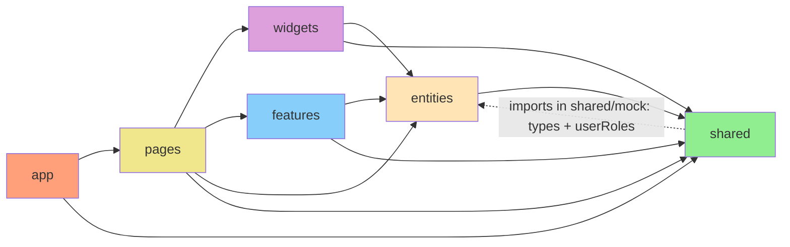
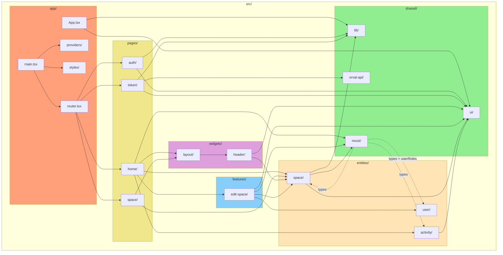
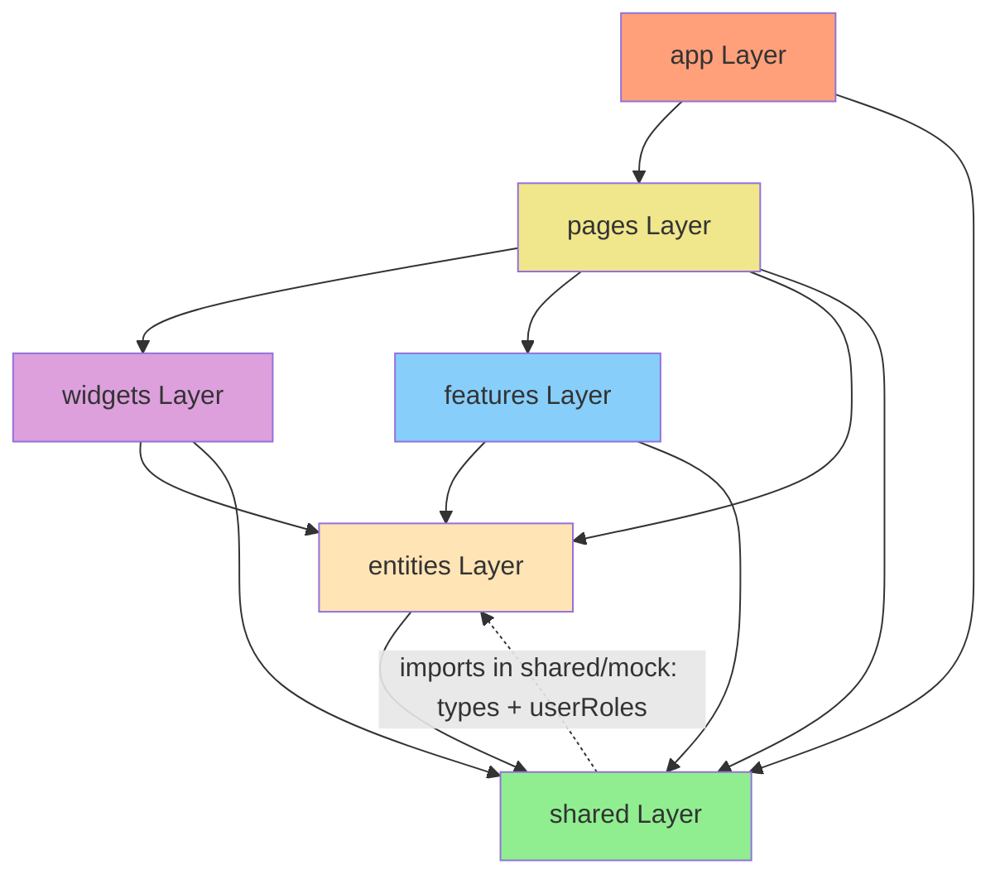
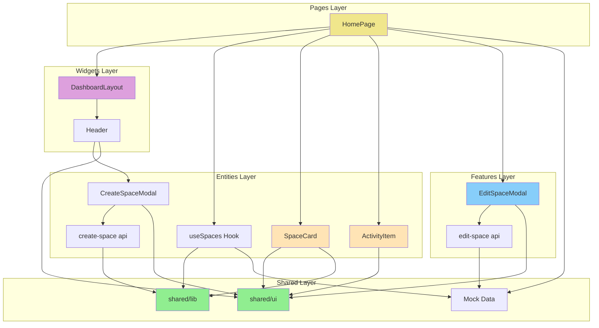
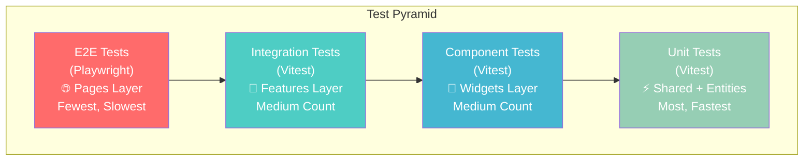

# Архитектура проекта

**Версия:** 1.5\
**Дата создания:** 2026-02-07\
**Дата обновления:** 2026-02-09\
**Методология:** Feature-Sliced Design (FSD)

---

## Краткое содержание

Этот документ подробно описывает архитектуру проекта Python-TypeScript Wiki Frontend, основанную на методологии Feature-Sliced Design (FSD). Рассматриваются слои проекта, их структура и назначение, потоки данных, управление сессией через auth-utils, частичное переключение между mock и реальным API, маршруты `/home` и `/home-empty`, тестирование по слоям, а также распространённые ошибки архитектуры.

Отдельно отмечено исключение текущей реализации: `shared/mock` импортирует `entities` (в основном type-only импорты, плюс runtime-константа `userRoles` из `entities/user/model/types.ts`). Это сделано, чтобы mock-данные не расходились с доменными контрактами: type-only импорты работают только на этапе TypeScript и не создают runtime-зависимость, а `userRoles` используется в рантайме как единый источник значений ролей.

---

## Оглавление

1. [Методология Feature-Sliced Design](#методология-feature-sliced-design)
2. [Структура проекта](#структура-проекта)
3. [Назначение каждого слоя](#назначение-каждого-слоя)
4. [Потоки данных](#потоки-данных)
5. [FSD в действии](#fsd-в-действии)
6. [Общие ошибки](#общие-ошибки)
7. [Тестирование по слоям](#тестирование-по-слоям)
8. [Полезные ссылки](#полезные-ссылки)
9. [Проверка архитектуры](#проверка-архитектуры)

---

## Методология Feature-Sliced Design

Feature-Sliced Design — современная методология организации фронтенд-кода, обеспечивающая чёткое разделение ответственности и контролируемые зависимости между слоями.

### Core Principles

1. **Разделение по ответственности** — каждый слой имеет определённую цель
2. **Зависимости только сверху вниз** — нижние слои не зависят от верхних
3. **Масштабируемость** — легкое добавление новых фич и сущностей
4. **Изоляция** — изменение одного слоя минимально влияет на остальные

---

## Структура проекта

```
src/
├── app/                   # Конфигурация приложения
│   ├── App.tsx            # Главный компонент приложения
│   ├── main.tsx           # Точка входа
│   ├── router.tsx         # Конфигурация маршрутов
│   ├── providers/         # Провайдеры (QueryClient)
│   ├── styles/            # Глобальные стили
│   └── assets/            # Статические ресурсы
├── pages/                 # Страницы маршрутов
│   ├── auth/              # Страница авторизации
│   ├── home/              # Главная страница (дашборд)
│   ├── space/             # Страница пространства
│   └── token/             # Страница обработки токена
├── widgets/               # Компонуемые UI блоки
│   ├── header/            # Хедер с логотипом и кнопками
│   └── layout/            # Layout компоненты (DashboardLayout)
├── features/              # Бизнес-логика и фичи
│   └── edit-space/        # Редактирование пространства
├── entities/              # Бизнес-сущности предметной области
│   ├── user/              # Пользователь (типы, схема, тесты)
│   ├── space/             # Пространство (типы, API, UI)
│   └── activity/          # Активность (типы, UI)
└── shared/                # Общие ресурсы для всех слоёв
    ├── ui/                # Переиспользуемые UI компоненты
    ├── lib/               # Утилиты (auth, routes, query-client)
    ├── mock/              # Mock данные для локальной разработки
    └── orval-api/         # Сгенерированный API клиент
```

### Direction of Dependencies



**Важно:** Стрелки показывают направление зависимостей. Нижние слои **не знают** о верхних.
Единственное текущее исключение в проекте: `shared/mock` импортирует `entities` (type-only импорты и runtime-константу `userRoles`). Иными словами, типы берутся из `entities` для типобезопасности моков, а `userRoles` подтягивается как runtime-value для согласованных ролей в мок-данных.

### File Structure Visualization



---

## Назначение каждого слоя

### 1. app (App Layer)

**Цель:** Конфигурация приложения и глобальные настройки.

**Структура:**
```
app/
├── App.tsx              # Корневой компонент
├── main.tsx             # Точка входа
├── router.tsx           # Конфигурация маршрутов
├── assets/              # Статические ресурсы (react.svg)
├── providers/           # Провайдеры приложения
│   └── QueryProvider.tsx
└── styles/
    └── index.css        # Глобальные стили
```

**Ответственности:**
- Точка входа приложения
- Конфигурация маршрутизатора (TanStack Router) — файл `router.tsx` является центральным узлом навигации, определяет все маршруты и защитные гарды (guards) через функцию `requireAuth`
- Провайдеры (QueryClient) — настройка кэширования TanStack Query через `shared/lib/query-client.ts`
- В `App.tsx` размещена вспомогательная фиксированная панель навигации для маршрутов (`Auth`, `Home`, `Home (Empty)`)
- Глобальные стили
- Статические ресурсы

**Правила:**
- ❌ Не размещать бизнес-логику
- ❌ Не размещать доменные сценарии уровня features/entities
- ✅ Размещать root-компоненты и инфраструктурную композицию (`App`, `providers`, `router`)

---

### 2. pages (Pages Layer)

**Цель:** Страницы маршрутов и их композиция.

**Структура:**
```
pages/
├── auth/
│   ├── index.ts
│   └── ui/AuthPage.tsx
├── home/
│   ├── index.ts
│   └── ui/HomePage.tsx
├── space/
│   ├── index.ts
│   └── ui/SpacePage.tsx
└── token/
    ├── index.ts
    └── ui/TokenPage.tsx
```

**Ответственности:**
- Реализация UI страниц, которые используются в маршрутах
- Композиция компонентов для страниц
- Layout страницы (через widgets)
- Параметры маршрута и navigation
- Использование cross-cutting API из `shared` (например `shared/orval-api` на странице `/token`)
- Поддержка двух вариантов дашборда: обычный (`/home`) и пустой (`/home-empty`)

**Пример кода** (`pages/home/ui/HomePage.tsx`):
```typescript
import { useState } from 'react';
import { SpaceCard, useSpaces, type Space } from '@/entities/space';
import { ActivityItem } from '@/entities/activity';
import { DashboardLayout } from '@/widgets/layout';
import { EditSpaceModal } from '@/features/edit-space';
import { mockActivities } from '@/shared/mock';

interface HomePageProps {
  isEmpty?: boolean;
}

export function HomePage({ isEmpty = false }: HomePageProps) {
  const { data: spaces = [] } = useSpaces();
  const activities = isEmpty ? [] : mockActivities;
  const [editingSpace, setEditingSpace] = useState<Space | null>(null);

  return (
    <DashboardLayout>
      <div className="grid grid-cols-1 md:grid-cols-2 gap-8">
        <section>
          <h2 className="text-xl font-bold mb-4">Мои пространства</h2>
          {spaces.length > 0 ? (
            <div className="space-y-3">
              {spaces.map((space) => (
                <SpaceCard
                  key={space.id}
                  space={space}
                  onSettingsClick={() => setEditingSpace(space)}
                />
              ))}
            </div>
          ) : (
            <p className="text-muted-foreground">У вас нет доступных пространств.</p>
          )}
        </section>
        <section>
          <h2 className="text-xl font-bold mb-4">Что я делал</h2>
          {activities.length > 0 ? (
            <div className="space-y-3">
              {activities.map((activity) => (
                <ActivityItem key={activity.id} activity={activity} />
              ))}
            </div>
          ) : (
            <p className="text-muted-foreground">Здесь пока ничего нет.</p>
          )}
        </section>
      </div>

      {editingSpace && (
        <EditSpaceModal
          space={editingSpace}
          isOpen={!!editingSpace}
          onOpenChange={(open) => !open && setEditingSpace(null)}
        />
      )}
    </DashboardLayout>
  );
}
```

**Правила:**
- ✅ Композиция компонентов из widgets, features, entities
- ❌ Не размещать бизнес-логику (вынести в features)
- ❌ Не размещать переиспользуемые компоненты (вынести в shared)

---

### 3. widgets (Widgets Layer)

**Цель:** Компонуемые UI блоки уровня страницы.

**Структура:**
```
widgets/
├── header/
│   ├── index.ts
│   └── ui/Header.tsx
└── layout/
    ├── index.ts
    └── ui/DashboardLayout.tsx
```

**Ответственности:**
- Крупные UI компоненты, используемые в нескольких местах
- Композиция features и entities
- Layout компоненты

**Примеры:**
- `widgets/header/` — хедер приложения
- `widgets/layout/` — layout компоненты (DashboardLayout)

**Пример кода** (`widgets/layout/ui/DashboardLayout.tsx`):
```typescript
import { Header } from '@/widgets/header';
import { type ReactNode } from 'react';

interface DashboardLayoutProps {
  children: ReactNode;
}

export function DashboardLayout({ children }: DashboardLayoutProps) {
  return (
    <div className="min-h-screen bg-background">
      <Header />
      <main className="container mx-auto px-4 py-8">{children}</main>
    </div>
  );
}
```

**Правила:**
- ✅ Компоновать features, entities, shared
- ❌ Не зависеть от pages
- ❌ Не размещать сложную бизнес-логику

---

### 4. features (Features Layer)

**Цель:** Бизнес-логика и интерактивность.

**Структура:**
```
features/edit-space/
├── api/
│   └── edit-space.ts
├── ui/
│   ├── edit-space-modal.tsx
│   ├── edit-space-user-search.tsx
│   └── edit-space-users-list.tsx
└── index.ts
```

**Ответственности:**
- Редактирование и удаление
- Модальные окна
- Формы и их валидация
- Сложные UI взаимодействия

**Фичи:**
- `features/edit-space/` — редактирование пространства (модальное окно, управление пользователями). Использует `useReducer` для управления сложным состоянием (поиск пользователей с debounce 300ms, список ожидающих добавления пользователей, текущий список пользователей пространства). Включает мутации для добавления/удаления пользователей, изменения ролей, переименования и удаления пространства; оптимистичные обновления применяются для изменения роли и удаления пользователя.

**Пример кода** (`features/edit-space/api/edit-space.ts`):
```typescript
import { userRoles, type UserRole } from '@/entities/user';
import { MOCK_ALL_USERS, MOCK_SPACE_USERS } from '@/shared/mock/users.ts';
import type { SpaceUser, User } from '@/entities/user/model/types.ts';

export const searchUsers = async (query: string): Promise<User[]> => {
  if (!query) return [];
  const lowerQuery = query.toLowerCase();
  const existingUserIds = new Set(MOCK_SPACE_USERS['default'].map((u) => u.id));

  return MOCK_ALL_USERS.filter((user) => !existingUserIds.has(user.id))
    .filter((user) => user.username.toLowerCase().includes(lowerQuery));
};

export const getSpaceUsers = async (spaceId: string): Promise<SpaceUser[]> => {
  return MOCK_SPACE_USERS[spaceId] || MOCK_SPACE_USERS['default'];
};

export const addUserToSpace = async (
  _spaceId: string,
  _userId: string,
  _role: UserRole = userRoles.reader
) => ({ success: true });

export const updateUserRole = async (
  _spaceId: string,
  _userId: string,
  _role: UserRole
) => ({ success: true });

export const removeUserFromSpace = async (_spaceId: string, _userId: string) => {
  return { success: true };
};

export const updateSpace = async (_spaceId: string, _name: string) => {
  return { success: true };
};

export const deleteSpace = async (_spaceId: string) => {
  return { success: true };
};
```

**Правила:**
- ✅ Бизнес-логика и интерактивность
- ❌ Не размещать компоненты без бизнес-логики (вынести в widgets)
- ❌ Не размещать типы сущностей (вынести в entities)

---

### 5. entities (Entities Layer)

**Цель:** Бизнес-сущности предметной области.

**Структура:**

```
entities/
├── user/
│   ├── model/
│   │   ├── types.ts
│   │   └── schema.ts
│   ├── model/__tests__/
│   │   └── user.test.ts
│   └── index.ts
├── space/
│   ├── api/
│   │   ├── create-space.ts
│   │   ├── useSpaces.ts
│   │   └── useSpace.ts
│   ├── model/
│   │   └── types.ts
│   ├── ui/
│   │   ├── SpaceCard.tsx
│   │   └── create-space-modal.tsx
│   └── index.ts
└── activity/
    ├── model/
    │   └── types.ts
    ├── ui/
    │   └── ActivityItem.tsx
    └── index.ts
```

**Ответственности:**
- Типы данных (TypeScript interfaces/types)
- API хуки (TanStack Query)
- Схемы валидации и типы (`userDataSchema`, `z.infer`, `*.zod.ts` от Orval)
- UI компоненты для сущности
- Юнит тесты для валидации

**Сущности:**
- `entities/user/` — пользователь (типы, схема Zod, роли: admin/writer/reader, тесты; runtime-валидация этой схемой сейчас используется в основном в unit-тестах)
- `entities/space/` — пространство (типы, API хуки `useSpaces/useSpace` с переключением mock/real, UI включая `SpaceCard` и `CreateSpaceModal`; создание пространства выполняется через реальный API вызов `create-space.ts`)
- `entities/activity/` — активность (типы, UI компоненты)

**Примечание:** `create-space-modal.tsx` размещён в `entities/space/ui`, хотя создание обычно относится к `features`. В текущем коде `Header` импортирует его напрямую (`@/entities/space/ui/create-space-modal`), потому что модалка не экспортируется через `entities/space/index.ts`. Сложная логика редактирования вынесена в `features/edit-space`.

**Пример кода** (`entities/space/api/useSpaces.ts`):
```typescript
import { useQuery } from '@tanstack/react-query';
import { fetchWithToken } from '@/shared/lib/fetch-mutator';
import type { Space } from '../model/types';
import { isLocalRun } from '@/shared/lib/environment';
import { getMockSpaces } from '@/shared/mock/spaceMocks';

interface SpacesResponse {
  items: Space[];
}

interface SpacesResponseSuccess {
  data: SpacesResponse;
  status: number;
  headers: Headers;
}

export function useSpaces() {
  return useQuery<Space[]>({
    queryKey: ['spaces'],
    queryFn: async () => {
      if (isLocalRun()) {
        return getMockSpaces();
      }

      const { data } = await fetchWithToken<SpacesResponseSuccess>('/spaces');
      return data.items;
    },
  });
}
```

**Правила:**
- ✅ Типы, API, UI для сущности
- ❌ Не размещать бизнес-логику (вынести в features)
- ❌ Не зависеть от других сущностей

---

### 6. shared (Shared Layer)

**Цель:** Переиспользуемые компоненты и утилиты.

**Структура:**
```
shared/
├── index.ts                  # Barrel-экспорты shared слоя
├── ui/                      # UI компоненты
│   ├── alert.tsx
│   ├── button.tsx
│   ├── card.tsx
│   ├── dialog.tsx
│   ├── dropdown-menu.tsx
│   ├── input.tsx
│   ├── morphing-button.tsx
│   └── select.tsx
├── lib/                     # Утилиты
│   ├── auth-utils.ts        # Управление сессией
│   ├── constants.ts         # Константы
│   ├── environment.ts       # Переменные окружения
│   ├── fetch-mutator.ts     # Fetch с токеном
│   ├── query-client.ts      # Конфигурация QueryClient
│   ├── routes.ts            # Маршруты
│   └── utils.ts             # cn() хелпер
├── mock/                    # Mock данные
│   ├── activityMocks.ts
│   ├── spaceMocks.ts
│   ├── users.ts
│   └── index.ts
└── orval-api/               # Сгенерированный API клиент
    └── withToken/
        ├── api/
        ├── types/
        └── index.ts
```

**Ответственности:**
- UI компоненты (Button, Input, Dialog и т.д.)
- Утилиты (auth, routes, query-client)
- Mock данные для разработки
- Общие типы и константы
- API клиент (сгенерированный Orval, в текущем UI напрямую используется на `/token`)

**Примечание:** В текущем проекте `shared/mock` импортирует из `entities` как типы (`Activity`, `Space`, `Article`, `SpaceUser`, `User`), так и value-константу `userRoles` (в `shared/mock/users.ts`) для синхронизации структуры моков с доменными типами и ролями. С точки зрения строгого FSD runtime-импорт `userRoles` остаётся осознанным исключением и проверяется отдельно при review архитектуры.
`shared/mock/index.ts` реэкспортирует содержимое `activityMocks.ts` и `spaceMocks.ts` (`mockActivities`, `mockSpaces`, `mockArticles`, `getMockSpaces`, `getMockSpace`); `users.ts` используется напрямую из `features/edit-space`.

**Утилиты:**

**auth-utils.ts** — управление сессией:
```typescript
export function setSessionToken(token: string, expiresAt: string): void
export function getSessionToken(): string | null
export function clearSessionToken(): void
export function isAuthenticated(): boolean
export function requireAuth(currentPath: string): void
export function saveRedirectUrl(url: string): void
export function getRedirectUrl(): string
export function clearRedirectUrl(): void
```

Функционал:
- Хранение токена и срока действия в `localStorage` (ключи: `session_token`, `session_expires_at`)
- Автоматическая проверка срока действия при получении токена (сравнение ISO datetime)
- Сохранение URL для редиректа после авторизации в `sessionStorage`
- Роут-гард `requireAuth` для защищённых страниц (с учётом флага `FEATURE_AUTH_BYPASS`)

**environment.ts** — переменные окружения:
```typescript
export const FEATURE_AUTH_BYPASS = import.meta.env.VITE_BYPASS_AUTH === 'true';
export const APP_ID = import.meta.env.VITE_SSO_APP_ID;
export const BASE_URL = import.meta.env.VITE_API_BASE_URL;
const APP_ENV = import.meta.env.VITE_APP_ENV || 'local';
export const isLocalRun = () => APP_ENV === 'local';
```

**fetch-mutator.ts** — кастомный мутатор для Orval:
- Автоматически добавляет Bearer токен из `localStorage` (`session_token`) ко всем API запросам
- Обрабатывает пустые ответы (статусы 204, 205, 304)
- Парсит JSON и обрабатывает ошибки

**Правила:**
- ✅ Только переиспользуемые компоненты и утилиты
- ❌ Не размещать бизнес-логику
- ❌ Не зависеть от верхних слоёв

---

## Потоки данных

### Data Flow (Top-Down)



### Пример потока: Отображение списка пространств

1. **app/router** — маршруты `/home` и `/home-empty` рендерят страницу `HomePage` (во втором случае с `isEmpty`)
2. **pages/home** — страница композиционно подключает `DashboardLayout`, `useSpaces`, `SpaceCard`, `ActivityItem`, `EditSpaceModal`
3. **entities/space/api** — `useSpaces()` получает данные из mock (`VITE_APP_ENV=local`) или API (иначе)
4. **entities/space/ui** — `SpaceCard` отображает пространство
5. **features/edit-space** — модальное окно управляет доступом и настройками пространства (в текущей реализации через mock-слой независимо от `VITE_APP_ENV`)
6. **shared/mock/activityMocks** — лента активности на `HomePage` берётся из моков (в текущей реализации без переключения на API)

---

## FSD в действии

### Пример: Пространство (Space)

```
entities/space/
├── api/
│   ├── create-space.ts       # Создание пространства
│   ├── useSpaces.ts          # Хук для получения списка
│   └── useSpace.ts           # Хук для получения одного
├── model/
│   └── types.ts              # Типы Space, Article
├── ui/
│   ├── SpaceCard.tsx         # Карточка пространства
│   └── create-space-modal.tsx # Модальное окно создания
└── index.ts                  # Экспорты

features/edit-space/
├── api/
│   └── edit-space.ts         # API для редактирования
├── ui/
│   ├── edit-space-modal.tsx  # Модальное окно редактирования
│   ├── edit-space-user-search.tsx  # Поиск пользователей
│   └── edit-space-users-list.tsx   # Список пользователей
└── index.ts

widgets/layout/
├── ui/
│   └── DashboardLayout.tsx   # Layout с Header
└── index.ts

pages/home/
├── ui/
│   └── HomePage.tsx          # Страница дашборда
└── index.ts
```

### Component Composition Flow



---

## Общие ошибки

Ниже приведены **условные** иллюстративные фрагменты для PR-review, а не буквальные копии текущих файлов.

### Неправильная архитектура (примеры)

```typescript
// ❌ В pages/home/ui/HomePage.tsx
// Плохо: Определение бизнес-логики в pages
const handleDeleteSpace = async (id: string) => {
  await deleteSpace(id);  // Логика должна быть в feature
  refetchSpaces();         // Хуки используются корректно
};
```

### Правильная архитектура

```typescript
// ✅ В pages/home/ui/HomePage.tsx
// Хорошо: Только композиция компонентов и использование хуков
import { useState } from 'react';
import { SpaceCard, useSpaces, type Space } from '@/entities/space';
import { DashboardLayout } from '@/widgets/layout';
import { EditSpaceModal } from '@/features/edit-space';

export function HomePage() {
  const { data: spaces = [] } = useSpaces();  // Хук из entities
  const [editingSpace, setEditingSpace] = useState<Space | null>(null);

  return (
    <DashboardLayout>
      {spaces.map((space) => (
        <SpaceCard
          key={space.id}
          space={space}
          onSettingsClick={() => setEditingSpace(space)}
        />
      ))}
      {editingSpace && (
        <EditSpaceModal
          space={editingSpace}
          isOpen={!!editingSpace}
          onOpenChange={(open) => !open && setEditingSpace(null)}
        />
      )}
    </DashboardLayout>
  );
}
```

---

## Тестирование по слоям

| Слой | Тип тестирования | Что тестируем | Тесты |
|------|------------------|---------------|---------------|
| **shared** | Юнит | Утилиты, компоненты | - |
| **entities** | Юнит + Интеграция | Типы, валидация, API хуки | `entities/user/model/__tests__/user.test.ts` |
| **features** | Интеграция | Бизнес-логика | - |
| **widgets** | Компонентные | Композиция | - |
| **pages** | E2E | Пользовательские сценарии уровня роутинга/интеграции | Playwright в `e2e/` (включая проектный auth-тест и демонстрационный тест) |

### Testing Strategy Pyramid



### Пример теста (entities/user/model/__tests__/user.test.ts)

```typescript
import { describe, it, expect } from 'vitest';
import { userDataSchema } from '../schema';

describe('User Schema Validation', () => {
  it('should validate a correct user object', () => {
    const name = 'ivan123';
    const validUser = {
      username: name,
      telegram_id: 12345678,
      first_name: 'Ivan',
      last_name: 'Ivanov',
      photo_url: 'https://ivanovich.com/photo.jpg',
      created_at: 1672531200,
      permission: 'admin',
    };
    const result = userDataSchema.safeParse(validUser);
    expect(result.success).toBe(true);
  });

  it('should fail validation if required fields are missing', () => {
    const invalidUser = {
      username: 'Vasiliy',
      created_at: 1672531200,
    };
    const result = userDataSchema.safeParse(invalidUser);
    expect(result.success).toBe(false);
  });
});
```

---

## Полезные ссылки

- [Feature-Sliced Design Official Documentation](https://feature-sliced.design/)
- [FSD Best Practices](https://feature-sliced.design/docs/guides)
- [Layer Responsibilities](https://feature-sliced.design/docs/reference/layers)

---

## Проверка архитектуры

### Чеклист PR review

- [ ] Нет импортов из верхних слоёв в нижние (например, `entities` не импортируют `features/pages/widgets`)
- [ ] Бизнес-логика в `features`, не в `pages`
- [ ] Переиспользуемые компоненты в `shared`, не в `entities`
- [ ] Типы сущностей в `entities`, не в `features`
- [ ] Композиция в `widgets` и `pages`
- [ ] Для `shared` проверено исключение: импорты из `entities` допускаются в `shared/mock` (type-only + `userRoles` в `users.ts`)

### Quick Check

```bash
# Проверка импортов (можно добавить в CI)
rg -n "from '@/(pages|widgets|features)'" src/entities src/shared
rg -n "from '@/entities" src/shared --glob '!src/shared/mock/**'
rg -n "from '@/entities" src/shared/mock
rg -n "userRoles" src/shared/mock/users.ts
```
