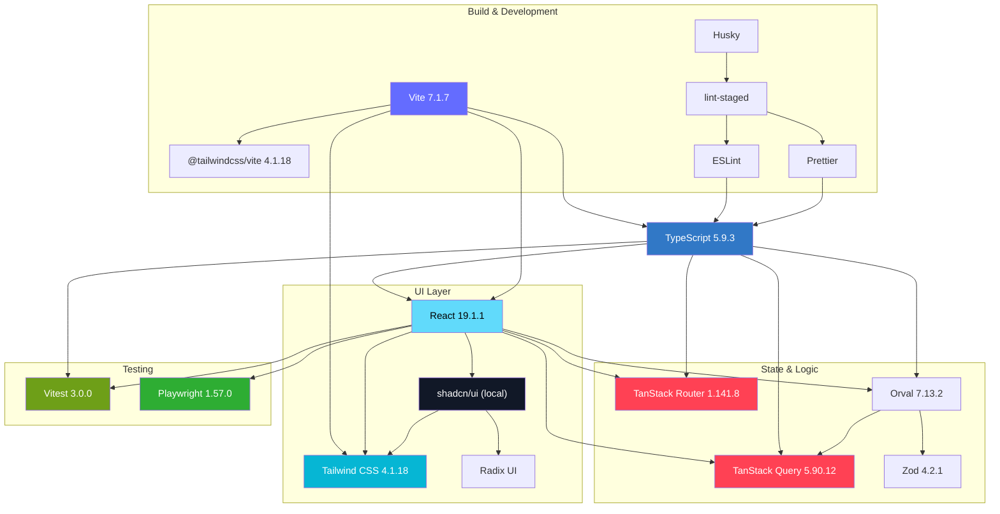
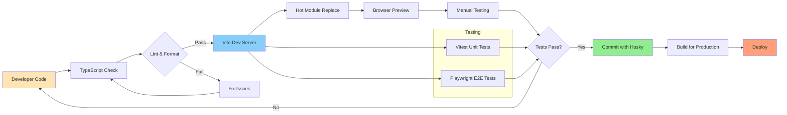
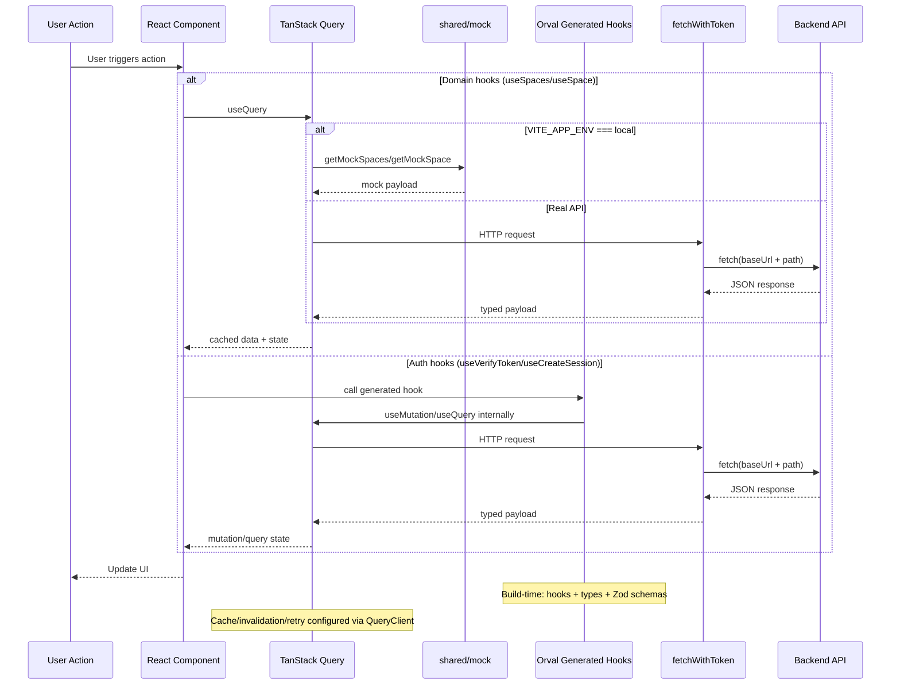

# Технологический стек

**Версия:** 1.7\
**Дата создания:** 2026-02-07\
**Дата обновления:** 2026-02-09

---

## Краткое содержание

Этот документ представляет собой обзор технологического стека проекта Python-TypeScript Wiki Frontend. Ниже перечислены технологии, которые используются в текущем коде, с версиями из `package.json`, назначением и примечаниями по применению в проекте.

---

## Оглавление

1. [Основные технологии](#основные-технологии)
2. [Frontend Framework](#frontend-framework)
3. [Build Tooling](#build-tooling)
4. [Routing](#routing)
5. [Data Fetching & State Management](#data-fetching--state-management)
6. [UI & Styling](#ui--styling)
7. [Testing](#testing)
8. [Development Tools](#development-tools)
9. [Package Manager](#package-manager)
10. [Alternatives Considered](#alternatives-considered)
11. [Requirements](#requirements)
12. [Package.json Scripts](#packagejson-scripts)
13. [Полезные ссылки](#полезные-ссылки)

---

## Основные технологии

### Technology Stack Architecture

## Frontend Framework

| Технология | Версия | Назначение |
|-----------|--------|-----------|
| **React** | 19.1.1 | UI фреймворк с современными возможностями |
| **TypeScript** | 5.9.3 | Типизация и безопасность кода |

**Почему React 19:**
- Автоматический batching для производительности
- Современные клиентские API и строгий режим разработки
- Хорошая совместимость с экосистемой TanStack

**Почему TypeScript 5.9:**
- Лучшая поддержка современных JS возможностей
- Улучшенный `infer` в generic типах
- Стабильная производительность

---

## Build Tooling

| Технология | Версия | Назначение |
|-----------|--------|-----------|
| **Vite** | 7.1.7 | Сервер разработки и сборщик |
| **@vitejs/plugin-react** | 5.0.4 | Поддержка React (JSX/TSX, Fast Refresh) в Vite |
| **@tailwindcss/vite** | 4.1.18 | Интеграция Tailwind CSS c Vite |
| **esbuild** | (через Vite) | Быстрая транспиляция |

**Почему Vite:**
- Молниеносный hot module replacement (HMR)
- Нативная поддержка ESM модулей
- Оптимизированная production сборка
- Экосистема плагинов

**Конфигурация:**
- `vite.config.ts` — основная конфигурация
- TypeScript Project References — изоляция типов
- Path aliases — `@/app`, `@/pages`, и т.д.

### Development Workflow

---

## Routing

| Технология | Версия | Назначение |
|-----------|--------|-----------|
| **TanStack Router** | 1.141.8 | Маршрутизация и навигация |

**Почему TanStack Router:**
- Type-safe маршрутизация (автоматическая типизация параметров)
- Удобные `beforeLoad` guard-ы для защиты маршрутов
- Отличная интеграция с React 19

**Ключевые возможности:**
- Кодовая конфигурация маршрутов через `createRoute`
- Обработка token callback через `location.searchStr` и redirect на `/token`
- Централизованная защита роутов через `requireAuth` в `beforeLoad`
- Типизированные path params (например `/space/$spaceId`)
- Явные маршруты текущей реализации: `/`, `/auth`, `/token`, `/home`, `/home-empty`, `/space/$spaceId`

---

## Data Fetching & State Management

| Технология | Версия | Назначение |
|-----------|--------|-----------|
| **TanStack Query** | 5.90.12 | Получение данных и кэширование |
| **Orval** | 7.13.2 | Генерация API клиента |
| **Zod** | 4.2.1 | Схемы и типы валидации |

**Почему TanStack Query:**
- Автоматическое кэширование и инвалидация
- Управление состоянием (loading, error, refetch)
- Поддержка оптимистичных обновлений (используется в `features/edit-space` для части операций)
- Глобальная конфигурация retry

**Почему Orval:**
- Генерация TypeScript клиента из OpenAPI
- Интеграция с React Query (сгенерированные хуки для auth/session и default API)
- Генерация Zod схем рядом с API хуками
- Синхронизация контрактов при обновлении OpenAPI спецификации (`mock/mock.api.json`)

**Почему Zod:**
- Схемы доменных контрактов (`entities/user/model/schema.ts`) и вывод типов через `z.infer`
- Генерация схем из OpenAPI (`*.zod.ts`) рядом с Orval API
- Поддержка валидации в тестах и при интеграции новых API-потоков
- В текущем UI runtime-валидация сетевых ответов через Zod не подключена напрямую

### Data Flow Through Stack

**Примечание к текущей реализации:** переключение `VITE_APP_ENV` влияет на чтение пространств (`useSpaces`, `useSpace`), но не на все данные. Лента активности (`mockActivities`) и `features/edit-space` сейчас используют mock-слой независимо от окружения.

---

## UI & Styling

| Технология | Версия | Назначение |
|-----------|--------|-----------|
| **shadcn/ui** | локально (через `components.json`) | Базовые UI-компоненты (скопированные в проект) |
| **Tailwind CSS** | 4.1.18 | Utility-first стилизация |
| **Radix UI** | 1.x-2.x | UI примитивы (под капотом shadcn/ui) |
| **class-variance-authority** | 0.7.1 | Вариативность компонентов |
| **clsx** | 2.1.1 | Условные классы |
| **tailwind-merge** | 3.4.0 | Слияние Tailwind классов |
| **Lucide React** | 0.562.0 | Иконки |

**Почему shadcn/ui:**
- В текущем проекте используется как code-copy подход: компоненты лежат в `src/shared/ui`
- Не зависит от конкретного UI фреймворка (скопированные компоненты, владение кодом)
- Использует Radix UI под капотом (доступность по WCAG AA)
- Предустановленные стили с возможностью полной кастомизации
- Модульная установка (только нужные компоненты)
- Удобная интеграция с существующей структурой `shared/ui` и утилитой `cn()`
- Активная поддержка и обновления

**Почему Tailwind CSS 4:**
- Utility-first подход без runtime CSS-in-JS
- Оптимизированная production сборка
- Отсутствие runtime overhead
- Консистентный дизайн

**Почему Radix UI (под капотом shadcn/ui):**
- Доступные UI примитивы (WCAG AA)
- Нестильзованные компоненты (полная кастомизация через shadcn)
- Паттерн `asChild` для гибкости композиции
- Компонуемость

**Почему class-variance-authority (CVA):**
- Type-safe варианты компонентов (variants API)
- Декларативное определение стилей для разных состояний
- Интеграция с Tailwind через утилиту `cn()` (tailwind-merge + clsx)
- Паттерн для масштабируемых компонентных систем

**Почему clsx + tailwind-merge:**
- `clsx` — условные классы
- `tailwind-merge` — умное слияние конфликтующих Tailwind классов
- Используются вместе в утилите `cn()` из shadcn/ui

---

## Testing

| Технология | Версия | Назначение |
|-----------|--------|-----------|
| **Vitest** | 3.0.0 | Юнит тестирование |
| **Playwright** | 1.57.0 | E2E тестирование |

**Почему Vitest:**
- Совместимость с Jest API (простая миграция)
- Быстрая работа через Vite
- Watch mode с HMR
- Coverage отчёты доступны при запуске с соответствующими флагами/настройкой

**Почему Playwright:**
- Мультибраузерная поддержка
- Встроенный tracing для отладки
- Headless mode для CI
- Единая конфигурация webServer + retries для локальной среды и CI
- В текущем наборе есть как проектный тест (`auth-button.spec.ts`), так и демонстрационный внешний тест (`google_search.spec.ts`)

---

## Development Tools

| Технология | Версия | Назначение |
|-----------|--------|-----------|
| **ESLint** | 9.39.2 | Линтинг кода |
| **Prettier** | 3.7.4 | Форматирование |
| **Husky** | 9.1.7 | Git hooks |
| **lint-staged** | 16.2.7 | Pre-commit проверка |

**Почему этот стек:**
- ESLint для статического анализа (отлов ошибок до запуска)
- Prettier для единообразного форматирования
- Husky для автоматизации Git hooks
- lint-staged для проверки только изменённых файлов
- В pre-commit хуке (`.husky/pre-commit`) запускается `npx lint-staged`

---

## Package Manager

| Инструмент | Версия | Назначение |
|-----------|--------|-----------|
| **npm** | 9.x+ (рекомендуется 10.x+) | Менеджер пакетов |

**Почему npm:**
- Стандартный менеджер пакетов Node.js
- Хорошая производительность начиная с npm 7+
- Надёжность и широкая поддержка
- Встроен в Node.js

---

## Alternatives Considered

> Раздел фиксирует архитектурные альтернативы и инженерные компромиссы команды. Это справочный материал, а не автоматически выводимая часть из исходного кода.

### Router
| Альтернатива | Почему не выбрана |
|-------------|-------------------|
| React Router | Не type-safe, нет встроенного data fetching |
| Next.js App Router | Не нужен SSR, избыточен для SPA |
| wouter | Меньше возможностей, экосистема |

### Data Fetching
| Альтернатива | Почему не выбрана |
|-------------|-------------------|
| React Query (v4) | TanStack Query v5 — более современный API |
| SWR | Меньше возможностей (нет mutations API) |
| Axios | Избыточен, fetch API достаточно |

### UI Library
| Альтернатива | Почему не выбрана |
|-------------|-------------------|
| Material UI | Слишком много стилей, трудная кастомизация |
| Chakra UI | Размер бандла, менее гибкая |
| Headless UI | Меньше компонентов чем Radix UI |

### Testing
| Альтернатива | Почему не выбрана |
|-------------|-------------------|
| Jest | Медленнее, больше конфигурации |
| Cypress | Менее надежный E2E, хуже DX |

---

## Requirements

### Минимальные требования
- **Node.js:** >=20.19.0 (ветка 20.x) или >=22.12.0 (требование Vite 7)
- **npm:** 9.x или новее (входит в Node.js)
- **Git:** 2.x

### Рекомендуемые требования
- **Node.js:** 22.12+ LTS
- **npm:** 10.x+ (обычно поставляется вместе с актуальным Node.js LTS)
- **RAM:** 8GB+ для комфортной разработки
- **CPU:** 4+ cores

---

## Package.json Scripts

| Script | Команда | Назначение |
|--------|---------|-----------|
| `npm run dev` | `vite --host 0.0.0.0` | Запуск dev сервера |
| `npm run build` | `tsc -b && vite build` | Production сборка |
| `npm run preview` | `vite preview` | Предпросмотр production сборки |
| `npm run api:generate` | `orval` | Генерация API клиента |
| `npm run tests:unit` | `vitest` | Запуск юнит тестов |
| `npm run tests:e2e` | `node --env-file=.env node_modules/@playwright/test/cli.js test` | Запуск E2E тестов |
| `npm run lint` | `eslint .` | Линтинг кода |
| `npm run lint:fix` | `eslint . --fix` | Автоисправление lint ошибок |
| `npm run format` | `prettier --check .` | Проверка форматирования |
| `npm run format:fix` | `prettier --write .` | Автоматическое форматирование |
| `npm run prepare` | `husky` | Инициализация git hooks |

---

## Полезные ссылки

- [React 19 Documentation](https://react.dev/)
- [Vite Documentation](https://vitejs.dev/)
- [TanStack Router](https://tanstack.com/router/latest)
- [TanStack Query](https://tanstack.com/query/latest)
- [Tailwind CSS](https://tailwindcss.com/)
- [Radix UI](https://www.radix-ui.com/)
- [Orval](https://orval.dev/)
- [Zod](https://zod.dev/)
- [Vitest](https://vitest.dev/)
- [Playwright](https://playwright.dev/)
