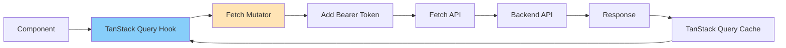
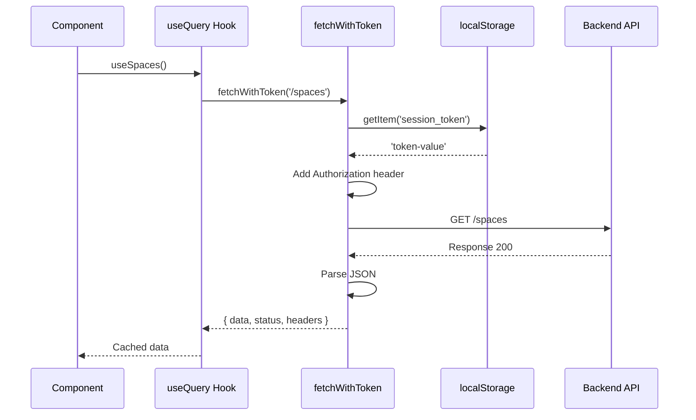

# API клиент

**Версия:** 1.2\
**Дата создания:** 2026-02-07\
**Дата обновления:** 2026-02-09

---

## Краткое содержание

Этот документ описывает конфигурацию и использование API клиента в проекте Python-TypeScript Wiki Frontend. Рассматривается генерация клиента через Orval, использование TanStack Query, fetch mutator для авторизации и переключение между mock и real API режимами.

---

## Оглавление

1. [Обзор архитектуры](#обзор-архитектуры)
2. [Orval конфигурация](#orval-конфигурация)
3. [Генерация API клиента](#генерация-api-клиента)
4. [Fetch Mutator](#fetch-mutator)
5. [Mock vs Real API](#mock-vs-real-api)
6. [Использование TanStack Query](#использование-tanstack-query)
7. [Zod валидация](#zod-валидация)

---

## Обзор архитектуры

### Стек инструментов

| Инструмент | Назначение |
|------------|-----------|
| **Orval** | Генерация TypeScript клиента из OpenAPI |
| **TanStack Query** | Кэширование и управление состоянием запросов |
| **Zod** | Генерация схем и опциональная runtime-валидация |
| **Fetch API** | HTTP клиент |

### Поток данных



### Структура сгенерированного кода

```
src/shared/orval-api/withToken/
├── api/                         # React Query хуки и Zod схемы (по тегам)
│   ├── auth/
│   │   ├── auth.ts              # React Query хуки для auth
│   │   └── auth.zod.ts          # Zod схемы для auth
│   └── default/
│       ├── default.ts           # React Query хуки для default
│       └── default.zod.ts       # Zod схемы для default
└── types/                       # TypeScript типы (все в одной папке)
    ├── sessionCreateResponseType.ts
    ├── tokenVerifyResponseType.ts
    ├── errorResponseType.ts
    └── ... (остальные типы)
```

**Примечание:** Структура организована по **тегам** из OpenAPI (auth, default), а не по эндпоинтам. Zod схемы (.zod.ts) генерируются в той же папке, что и обычные хуки.

### Что генерируется, а что написано вручную

- Через **Orval** в текущем проекте генерируются API-хуки и типы для `auth` и `default` тегов (файлы в `src/shared/orval-api/withToken/`).
- Часть API-слоя написана вручную, например:
  - `src/entities/space/api/useSpaces.ts`
  - `src/entities/space/api/useSpace.ts`
  - `src/entities/space/api/create-space.ts`
- Указанные выше ручные функции используют тот же `fetchWithToken`, что и Orval-клиент.

---

## Orval конфигурация

### orval.config.ts

```typescript
import { defineConfig } from 'orval';

const inputTargerUrl = './mock/mock.api.json';

export default defineConfig({
  withToken: {
    input: {
      target: inputTargerUrl,
    },
    output: {
      workspace: './src/shared/orval-api/withToken',
      target: './api',
      schemas: './types',
      client: 'react-query',
      httpClient: 'fetch',
      mode: 'tags-split',
      clean: true,
      override: {
        fetch: {
          includeHttpResponseReturnType: true,
          forceSuccessResponse: true,
        },
        mutator: {
          path: '../../lib/fetch-mutator.ts',
          name: 'fetchWithToken',
        },
        components: {
          schemas: {
            suffix: 'Type',
          },
        },
      },
    },
  },
  withTokenZod: {
    input: {
      target: inputTargerUrl,
    },
    output: {
      mode: 'tags-split',
      client: 'zod',
      workspace: './src/shared/orval-api/withToken',
      target: './api',
      fileExtension: '.zod.ts',
      override: {
        zod: {
          generateEachHttpStatus: true,
        },
      },
    },
  },
});
```

### Разбор конфигурации

#### withToken (React Query клиент)

| Настройка | Значение | Описание |
|-----------|----------|----------|
| `client` | `'react-query'` | Генерировать React Query хуки |
| `httpClient` | `'fetch'` | Использовать Fetch API |
| `mode` | `'tags-split'` | Разделять по тегам (tags) |
| `clean` | `true` | Очищать папку перед генерацией |
| `mutator.path` | `'../../lib/fetch-mutator.ts'` | Путь к fetch mutator |
| `schemas.suffix` | `'Type'` | Добавляет суффикс `Type` к именам сгенерированных типов |

#### withTokenZod (Zod схемы)

| Настройка | Значение | Описание |
|-----------|----------|----------|
| `client` | `'zod'` | Генерировать Zod схемы |
| `mode` | `'tags-split'` | Разделять по тегам |
| `fileExtension` | `'.zod.ts'` | Расширение для файлов |
| `zod.generateEachHttpStatus` | `true` | Генерировать схемы для всех HTTP статусов |

---

## Генерация API клиента

### Команда

```bash
npm run api:generate
```

### Когда перегенерировать

- После обновления `mock/mock.api.json`
- После изменения `orval.config.ts`
- После удаления/очистки файлов в `src/shared/orval-api/withToken/`

### Что генерируется

#### React Query хуки (пример)

```typescript
// src/shared/orval-api/withToken/index.ts
export {
  useVerifyTokenTokenPost,
  useCreateSessionSessionPost,
  useGetSessionSessionGet,
} from './api/auth/auth';

// Вызов mutate в коде приложения
verifyMutation.mutate({ data: { token } });
```

#### TypeScript типы (пример)

```typescript
// src/shared/orval-api/withToken/types/tokenVerifyResponseType.ts
import type { TokenUserResponseType } from './tokenUserResponseType';

export interface TokenVerifyResponseType {
  created: boolean;
  user: TokenUserResponseType;
}
```

#### Zod схемы (пример)

```typescript
// src/shared/orval-api/withToken/api/auth/auth.zod.ts
import * as zod from 'zod';

export const verifyTokenTokenPost200Response = zod.object({
  created: zod.boolean(),
  user: zod.object({
    telegram_id: zod.number(),
    username: zod.union([zod.string(), zod.null()]),
    created_at: zod.iso.datetime({}),
    last_login_at: zod.iso.datetime({}),
  }),
});
```

---

## Fetch Mutator

### Назначение

Fetch mutator — это функция, которая оборачивает все API запросы для:

1. Добавления Bearer токена к запросам
2. Обработки пустых ответов (204, 205, 304)
3. Парсинга JSON и обработки ошибок

### src/shared/lib/fetch-mutator.ts

```typescript
import { BASE_URL } from '@/shared/lib';

export const fetchWithToken = async <
  T extends { data: unknown; status: number; headers: Headers },
>(
  url: string,
  options?: RequestInit
): Promise<T> => {
  // Получаем токен из localStorage
  const token =
    typeof window !== 'undefined'
      ? localStorage.getItem('session_token')
      : null;

  // Добавляем Authorization заголовок
  const headers = new Headers(options?.headers);
  if (token) {
    headers.set('Authorization', `Bearer ${token}`);
  }

  const newOptions: RequestInit = {
    ...options,
    headers,
  };

  // Выполняем запрос
  const urlObj = new URL(url, BASE_URL);
  const res = await fetch(urlObj.toString(), newOptions);

  // Обрабатываем пустые ответы
  const body = [204, 205, 304].includes(res.status)
    ? null
    : await res.text();

  // Парсим JSON
  const data = body ? JSON.parse(body) : {};

  // Бросаем ошибку для non-2xx ответов
  if (!res.ok) {
    throw data;
  }

  // Возвращаем типизированный ответ
  return {
    data,
    status: res.status,
    headers: res.headers,
  } as T;
};
```

### Поток обработки запроса



### Обработка ошибок

- Non-2xx ответы (4xx, 5xx) → бросается ошибка
- Ошибка попадает в `error` объекта Query/Mutation в TanStack Query
- В `src/pages/token/ui/TokenPage.tsx` ошибки обрабатываются через `verifyMutation.isError` и `createSessionMutation.isError`

---

## Mock vs Real API

### Переключение через isLocalRun()

```typescript
// src/shared/lib/environment.ts
const APP_ENV = import.meta.env.VITE_APP_ENV || 'local';

export const isLocalRun = () => APP_ENV === 'local';
```

### Использование в хуках

```typescript
// src/entities/space/api/useSpaces.ts
import { useQuery } from '@tanstack/react-query';
import { fetchWithToken } from '@/shared/lib/fetch-mutator';
import type { Space } from '../model/types';
import { isLocalRun } from '@/shared/lib/environment';
import { getMockSpaces } from '@/shared/mock/spaceMocks';

interface SpacesResponse {
  items: Space[];
}

interface SpacesResponseSuccess {
  data: SpacesResponse;
  status: number;
  headers: Headers;
}

export function useSpaces() {
  return useQuery<Space[]>({
    queryKey: ['spaces'],
    queryFn: async () => {
      // Переключение между mock и real API
      if (isLocalRun()) {
        return getMockSpaces();
      }

      // Real API запрос через fetchWithToken
      const { data } = await fetchWithToken<SpacesResponseSuccess>('/spaces');
      return data.items;
    },
  });
}
```

### Переменная VITE_APP_ENV

| Значение | Режим | API |
|----------|-------|-----|
| `local` | Mock режим | Mock данные из `src/shared/mock/` |
| `development` | Dev режим | Real backend API |
| `production` | Prod режим | Real backend API |

### Mock данные

```
src/shared/mock/
├── spaceMocks.ts      # Mock данные пространств
├── users.ts           # Mock данные пользователей
├── activityMocks.ts   # Mock данные активности
└── index.ts           # Экспорты
```

**Примечание:** Runtime mock-данные лежат в `src/shared/mock/*.ts`; для генерации Orval используется отдельный файл `mock/mock.api.json`.

### Пример mock данных

```typescript
// src/shared/mock/spaceMocks.ts
import type { Space } from '@/entities/space/model/types';

export const mockSpaces: Space[] = [
  {
    id: '1',
    name: 'Local Space 1',
    role: 'owner',
    is_deleted: false,
    deleted_at: null,
  },
  {
    id: '2',
    name: 'Local Space 2',
    role: 'member',
    is_deleted: false,
    deleted_at: null,
  },
];

export const getMockSpaces = (): Space[] => mockSpaces;
```

---

## Использование TanStack Query

### Query (GET запросы)

Реальный пример из проекта:

```typescript
import { useQuery } from '@tanstack/react-query';
import { fetchWithToken } from '@/shared/lib/fetch-mutator';

export function useSpaces() {
  return useQuery<Space[]>({
    queryKey: ['spaces'],
    queryFn: async () => {
      if (isLocalRun()) {
        return getMockSpaces();
      }
      const { data } = await fetchWithToken<SpacesResponseSuccess>('/spaces');
      return data.items;
    },
  });
}
```

### Mutation (POST, PUT, DELETE)

Примеры кода:

```typescript
// src/pages/token/ui/TokenPage.tsx
const verifyMutation = useVerifyTokenTokenPost({
  mutation: {
    onSuccess: () => {
      createSessionMutation.mutate({ data: { token } });
    },
  },
});

const createSessionMutation = useCreateSessionSessionPost({
  mutation: {
    onSuccess: (response) => {
      setSessionToken(response.data.session_token, response.data.expires_at);
    },
  },
});
```

### Состояния запроса

```typescript
// src/pages/token/ui/TokenPage.tsx
if (verifyMutation.isPending || createSessionMutation.isPending) {
  return <LoadingState />;
}

if (verifyMutation.isError) {
  return <ErrorState error={verifyMutation.error} />;
}
```

### Mutation + инвалидация кэша (ручной API слой)

```typescript
// src/entities/space/ui/create-space-modal.tsx
const createSpaceMutation = useMutation({
  mutationFn: (spaceName: string) => createSpace(spaceName),
  onSuccess: () => {
    queryClient.invalidateQueries({ queryKey: ['spaces'] });
    onOpenChange(false);
    setName('');
  },
});
```

---

## Zod валидация

### Что есть в коде

- Схемы генерируются Orval в файлы `src/shared/orval-api/withToken/api/auth/auth.zod.ts` и `src/shared/orval-api/withToken/api/default/default.zod.ts`.
- Схемы реэкспортируются из `src/shared/orval-api/withToken/index.ts`.
- В runtime-коде приложения нет использования этих схем через `.parse()`/`.safeParse()`.

---

## Полезные ссылки

- [Orval Documentation](https://orval.dev/)
- [TanStack Query Documentation](https://tanstack.com/query/latest)
- [Zod Documentation](https://zod.dev/)
- [Fetch API](https://developer.mozilla.org/en-US/docs/Web/API/Fetch_API)
