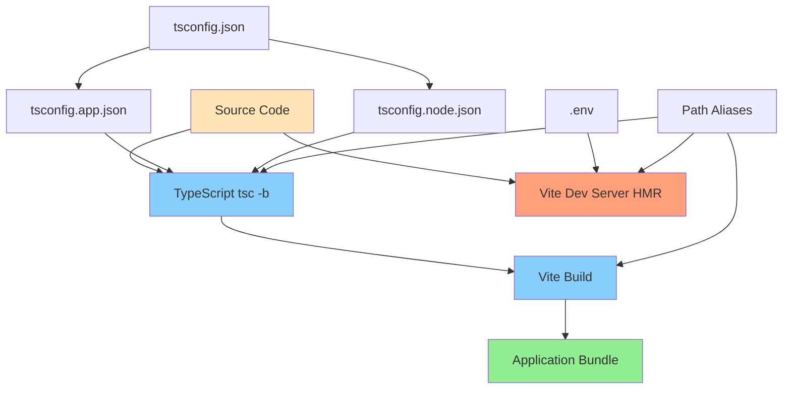
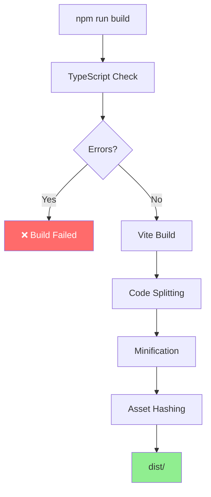

# Конфигурация сборки

**Версия:** 1.7\
**Дата:** 2026-02-07\
**Дата обновления:** 2026-02-09

---

## Краткое содержание

Этот документ описывает конфигурацию сборки проекта Python-TypeScript Wiki Frontend, включая настройку Vite, TypeScript Project References, Path Aliases и оптимизацию для production. Рассматриваются все конфигурационные файлы, их назначение, взаимодействие между ними и лучшие практики по настройке сборки.

---

## Оглавление

1. [Обзор конфигураций](#обзор-конфигураций)
2. [Vite конфигурация](#vite-конфигурация)
3. [TypeScript Project References](#typescript-project-references)
4. [Path Aliases](#path-aliases)
5. [Оптимизация сборки](#оптимизация-сборки)
6. [Dev Server](#dev-server)
7. [Production Build](#production-build)

---

## Обзор конфигураций

### Структура конфигурационных файлов

```
python-typescript-wiki-frontend/
├── vite.config.ts           # Конфигурация Vite
├── tsconfig.json            # Root TypeScript config
├── tsconfig.app.json        # TypeScript для приложения
├── tsconfig.node.json       # TypeScript для build скриптов
├── .prettierrc              # Prettier конфигурация
├── eslint.config.js         # ESLint конфигурация
└── .env                     # Переменные окружения
```

### Цепочка конфигураций



---

## Vite конфигурация

### vite.config.ts

```typescript
import { defineConfig } from 'vite';
import react from '@vitejs/plugin-react';
import tailwindcss from '@tailwindcss/vite';
import path from 'path';

export default defineConfig({
  plugins: [react(), tailwindcss()],
  resolve: {
    alias: {
      '@': path.resolve(__dirname, './src'),
      '@/app': path.resolve(__dirname, './src/app'),
      '@/pages': path.resolve(__dirname, './src/pages'),
      '@/widgets': path.resolve(__dirname, './src/widgets'),
      '@/features': path.resolve(__dirname, './src/features'),
      '@/entities': path.resolve(__dirname, './src/entities'),
      '@/shared': path.resolve(__dirname, './src/shared'),
    },
  },
  server: {
    allowedHosts: true,
  },
});
```

### Разбор конфигурации

#### Plugins

| Плагин | Назначение |
|--------|-----------|
| `@vitejs/plugin-react` | Поддержка React и JSX |
| `@tailwindcss/vite` | Интеграция Tailwind CSS |

#### Resolve Aliases

Path aliases позволяют импортировать модули с короткими путями:

```typescript
// ❌ Без alias
import { Button } from '../../../shared/ui';

// ✅ С alias
import { Button } from '@/shared/ui';
```

#### Server

```typescript
server: {
  allowedHosts: true,  // Разрешает все хосты для dev server
}
```

**Почему `allowedHosts: true`:**
- Позволяет доступ к dev server с любого хоста
- Полезно для разработки в Docker/VM
- Безопасно только для development

---

## TypeScript Project References

### Обзор

TypeScript Project References позволяют разделить конфигурацию на несколько файлов для разных контекстов:

- **Root config** (`tsconfig.json`) — базовая конфигурация и пути
- **App config** (`tsconfig.app.json`) — для приложения
- **Node config** (`tsconfig.node.json`) — для Vite build скриптов

### tsconfig.json (Root)

```json
{
  "files": [],
  "references": [
    { "path": "./tsconfig.app.json" },
    { "path": "./tsconfig.node.json" }
  ],
  "compilerOptions": {
    "baseUrl": ".",
    "paths": {
      "@/*": ["./src/*"],
      "@/app/*": ["./src/app/*"],
      "@/pages/*": ["./src/pages/*"],
      "@/widgets/*": ["./src/widgets/*"],
      "@/features/*": ["./src/features/*"],
      "@/entities/*": ["./src/entities/*"],
      "@/shared/*": ["./src/shared/*"]
    }
  }
}
```

**Назначение:**
- Определяет project references
- Задаёт общие path aliases (дублируется для IDE)

### tsconfig.app.json (Application)

```json
{
  "compilerOptions": {
    "tsBuildInfoFile": "./node_modules/.tmp/tsconfig.app.tsbuildinfo",
    "target": "ES2022",
    "useDefineForClassFields": true,
    "lib": ["ES2022", "DOM", "DOM.Iterable"],
    "module": "ESNext",
    "types": ["vite/client"],
    "skipLibCheck": true,

    /* Bundler mode */
    "moduleResolution": "bundler",
    "allowImportingTsExtensions": true,
    "verbatimModuleSyntax": true,
    "moduleDetection": "force",
    "noEmit": true,
    "jsx": "react-jsx",

    /* Пути aliases для shadcn и FSD */
    "baseUrl": ".",
    "paths": {
      "@/*": ["./src/*"],
      "@/app/*": ["./src/app/*"],
      "@/pages/*": ["./src/pages/*"],
      "@/widgets/*": ["./src/widgets/*"],
      "@/features/*": ["./src/features/*"],
      "@/entities/*": ["./src/entities/*"],
      "@/shared/*": ["./src/shared/*"]
    },

    /* Линтеры */
    "strict": true,
    "noUnusedLocals": true,
    "noUnusedParameters": true,
    "erasableSyntaxOnly": true,
    "noFallthroughCasesInSwitch": true,
    "noUncheckedSideEffectImports": true
  },
  "include": ["src"]
}
```

**Ключевые настройки:**

| Настройка | Значение | Описание |
|-----------|----------|----------|
| `target` | `ES2022` | Целевая версия JavaScript |
| `module` | `ESNext` | ES модули |
| `jsx` | `react-jsx` | Новый JSX трансформ |
| `moduleResolution` | `bundler` | Режим для сборщиков |
| `strict` | `true` | Строгая типизация |

### tsconfig.node.json (Node/Build Scripts)

```json
{
  "compilerOptions": {
    "tsBuildInfoFile": "./node_modules/.tmp/tsconfig.node.tsbuildinfo",
    "target": "ES2023",
    "lib": ["ES2023"],
    "module": "ESNext",
    "types": ["node"],
    "skipLibCheck": true,

    /* Bundler mode */
    "moduleResolution": "bundler",
    "allowImportingTsExtensions": true,
    "verbatimModuleSyntax": true,
    "moduleDetection": "force",
    "noEmit": true,

    /* Linting */
    "strict": true,
    "noUnusedLocals": true,
    "noUnusedParameters": true,
    "erasableSyntaxOnly": true,
    "noFallthroughCasesInSwitch": true,
    "noUncheckedSideEffectImports": true
  },
  "include": ["vite.config.ts"]
}
```

**Назначение:**
- Конфигурация для `vite.config.ts` и других Node.js скриптов
- Используется в `tsc -b` для проверки `vite.config.ts` перед `vite build`
- Совместим с современными TypeScript настройками проекта

---

## Path Aliases

### Что такое Path Aliases?

Path aliases позволяют использовать короткие импорты вместо относительных путей.

### Двойная настройка

Path aliases настраиваются в двух местах:

#### 1. Vite resolve aliases (vite.config.ts)

```typescript
resolve: {
  alias: {
    '@': path.resolve(__dirname, './src'),
    '@/app': path.resolve(__dirname, './src/app'),
    '@/pages': path.resolve(__dirname, './src/pages'),
    '@/widgets': path.resolve(__dirname, './src/widgets'),
    '@/features': path.resolve(__dirname, './src/features'),
    '@/entities': path.resolve(__dirname, './src/entities'),
    '@/shared': path.resolve(__dirname, './src/shared'),
  },
}
```

#### 2. TypeScript paths (tsconfig.json + tsconfig.app.json)

```json
{
  "compilerOptions": {
    "paths": {
      "@/*": ["./src/*"],
      "@/app/*": ["./src/app/*"],
      "@/pages/*": ["./src/pages/*"],
      "@/widgets/*": ["./src/widgets/*"],
      "@/features/*": ["./src/features/*"],
      "@/entities/*": ["./src/entities/*"],
      "@/shared/*": ["./src/shared/*"]
    }
  }
}
```

### Зачем нужны обе настройки?

| Настройка | Используется | Зачем нужна |
|-----------|--------------|-------------|
| **Vite resolve** | Vite bundler, runtime | Разрешение путей при сборке |
| **TypeScript paths** | TypeScript compiler, IDE | Автодополнение, проверка типов |

**Без TypeScript paths:**
- IDE не понимает импорты (`@/...`)
- Нет автодополнения
- Ошибки типов в редакторе

**Без Vite resolve:**
- Ошибки при сборке
- Импорты не работают в runtime

### Список доступных aliases

| Alias | Резолвится в | Пример использования |
|-------|--------------|---------------------|
| `@/` | `./src` | `import { cn } from '@/shared/lib'` |
| `@/app` | `./src/app` | `import App from '@/app/App'` |
| `@/pages` | `./src/pages` | `import { HomePage } from '@/pages/home'` |
| `@/widgets` | `./src/widgets` | `import { Header } from '@/widgets/header'` |
| `@/features` | `./src/features` | `import { EditSpaceModal } from '@/features/edit-space'` |
| `@/entities` | `./src/entities` | `import { SpaceCard } from '@/entities/space'` |
| `@/shared` | `./src/shared` | `import { Button } from '@/shared/ui'` |

### Использование в коде

```typescript
// ❌ Без aliases (относительные пути)
import { Button } from '../../../shared/ui';
import { useSpaces } from '../../../entities/space/api/useSpaces';
import { requireAuth } from '../../../shared/lib/auth-utils';

// ✅ С aliases
import { Button } from '@/shared/ui';
import { useSpaces } from '@/entities/space';
import { requireAuth } from '@/shared/lib';
```

---

## Оптимизация сборки

### Tree Shaking

Vite автоматически удаляет неиспользуемый код:

```typescript
// Если импортируете только Button из UI библиотеки
import { Button } from '@/shared/ui';

// Vite уберёт остальные компоненты из bundle
```

### Code Splitting

Vite автоматически разделяет код на чанки при сборке. Code splitting может быть реализован через динамический импорт:

```typescript
// Пример lazy loading (не используется в текущем проекте)
const SpacePage = lazy(() => import('@/pages/space'));

// В текущем проекте компоненты импортируются напрямую
import { SpacePage } from '@/pages/space';
```

**Примечание:** В текущем проекте lazy loading не используется. Все компоненты загружаются в основном bundle. Code splitting происходит автоматически для зависимостей и модулей.

### Minification

Production сборка автоматически минифицирует код:

```bash
npm run build

# Результат в dist/
# ├── assets/
# │   ├── index-abc123.js  # Минифицированный код
# │   └── index-abc123.css # Минифицированный CSS
```

### Анализ bundle (опционально)

Для анализа размера bundle можно использовать `rollup-plugin-visualizer`:

**Установка:**
```bash
npm install --save-dev rollup-plugin-visualizer
```

**Настройка:**
```typescript
// vite.config.ts
import { visualizer } from 'rollup-plugin-visualizer';

export default defineConfig({
  plugins: [
    react(),
    tailwindcss(),
    visualizer({ open: true, filename: 'dist/stats.html' })
  ],
});
```

**Примечание:** Плагин не установлен в текущем проекте. Это опциональный инструмент для анализа bundle при необходимости.

---

## Dev Server

### Запуск

```bash
npm run dev
```

**По умолчанию:**
- URL: `http://localhost:5173`
- Порт может быть занят — автоматически выберет свободный

### Настройка порта

```bash
# Указать порт явно через флаг
npm run dev -- --port 3000

# Или изменить порт в vite.config.ts
```

### Hot Module Replacement (HMR)

Vite обеспечивает мгновенные изменения без перезагрузки страницы:

```typescript
// Изменения в компоненте обновляют только этот компонент
// Изменения в CSS обновляют только стили
```

### Host настройка

```typescript
server: {
  allowedHosts: true,  // Разрешает все хосты
  // или
  allowedHosts: ['localhost', 'training.wiki'],  // Только указанные
}
```

### Proxy настройка (опционально)

**Примечание:** Proxy в текущей конфигурации проекта не используется. Все API запросы направляются напрямую на `VITE_API_BASE_URL`.

Если потребуется добавить proxy для проксирования запросов к бэкенду:

```typescript
// vite.config.ts
server: {
  allowedHosts: true,
  proxy: {
    '/api': {
      target: 'http://localhost:8000',
      changeOrigin: true,
      rewrite: (path) => path.replace(/^\/api/, '')
    }
  }
}
```

---

## Production Build

### Команда

```bash
npm run build
```

### Процесс сборки



### Результат в dist/

```
dist/
├── index.html              # HTML entry point
└── assets/
    ├── index-abc123.js      # JavaScript bundle (с хешем)
    ├── index-def456.css     # CSS bundle (с хешем)
    └── logo-ghi789.png      # Изображения и ресурсы
```

### Хеширование ресурсов

Хеширование используется для кэширования:

- `index-abc123.js` — содержимое изменилось → новый хеш
- Браузер загружает новую версию только при изменении файла

### Проверка production build

```bash
# Предпросмотр production сборки
npm run preview

# Запускает статический сервер на http://localhost:4173
```

### Развертывание

```bash
# Сборка
npm run build

# Копирование dist/ на сервер
scp -r dist/* user@server:/var/www/html/
```

**Примечание:** Текущий `Dockerfile` в репозитории — это минимальный dev-контейнер (`ENTRYPOINT /bin/bash`), а не production runtime-образ для `dist/`. Для прод-развёртывания используйте отдельный runtime образ или инфраструктуру монорепозитория.

---

## Полезные ссылки

- [Vite Documentation](https://vitejs.dev/)
- [TypeScript Project References](https://www.typescriptlang.org/docs/handbook/project-references.html)
- [Path Mapping](https://www.typescriptlang.org/tsconfig#paths)
