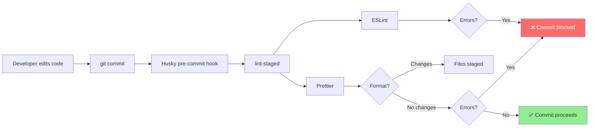
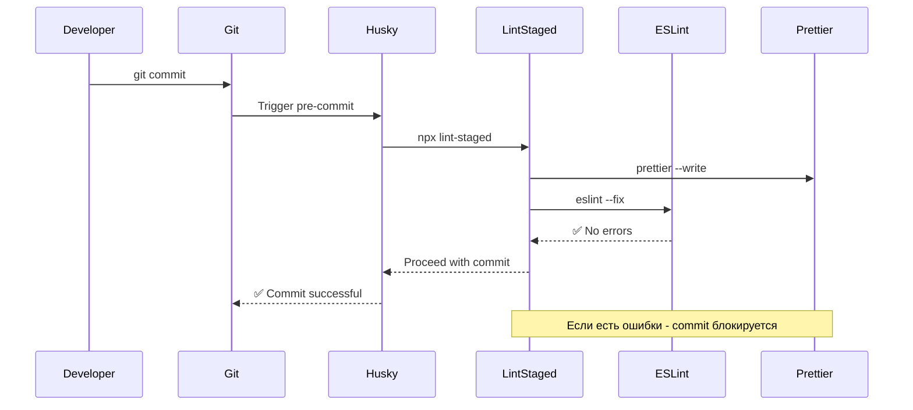

# Стиль кода и качество

**Версия:** 1.4\
**Дата:** 2026-02-09

---

## Краткое содержание

Этот документ описывает инструменты и правила для поддержания качества кода в проекте Python-TypeScript Wiki Frontend. Рассматриваются конфигурация ESLint, Prettier, Husky, lint-staged и процесс pre-commit проверки.

---

## Оглавление

1. [Обзор инструментов](#обзор-инструментов)
2. [ESLint](#eslint)
3. [Prettier](#prettier)
4. [Husky Git Hooks](#husky-git-hooks)
5. [lint-staged](#lint-staged)
6. [Отключение правил](#отключение-правил)

---

## Обзор инструментов

| Инструмент | Назначение | Когда запускается |
|------------|-----------|-------------------|
| **ESLint** | Линтинг кода, поиск ошибок | `npm run lint`, pre-commit (`lint-staged`) |
| **Prettier** | Форматирование кода | `npm run format`, pre-commit (`lint-staged`) |
| **Husky** | Git hooks | `pre-commit` при `git commit` |
| **lint-staged** | Проверка только изменённых файлов | Pre-commit |

### Связь инструментов



---

## ESLint

### Конфигурация

`eslint.config.js`:

```javascript
import js from '@eslint/js';
import globals from 'globals';
import reactHooks from 'eslint-plugin-react-hooks';
import reactRefresh from 'eslint-plugin-react-refresh';
import tseslint from 'typescript-eslint';
import { defineConfig } from 'eslint/config';
import eslintConfigPrettier from 'eslint-config-prettier';

export default defineConfig([
  {
    ignores: [
      'dist',
      'node_modules',
      'build',
      'coverage',
      '.next',
      'e2e',
      'src/shared/orval-api',
    ],
  },
  {
    files: ['**/*.{js,mjs,cjs,ts,jsx,tsx}'],
    extends: [
      js.configs.recommended,
      tseslint.configs.recommended,
      reactHooks.configs['recommended-latest'],
      reactRefresh.configs.vite,
    ],
    languageOptions: {
      ecmaVersion: 2020,
      globals: {
        ...globals.browser,
        ...globals.es2020,
      },
    },
    rules: {
      'eol-last': ['error', 'always'],
      'no-unused-vars': 'off',
      '@typescript-eslint/no-unused-vars': [
        'warn',
        {
          argsIgnorePattern: '^_',
          varsIgnorePattern: '^_',
          caughtErrorsIgnorePattern: '^_',
        },
      ],
      'no-console': 'warn',
    },
  },
  eslintConfigPrettier,
]);
```

### Основные правила

| Правило | Уровень | Описание |
|---------|---------|----------|
| `eol-last` | `error` | Требует пустую строку в конце файла |
| `no-unused-vars` | `off` | Отключено (используем TS версия) |
| `@typescript-eslint/no-unused-vars` | `warn` | Предупреждает о неиспользуемых переменных |
| `no-console` | `warn` | Предупреждает о вызовах `console.*` |

### Игнорируемые директории

```javascript
ignores: [
  'dist',                    // Production build
  'node_modules',            // Зависимости
  'build',                   // Build артефакты
  'coverage',                // Отчёты о покрытии
  '.next',
  'e2e',                     // E2E тесты
  'src/shared/orval-api',    // Сгенерированный код
]
```

### Запуск ESLint

```bash
# Проверка всех файлов
npm run lint

# Автоисправление ошибок
npm run lint:fix

# Проверка конкретного файла
npx eslint src/pages/home/ui/HomePage.tsx

# Проверка с выводом в JSON
npx eslint src/ --format json
```

---

## Prettier

### Конфигурация

`.prettierrc`:

```json
{
  "semi": true,
  "singleQuote": true,
  "tabWidth": 2,
  "trailingComma": "es5",
  "printWidth": 80,
  "bracketSpacing": true,
  "endOfLine": "lf"
}
```

### Сбор правил

| Правило | Значение | Пример |
|---------|----------|--------|
| `semi` | `true` | Использовать точки с запятой |
| `singleQuote` | `true` | Одиночные кавычки для строк |
| `tabWidth` | `2` | 2 пробела для отступа |
| `trailingComma` | `es5` | Запятые в ES5 (там где допустимо) |
| `printWidth` | `80` | Макс. длина строки 80 символов |
| `bracketSpacing` | `true` | Пробелы в объектах: `{ a: 1 }` |
| `endOfLine` | `lf` | Unix стиль переноса строк |

### Пример форматирования

**Вход (до Prettier):**
```typescript
const user={name:"Ivan",age:25,roles:["admin","writer"]};
function getUser(user:{name:string,age:number,roles:string[]}){return user;}
```

**Выход (после Prettier):**
```typescript
const user = { name: 'Ivan', age: 25, roles: ['admin', 'writer'] };

function getUser(user: {
  name: string;
  age: number;
  roles: string[];
}) {
  return user;
}
```

### Запуск Prettier

```bash
# Проверка форматирования
npx prettier --check .

# Проверка форматирования через npm script
npm run format

# Форматирование всех файлов
npm run format:fix

# Форматирование конкретного файла
npx prettier --write src/pages/home/ui/HomePage.tsx

# Проверка без форматирования
npx prettier --list-different src/
```

---

## Husky Git Hooks

### Что такое Husky?

Husky запускает git hooks. В текущем проекте используется только `pre-commit`.

### Состояние в проекте

- В `package.json` есть скрипт `prepare: "husky"`.
- Хук `.husky/pre-commit` запускает `npx lint-staged`.

### Pre-commit hook

`.husky/pre-commit`:

```bash
npx lint-staged
```

**Примечание:** `lint-staged` автоматически запускает команды из масок `lint-staged` в `package.json` для staged файлов.

### Workflow



---

## lint-staged

### Что такое lint-staged?

lint-staged запускает линтеры только на файлах, которые были изменены (staged). Это ускоряет pre-commit проверку.

### Конфигурация

В `package.json`:

```json
{
  "lint-staged": {
    "*.{js,ts,jsx,tsx,mjs}": [
      "prettier --write",
      "eslint --fix --max-warnings=0 --no-warn-ignored"
    ],
    "*.{json,css,md,html}": [
      "prettier --write"
    ]
  }
}
```

### Что проверяется

| Расширение | Инструменты |
|------------|-------------|
| `*.{js,ts,jsx,tsx,mjs}` | Prettier + ESLint |
| `*.{json,css,md,html}` | Prettier |

---

## Отключение правил

### ESLint

В проекте встречаются локальные отключения правил ESLint. Примеры:

```typescript
// src/entities/space/ui/create-space-modal.tsx
// eslint-disable-next-line no-console
console.error('Failed to create space', error);
```

```typescript
// src/shared/orval-api/withToken/types/errorCodeType.ts
// eslint-disable-next-line @typescript-eslint/no-redeclare
```

```typescript
// src/shared/ui/button.tsx
// eslint-disable-next-line react-refresh/only-export-components
```

### Файлы, игнорируемые инструментами

В текущем проекте используются:
- `ignores` внутри `eslint.config.js`
- `lint-staged` маски в `package.json`

---

## Команды

| Команда | Описание |
|---------|----------|
| `npm run lint` | Проверка ESLint всех файлов |
| `npm run lint:fix` | Автоисправление ESLint |
| `npm run format` | Проверка форматирования (`prettier --check .`) |
| `npm run format:fix` | Форматирование Prettier всех файлов |
| `npx eslint src/file.ts` | Проверка конкретного файла |
| `npx prettier --write src/file.ts` | Форматирование конкретного файла |

---

## Полезные ссылки

- [ESLint Documentation](https://eslint.org/)
- [Prettier Documentation](https://prettier.io/)
- [Husky Documentation](https://typicode.github.io/husky/)
- [lint-staged Documentation](https://github.com/okonet/lint-staged)
