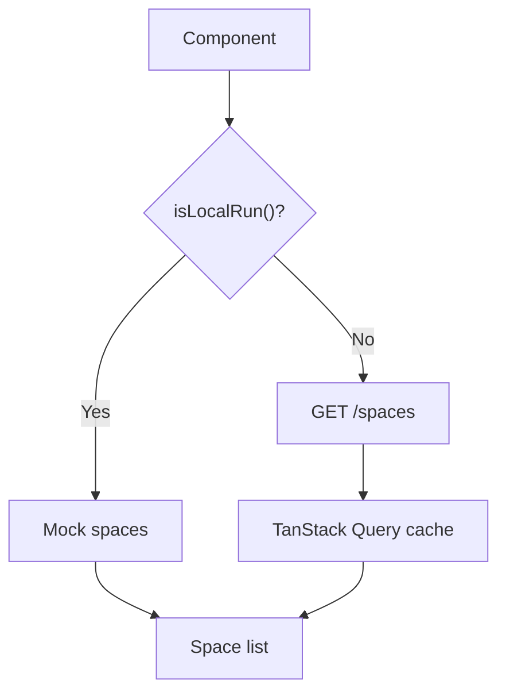

# Слой Entities

**Версия:** 1.3\
**Дата создания:** 2026-02-08\
**Дата обновления:** 2026-02-09

---

## Краткое содержание

Этот документ описывает слой `entities` в архитектуре Feature-Sliced Design (FSD) проекта Python-TypeScript Wiki Frontend. Рассматриваются назначение слоя, его структура, обзор сущностей (User, Space, Activity), их типы, API хуки, UI компоненты, Zod-схемы и тесты (где они действительно есть), а также паттерны для создания новых сущностей.

---

## Оглавление

1. [Назначение и обязанности](#назначение-и-обязанности)
2. [Структура слоя](#структура-слоя)
3. [Сущность User](#сущность-user)
4. [Сущность Space](#сущность-space)
5. [Сущность Activity](#сущность-activity)
6. [Best practices](#best-practices)
7. [Создание новых сущностей](#создание-новых-сущностей)

---

## Назначение и обязанности

Слой `entities` — это уровень приложения, который содержит бизнес-сущности предметной области. Сущности инкапсулируют данные и базовые операции вокруг конкретного бизнес-объекта.

**Обязанности:**
- Типы данных (TypeScript interfaces/types)
- Валидация данных (Zod схемы, где требуется)
- API хуки/функции доступа к данным (TanStack Query/`fetchWithToken`)
- UI компоненты для отображения сущности
- Локальные тесты модели (если есть в сущности)

**Правила:**
- ✅ Сущность может включать только необходимые части (например, только `model + ui`)
- ✅ Переиспользование на нескольких страницах и фичах
- ✅ Типы и API остаются близко к сущности
- ❌ Не содержать сценарную бизнес-логику уровня user-flow (вынести в features)
- ❌ Не содержать составные UI (вынести в widgets)

**Отличия от features:**
- **Entities** — бизнес-сущности (типы, API, UI)
- **Features** — бизнес-логика и интерактивность

---

## Структура слоя

```
entities/
├── user/
│   ├── model/
│   │   ├── types.ts
│   │   ├── schema.ts
│   │   └── __tests__/
│   │       └── user.test.ts
│   └── index.ts
├── space/
│   ├── model/
│   │   └── types.ts
│   ├── api/
│   │   ├── useSpaces.ts
│   │   ├── useSpace.ts
│   │   └── create-space.ts
│   ├── ui/
│   │   ├── SpaceCard.tsx
│   │   └── create-space-modal.tsx
│   └── index.ts
└── activity/
    ├── model/
    │   └── types.ts
    ├── ui/
    │   └── ActivityItem.tsx
    └── index.ts
```

### Назначение файлов

| Файл | Назначение |
|------|-----------|
| `entities/*/model/types.ts` | Типы сущности (TypeScript) |
| `entities/*/model/schema.ts` | Zod-схема валидации (опционально, по необходимости) |
| `entities/*/model/__tests__/` | Юнит-тесты модели (опционально) |
| `entities/*/api/` | API вызовы и/или хуки TanStack Query (опционально) |
| `entities/*/ui/` | UI-компоненты для сущности (опционально) |
| `entities/*/index.ts` | Публичные экспорты сущности |

---

## Сущность User

### Типы

**Файл:** `entities/user/model/types.ts`

**Назначение:** Типы данных пользователя.

**Реализация:**

```typescript
import { z } from 'zod';
import { userDataSchema } from './schema';

export type UserData = z.infer<typeof userDataSchema>;

export const userRoles = {
  admin: 'admin',
  writer: 'writer',
  reader: 'reader',
} as const;

export type UserRole = (typeof userRoles)[keyof typeof userRoles];

export const isUserRole = (value: string): value is UserRole =>
  Object.values(userRoles).includes(value as UserRole);

export interface User {
  id: string;
  username: string;
}

export interface SpaceUser extends User {
  role: UserRole;
}
```

**Роли пользователей:**

| Роль | Код | Описание |
|------|-----|----------|
| **admin** | `userRoles.admin` | Значение роли `admin` |
| **writer** | `userRoles.writer` | Значение роли `writer` |
| **reader** | `userRoles.reader` | Значение роли `reader` |

### Zod схема валидации

**Файл:** `entities/user/model/schema.ts`

**Назначение:** Валидация данных пользователя при получении от API.

**Реализация:**

```typescript
import { z } from 'zod';

export const userDataSchema = z.object({
  username: z.string(),
  telegram_id: z.number(),
  first_name: z.string().optional(),
  last_name: z.string().optional(),
  photo_url: z.url().optional(),
  created_at: z.number(),
  permission: z.string().optional(),
});
```

**Поля схемы:**

| Поле | Тип | Обязательно | Описание |
|------|-----|-----------|----------|
| `username` | `string` | ✅ | Имя пользователя |
| `telegram_id` | `number` | ✅ | Telegram ID |
| `first_name` | `string` | ❌ | Имя |
| `last_name` | `string` | ❌ | Фамилия |
| `photo_url` | `string (URL)` | ❌ | Ссылка на фото |
| `created_at` | `number` | ✅ | Дата создания (timestamp) |
| `permission` | `string` | ❌ | Разрешения пользователя |

### Юнит тесты

**Файл:** `entities/user/model/__tests__/user.test.ts`

**Назначение:** Тестирование Zod схемы валидации.

**Реализация (ключевые тесты):**

```typescript
import { describe, it, expect } from 'vitest';
import { userDataSchema } from '../schema';
import type { UserData } from '../types';

describe('User Schema Validation', () => {
  it('should validate a correct user object', () => {
    const name = 'ivan123';
    const validUser = {
      username: name,
      telegram_id: 12345678,
      first_name: 'Ivan',
      last_name: 'Ivanov',
      photo_url: 'https://ivanovich.com/photo.jpg',
      created_at: 1672531200,
      permission: 'admin',
    };

    const result = userDataSchema.safeParse(validUser);
    expect(result.success).toBe(true);

    if (result.success) {
      const userData: UserData = result.data;
      expect(userData.username).toBe(name);
    }
  });

  it('should validate a user with only required fields', () => {
    const minimalUser = {
      username: 'ivan123',
      telegram_id: 87654321,
      created_at: 1672531200,
    };

    const result = userDataSchema.parse(minimalUser);
    expect(result).toMatchObject(minimalUser);
  });

  it('should fail validation if required fields are missing', () => {
    const invalidUser = {
      username: 'Vasiliy',
      created_at: 1672531200,
    };

    const result = userDataSchema.safeParse(invalidUser);
    expect(result.success).toBe(false);

    if (!result.success) {
      expect(result.error.issues[0].path).toContain('telegram_id');
    }
  });

  it('should fail validation with incorrect data types', () => {
    const invalidUser = {
      username: 'Vasiliy',
      telegram_id: 'not-a-number',
      created_at: 'now',
    };

    const result = userDataSchema.safeParse(invalidUser);
    expect(result.success).toBe(false);

    if (!result.success) {
      const paths = result.error.issues.map((i) => i.path[0]);
      expect(paths).toContain('telegram_id');
      expect(paths).toContain('created_at');
    }
  });
});
```

**Тестовые сценарии:**
1. ✅ Валидация правильного объекта пользователя
2. ✅ Валидация объекта с только обязательными полями
3. ❌ Провал валидации при отсутствии обязательных полей
4. ✅ Успешный `parse` и присвоение типу `UserData`
5. ❌ Провал валидации при неправильных типах данных
6. ❌ Провал валидации при неверном URL для `photo_url`
7. ✅ Демонстрация типа, выведенного из Zod схемы

---

## Сущность Space

### Типы

**Файл:** `entities/space/model/types.ts`

**Назначение:** Типы данных пространства и статьи.

**Реализация:**

```typescript
export interface Space {
  id: string;
  name: string;
  role: string;
  is_deleted: boolean;
  deleted_at: string | null;
}

export interface Article {
  id: string;
  name: string;
  created_at: string;
}
```

**Поля типов:**

| Поле | Тип | Описание |
|------|-----|----------|
| `Space.id` | `string` | ID пространства |
| `Space.name` | `string` | Название пространства |
| `Space.role` | `string` | Роль пользователя в пространстве |
| `Space.is_deleted` | `boolean` | Удалено ли пространство |
| `Space.deleted_at` | `string | null` | Дата удаления |
| `Article.id` | `string` | ID статьи |
| `Article.name` | `string` | Название статьи |
| `Article.created_at` | `string` | Дата создания |

### API хуки

**Файл:** `entities/space/api/useSpaces.ts`

**Назначение:** Хук для получения списка всех пространств.

**Реализация:**

```typescript
import { useQuery } from '@tanstack/react-query';
import { fetchWithToken } from '@/shared/lib/fetch-mutator';
import type { Space } from '../model/types';
import { isLocalRun } from '@/shared/lib/environment';
import { getMockSpaces } from '@/shared/mock/spaceMocks';

interface SpacesResponse {
  items: Space[];
}

interface SpacesResponseSuccess {
  data: SpacesResponse;
  status: number;
  headers: Headers;
}

export function useSpaces() {
  return useQuery<Space[]>({
    queryKey: ['spaces'],
    queryFn: async () => {
      if (isLocalRun()) {
        return getMockSpaces();
      }

      const { data } = await fetchWithToken<SpacesResponseSuccess>('/spaces');
      return data.items;
    },
  });
}
```

**Поток данных:**



**Ключевые элементы:**
- **Переключение mock/real:** Через `isLocalRun()`
- **Mock данные:** `getMockSpaces()` из `shared/mock/spaceMocks.ts`
- **API запрос:** `fetchWithToken()` из `shared/lib/fetch-mutator.ts`
- **Кэширование:** TanStack Query с `queryKey: ['spaces']`
- **Создание пространства:** `createSpace()` выполняет `POST /api/v1/spaces` без mock-ветки в `entities/space/api/create-space.ts`

**API хуки:**

| Хук | Назначение | Конечная точка |
|------|-----------|---------------|
| `useSpaces()` | Получение списка пространств | `GET /spaces` |
| `useSpace(spaceId)` | Получение одного пространства | `GET /spaces/{spaceId}` |
| `createSpace(name)` | Создание пространства (используется в `CreateSpaceModal`) | `POST /api/v1/spaces` |

В текущей реализации `useSpace(spaceId)` возвращает объект формата `{ id, name, articles }` (тип `SpaceResponse` внутри хука).

### UI компоненты

#### SpaceCard

**Файл:** `entities/space/ui/SpaceCard.tsx`

**Назначение:** Карточка пространства с названием и кнопкой настроек.

**Реализация:**

```typescript
import { Settings } from 'lucide-react';
import { Card } from '@/shared/ui';
import { Link } from '@tanstack/react-router';
import { ROUTES } from '@/shared/lib';
import type { Space } from '../model/types';

interface SpaceCardProps {
  space: Space;
  onSettingsClick?: () => void;
}

export function SpaceCard({ space, onSettingsClick }: SpaceCardProps) {
  return (
    <Card className="group flex flex-row justify-between p-4 hover:bg-muted/50 transition-colors">
      <Link
        to={ROUTES.SPACE}
        params={{ spaceId: space.id }}
        className="cursor-pointer font-medium flex-1"
      >
        {space.name}
      </Link>
      <button
        className="opacity-100 hover:opacity-50 transition-opacity p-1 hover:bg-muted rounded cursor-pointer"
        onClick={(e) => {
          e.preventDefault();
          e.stopPropagation();
          onSettingsClick?.();
        }}
      >
        <Settings className="size-4 text-muted-foreground" />
      </button>
    </Card>
  );
}
```

**Ключевые элементы:**
- **Название:** Ссылка на страницу пространства
- **Кнопка настроек:** Иконка Settings (зубчатое колесо)
- **Интерактивность:** Hover эффекты, переход по клику

#### CreateSpaceModal

**Файл:** `entities/space/ui/create-space-modal.tsx`

**Назначение:** Модальное окно создания нового пространства.

**Реализация (ключевые части):**

```typescript
import { useState } from 'react';
import { useMutation, useQueryClient } from '@tanstack/react-query';
import {
  Dialog,
  DialogContent,
  DialogHeader,
  DialogTitle,
  Input,
  Button,
} from '@/shared/ui';
import { createSpace } from '../api/create-space';

interface CreateSpaceModalProps {
  isOpen: boolean;
  onOpenChange: (open: boolean) => void;
}

export function CreateSpaceModal({
  isOpen,
  onOpenChange,
}: CreateSpaceModalProps) {
  const [name, setName] = useState('');
  const isNameValid = name.trim().length >= 3;
  const queryClient = useQueryClient();

  const createSpaceMutation = useMutation({
    mutationFn: (spaceName: string) => createSpace(spaceName),
    onSuccess: () => {
      queryClient.invalidateQueries({ queryKey: ['spaces'] });
      onOpenChange(false);
      setName('');
    },
    onError: (error) => {
      // eslint-disable-next-line no-console
      console.error('Failed to create space', error);
    },
  });

  const handleSave = () => {
    if (!isNameValid) return;
    createSpaceMutation.mutate(name);
  };

  return (
    <Dialog open={isOpen} onOpenChange={onOpenChange}>
      <DialogContent className="max-w-xl p-6">
        <DialogHeader className="mb-4">
          <DialogTitle className="text-xl font-semibold">
            Создать новое пространство
          </DialogTitle>
        </DialogHeader>
        <div className="flex items-center gap-4 w-full">
          <Input
            value={name}
            onChange={(e) => setName(e.target.value)}
            placeholder="Название пространства"
            className={`flex-1`}
          />
          <Button
            onClick={handleSave}
            disabled={createSpaceMutation.isPending || !isNameValid}
            size="form"
          >
            Сохранить
          </Button>
        </div>
      </DialogContent>
    </Dialog>
  );
}
```

**Ключевые элементы:**
- **Валидация:** Минимум 3 символа в названии
- **Мутация:** `createSpaceMutation` для создания пространства
- **Инвалидация кэша:** `queryClient.invalidateQueries({ queryKey: ['spaces'] })`
- **Закрытие:** После успешного создания или при закрытии модального окна

Примечание: в текущем проекте `CreateSpaceModal` не экспортируется из `entities/space/index.ts` и импортируется напрямую из `@/entities/space/ui/create-space-modal`.

---

## Сущность Activity

### Типы

**Файл:** `entities/activity/model/types.ts`

**Назначение:** Типы данных активности пользователя.

**Реализация:**

```typescript
export interface Activity {
  id: string;
  pageTitle: string;
  visitedAt: string;
}
```

**Поля типа:**

| Поле | Тип | Описание |
|------|-----|----------|
| `Activity.id` | `string` | ID активности |
| `Activity.pageTitle` | `string` | Заголовок страницы |
| `Activity.visitedAt` | `string` | Текст времени посещения (например, "Посещено 2 часа назад") |

### UI компоненты

#### ActivityItem

**Файл:** `entities/activity/ui/ActivityItem.tsx`

**Назначение:** Карточка активности с заголовком страницы и временем посещения.

**Реализация:**

```typescript
import { Card } from '@/shared/ui';
import type { Activity } from '../model/types';

interface ActivityItemProps {
  activity: Activity;
}

export function ActivityItem({ activity }: ActivityItemProps) {
  return (
    <Card className="p-4 cursor-pointer hover:bg-muted/50 transition-colors">
      <h4 className="font-semibold text-foreground">{activity.pageTitle}</h4>
      <p className="text-sm text-muted-foreground mt-1">{activity.visitedAt}</p>
    </Card>
  );
}
```

**Ключевые элементы:**
- **Заголовок:** Название страницы
- **Время:** Текст времени посещения
- **Интерактивность:** Hover эффекты

---

## Best practices

### Разделение ответственности

| Компонент | Слой | Ответственность |
|-----------|------|-------------------|
| **SpaceCard** | entities | UI для пространства |
| **CreateSpaceModal** | entities | Создание пространства |
| **EditSpaceModal** | features | Редактирование пространства |
| **Dialog** | shared | Компонент модального окна |
| **Button** | shared | Переиспользуемый UI компонент |

### Структура сущности

**Правило:** Структура сущности должна быть минимально достаточной для её задач.

```typescript
// ✅ Правильно
entities/
├── user/
│   ├── model/
│   └── index.ts
└── space/
    ├── model/
    ├── api/
    ├── ui/
    └── index.ts
```

### API хуки с переключением mock/real

**Правило:** API хуки должны автоматически переключаться между mock и real API.

```typescript
// ✅ Правильно
export function useSpaces() {
  return useQuery<Space[]>({
    queryKey: ['spaces'],
    queryFn: async () => {
      if (isLocalRun()) {
        return getMockSpaces();
      }

      const { data } = await fetchWithToken<SpacesResponseSuccess>('/spaces');
      return data.items;
    },
  });
}
```

### Zod валидация

**Правило:** Используйте Zod для runtime-валидации там, где это действительно нужно.

В текущем проекте Zod-схема в слое `entities` реализована для `user` (`entities/user/model/schema.ts`), а не для всех сущностей.

```typescript
// ✅ Правильно
import { z } from 'zod';

export const userDataSchema = z.object({
  username: z.string(),
  telegram_id: z.number(),
  // ...
});

// Использование
const result = userDataSchema.safeParse(apiData);
if (!result.success) {
  // Обработка ошибки
}
```

---

## Создание новых сущностей

Ниже шаблон, собранный по текущим паттернам `user`, `space`, `activity`.

### Шаг 1: Соберите минимальную структуру

```bash
src/entities/<entity>/
├── model/
│   └── types.ts
├── api/                         # опционально, если у сущности есть запросы (как в space)
│   ├── use<Entities>.ts
│   └── use<Entity>.ts
├── ui/                          # опционально, если у сущности есть UI (как в space/activity)
│   └── <Entity>Card.tsx
├── model/schema.ts              # опционально, если нужна runtime-валидация (как в user)
├── model/__tests__/             # опционально, если есть тесты модели (как в user)
│   └── <entity>.test.ts
└── index.ts
```

### Шаг 2: Опишите типы в `model/types.ts`

```typescript
export interface Entity {
  id: string;
  name: string;
}
```

### Шаг 3: (Опционально) добавьте Zod-схему

```typescript
import { z } from 'zod';

export const entitySchema = z.object({
  id: z.string(),
  name: z.string(),
});
```

### Шаг 4: (Опционально) добавьте API хук по паттерну `space/api/*`

```typescript
import { useQuery } from '@tanstack/react-query';
import { fetchWithToken } from '@/shared/lib/fetch-mutator';
import { isLocalRun } from '@/shared/lib/environment';
import type { Entity } from '../model/types';

interface EntitiesResponse {
  items: Entity[];
}

interface EntitiesResponseSuccess {
  data: EntitiesResponse;
  status: number;
  headers: Headers;
}

export function useEntities() {
  return useQuery<Entity[]>({
    queryKey: ['entities'],
    queryFn: async () => {
      if (isLocalRun()) {
        return [];
      }

      const { data } =
        await fetchWithToken<EntitiesResponseSuccess>('/<endpoint>');
      return data.items;
    },
  });
}
```

### Шаг 5: (Опционально) добавьте UI компонент по паттерну `SpaceCard`/`ActivityItem`

```typescript
import { Card } from '@/shared/ui';
import type { Entity } from '../model/types';

export function EntityCard({ entity }: { entity: Entity }) {
  return <Card className="p-4">{entity.name}</Card>;
}
```

### Шаг 6: Настройте публичные экспорты в `index.ts`

```typescript
export type { Entity } from './model/types';
export { EntityCard } from './ui/EntityCard';
export { useEntities } from './api/useEntities';
export { entitySchema } from './model/schema';
```

Используйте только те экспорты, для которых реально есть файлы (по аналогии с `entities/user/index.ts`, `entities/space/index.ts`, `entities/activity/index.ts`).

---

## Полезные ссылки

- [Feature-Sliced Design - Entities Layer](https://feature-sliced.design/docs/reference/layers#entities)
- [Zod Documentation](https://zod.dev/)
- [TanStack Query Documentation](https://tanstack.com/query/latest)
- [Vitest Documentation](https://vitest.dev/)
