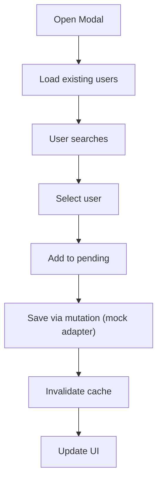
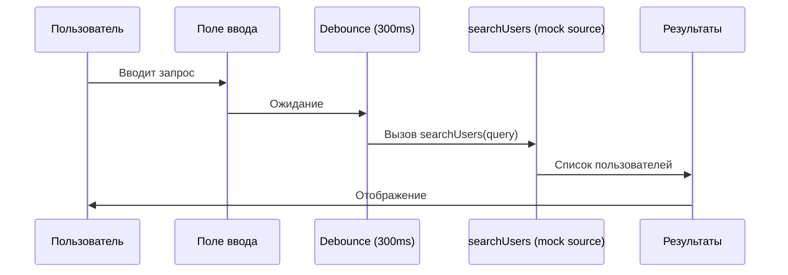
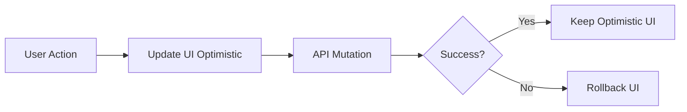

# Слой Features

**Версия:** 1.2\
**Дата создания:** 2026-02-08\
**Дата обновления:** 2026-02-09

---

## Краткое содержание

Этот документ описывает слой `features` в архитектуре Feature-Sliced Design (FSD) проекта Python-TypeScript Wiki Frontend. Рассматриваются назначение слоя, его структура, обзор фичи Edit Space (редактирование пространства), паттерны фич (модальные окна, формы, взаимодействия) и best practices для создания новых фич.

---

## Оглавление

1. [Назначение и обязанности](#назначение-и-обязанности)
2. [Структура слоя](#структура-слоя)
3. [Обзор фичи Edit Space](#обзор-фичи-edit-space)
4. [Паттерны фич](#паттерны-фич)
5. [Best practices](#best-practices)
6. [Добавление новых фич](#добавление-новых-фич)

---

## Назначение и обязанности

Слой `features` — это уровень приложения, который содержит бизнес-логику, интерактивность и сложные UI взаимодействия. Фичи — это законченные функциональные блоки, которые могут использоваться в нескольких местах приложения.

**Обязанности:**
- Бизнес-логика и состояние (state management)
- Модальные окна и формы
- Сложные UI взаимодействия
- Управление данными и событиями
- Интеграция нескольких сущностей (entities)

**Правила:**
- ✅ Бизнес-логика и интерактивность
- ✅ Интеграция нескольких entities
- ✅ Переиспользование на разных страницах
- ❌ Не содержать типы сущностей (вынести в entities)
- ❌ Не содержать переиспользуемые компоненты (вынести в shared)

**Отличия от entities:**
- **Entities** — бизнес-сущности (типы, API, UI для сущности)
- **Features** — бизнес-логика и интерактивность (редактирование, управление, формы)

---

## Структура слоя

```
features/
└── edit-space/
    ├── api/
    │   └── edit-space.ts
    ├── ui/
    │   ├── edit-space-modal.tsx
    │   ├── edit-space-users-list.tsx
    │   └── edit-space-user-search.tsx
    └── index.ts
```

### Назначение файлов

| Файл | Назначение |
|------|-----------|
| `features/edit-space/api/edit-space.ts` | Mock-адаптер данных для фичи (поиск/чтение пользователей, операции изменения пространства и участников) |
| `features/edit-space/ui/edit-space-modal.tsx` | Главный компонент модального окна редактирования |
| `features/edit-space/ui/edit-space-users-list.tsx` | Список существующих пользователей с ролями |
| `features/edit-space/ui/edit-space-user-search.tsx` | Поиск пользователей и добавление |
| `features/edit-space/index.ts` | Экспорт фичи |

Текущая реализация фичи использует типы из `entities` как через публичный API (`@/entities/user`), так и через прямые импорты из `@/entities/user/model/types.ts`.

В текущем проекте `EditSpaceModal` импортируется из `@/features/edit-space` и используется в `pages/home/ui/HomePage.tsx`.

---

## Обзор фичи Edit Space

### Назначение

Фича **Edit Space** — это модальное окно для редактирования пространства. Позволяет:

- Изменять название пространства
- Управлять пользователями (добавление, удаление, изменение ролей)
- Удалять пространство

Текущий API-слой фичи (`features/edit-space/api/edit-space.ts`) работает как mock-адаптер:
- поиск и чтение пользователей идут из `shared/mock/users.ts`
- операции изменения (`addUserToSpace`, `updateUserRole`, `removeUserFromSpace`, `updateSpace`, `deleteSpace`) возвращают stub-ответ `{ success: true }`

### Компоненты фичи

#### 1. EditSpaceModal

**Файл:** `features/edit-space/ui/edit-space-modal.tsx`

**Назначение:** Главный компонент модального окна редактирования.

**Реализация (ключевые части):**

```typescript
export function EditSpaceModal({
  space,
  isOpen,
  onOpenChange,
}: EditSpaceModalProps) {
  const [state, dispatch] = useReducer(reducer, {
    spaceName: space.name,
    searchQuery: '',
    foundUsers: [],
    pendingUsers: [],
  });

  // Мутации для обновления пространства
  const updateSpaceMutation = useMutation({
    mutationFn: (name: string) => updateSpace(space.id, name),
  });

  const addUserMutation = useMutation({
    mutationFn: (userId: string) => addUserToSpace(space.id, userId),
    onSuccess: (_, userId) => {
      queryClient.invalidateQueries({ queryKey: ['spaceUsers', space.id] });
      dispatch({ type: 'REMOVE_PENDING_USER', payload: userId });
    },
  });

  // Обработчики
  const handleSaveSpaceName = useCallback(() => {
    if (!state.spaceName || state.spaceName === space.name) return;
    updateSpaceMutation.mutate(state.spaceName);
  }, [state.spaceName, space.name, updateSpaceMutation]);

  const handleDeleteSpace = useCallback(() => {
    if (confirm('Вы уверены, что хотите удалить это пространство?')) {
      deleteSpaceMutation.mutate();
    }
  }, [deleteSpaceMutation]);

  return (
    <Dialog open={isOpen} onOpenChange={onOpenChange}>
      {/* Название и кнопка сохранения */}
      <Input
        value={state.spaceName}
        onChange={(e) => dispatch({ type: 'SET_SPACE_NAME', payload: e.target.value })}
        placeholder="Название пространства"
      />

      {/* Список пользователей */}
      <EditSpaceUsersList
        existingUsers={existingUsers}
        loadingUsers={loadingUsers}
        onRoleChange={handleRoleChange}
        onRemoveUser={handleRemoveUser}
      />

      {/* Поиск пользователей */}
      <EditSpaceUserSearch
        searchQuery={state.searchQuery}
        foundUsers={state.foundUsers}
        pendingUsers={state.pendingUsers}
        existingUsers={existingUsers}
        onSearchQueryChange={(query) => dispatch({ type: 'SET_SEARCH_QUERY', payload: query })}
        onSelectUser={handleSelectUser}
        onAddPendingUser={handleAddPendingUser}
      />

      {/* Кнопки действий */}
      <Button onClick={handleDeleteSpace} variant="destructive">
        Удалить
      </Button>
    </Dialog>
  );
}
```

**Ключевые элементы:**
- **State management:** Использует `useReducer` для сложного состояния
- **Оптимистичные обновления UI:** `onMutate`/`onError` для `updateRoleMutation` и `removeUserMutation`
- **Мутации:**
  - `updateSpaceMutation` — обновление названия
  - `addUserMutation` — добавление пользователя
  - `updateRoleMutation` — изменение роли
  - `removeUserMutation` — удаление пользователя
  - `deleteSpaceMutation` — удаление пространства

**State management (useReducer):**

```typescript
type State = {
  spaceName: string;
  searchQuery: string;
  foundUsers: User[];
  pendingUsers: User[];
};

type Action =
  | { type: 'SET_SPACE_NAME'; payload: string }
  | { type: 'SET_SEARCH_QUERY'; payload: string }
  | { type: 'SET_FOUND_USERS'; payload: User[] }
  | { type: 'ADD_PENDING_USER'; payload: User }
  | { type: 'REMOVE_PENDING_USER'; payload: string }
  | { type: 'CLEAR_SEARCH' }
  | { type: 'RESET'; payload: string };
```

**Поток данных:**



---

#### 2. EditSpaceUsersList

**Файл:** `features/edit-space/ui/edit-space-users-list.tsx`

**Назначение:** Отображение списка существующих пользователей с возможностью изменения ролей и удаления.

**Реализация (ключевые части):**

```typescript
export function EditSpaceUsersList({
  existingUsers,
  loadingUsers,
  onRoleChange,
  onRemoveUser,
}: EditSpaceUsersListProps) {
  return (
    <div className="flex flex-col gap-2 overflow-y-auto">
      <span className="text-sm text-gray-500 font-medium">Участники:</span>
      {loadingUsers ? (
        <div className="text-sm text-gray-400">Загрузка...</div>
      ) : (
        existingUsers.map((user) => (
          <div key={user.id} className="flex items-center justify-between rounded-sm">
            <span className="text-sm pl-2">@{user.username}</span>
            <div className="flex items-center gap-1">
              <Select
                value={user.role}
                onValueChange={(val) => {
                  if (isUserRole(val)) {
                    onRoleChange(user.id, val);
                  }
                }}
              >
                <SelectContent>
                  <SelectItem value={userRoles.admin}>Владелец</SelectItem>
                  <SelectItem value={userRoles.writer}>Запись</SelectItem>
                  <SelectItem value={userRoles.reader}>Чтение</SelectItem>
                </SelectContent>
              </Select>
              <Button onClick={() => onRemoveUser(user.id)}>
                <Minus className="h-2 w-2" />
              </Button>
            </div>
          </div>
        ))
      )}
    </div>
  );
}
```

**Ключевые элементы:**
- **Список пользователей:** Отображает всех пользователей пространства
- **Изменение роли:** Dropdown с ролями (Владелец, Запись, Чтение)
- **Удаление пользователя:** Кнопка с иконкой минус

**Роли пользователей:**
| Роль | Код | Описание |
|------|-----|----------|
| **admin** | `userRoles.admin` | Значение роли для пункта "Владелец" в селекте |
| **writer** | `userRoles.writer` | Значение роли для пункта "Запись" в селекте |
| **reader** | `userRoles.reader` | Значение роли для пункта "Чтение" в селекте |

---

#### 3. EditSpaceUserSearch

**Файл:** `features/edit-space/ui/edit-space-user-search.tsx`

**Назначение:** Поиск пользователей и добавление их в пространство.

**Реализация (ключевые части):**

```typescript
export function EditSpaceUserSearch({
  searchQuery,
  foundUsers,
  pendingUsers,
  existingUsers,
  onSearchQueryChange,
  onSelectUser,
  onAddPendingUser,
}: EditSpaceUserSearchProps) {
  return (
    <div className="flex flex-col gap-4">
      {/* Поле поиска */}
      <div className="relative">
        <Input
          value={searchQuery}
          onChange={(e) => onSearchQueryChange(e.target.value)}
          placeholder="Найти пользователя..."
        />

        {/* Результаты поиска */}
        {foundUsers.length > 0 && searchQuery && (
          <div className="absolute top-full left-0 right-0 mt-1 bg-white border rounded-md shadow-lg z-10">
            {foundUsers.map((user) => (
              <div
                key={user.id}
                className="px-3 py-2 hover:bg-gray-100 cursor-pointer"
                onClick={() => onSelectUser(user)}
              >
                @{user.username}
              </div>
            ))}
          </div>
        )}
      </div>

      {/* Выбранные пользователи */}
      <div className="flex flex-col gap-2">
        <span className="text-sm text-gray-500 font-medium">
          Выбранные пользователи:
        </span>
        {pendingUsers.map((user) => (
          <div className="flex items-center justify-between p-2 rounded-sm">
            <span className="text-sm">@{user.username}</span>
            {!existingUsers.some(
              (existingUser) => existingUser.id === user.id
            ) && (
              <Button onClick={() => onAddPendingUser(user)}>
                <Plus className="h-2 w-2" />
              </Button>
            )}
          </div>
        ))}
        {pendingUsers.length === 0 && (
          <span className="text-sm text-gray-400">Нет выбранных</span>
        )}
      </div>
    </div>
  );
}
```

**Ключевые элементы:**
- **Debounce 300ms:** Поиск с задержкой для оптимизации (реализован в `EditSpaceModal` через `setTimeout`)
- **Результаты поиска:** Dropdown со списком найденных пользователей
- **Ожидание добавления:** Пользователи добавляются в "Ожидающие" после выбора
- **Кнопка добавления:** Появляется, если пользователь ещё не добавлен

**Поток поиска:**



---

## Паттерны фич

### Паттерн 1: Фича с модальным окном

Фича с модальным окном — это законченный UI блок, который:

1. **Отображает содержимое** в диалоговом окне
2. **Управляет состоянием** (открыто/закрыто)
3. **Интегрируется** с несколькими entities

**Пример:**

```typescript
export function EditSpaceModal({ space, isOpen, onOpenChange }) {
  return (
    <Dialog open={isOpen} onOpenChange={onOpenChange}>
      {/* Компоненты из entities и shared */}
      <EntityUI />
      <FeatureUI />
    </Dialog>
  );
}
```

### Паттерн 2: Фича с формой

Фича с формой — это UI блок, который:

1. **Собирает данные** из полей ввода
2. **Валидирует** данные перед отправкой
3. **Отправляет** на API через мутацию
4. **Обрабатывает** ошибки и успех

**Пример:**

```typescript
export function EditSpaceModal({ space, isOpen, onOpenChange }) {
  const [state, dispatch] = useReducer(reducer, initialState);

  const handleSave = useCallback(() => {
    if (!isValid(state)) return;
    saveMutation.mutate(state);
  }, [state, saveMutation]);

  return (
    <Dialog open={isOpen} onOpenChange={onOpenChange}>
      <Input
        value={state.spaceName}
        onChange={(e) => dispatch({ type: 'SET_SPACE_NAME', payload: e.target.value })}
      />
      <Button onClick={handleSave}>Сохранить</Button>
    </Dialog>
  );
}
```

### Паттерн 3: Фича с оптимистичными обновлениями

Фича с оптимистичными обновлениями UI — это фича, которая:

1. **Обновляет UI мгновенно** (optimistic update)
2. **Откатывает изменения** при ошибке
3. **При необходимости** инвалидирует кэш (например, `addUserMutation` в текущем коде)

**Пример:**

```typescript
import type { SpaceUser } from '@/entities/user/model/types.ts';
import type { UserRole } from '@/entities/user';

const updateRoleMutation = useMutation({
  mutationFn: ({ userId, role }: { userId: string; role: UserRole }) =>
    updateUserRole(space.id, userId, role),
  onMutate: async ({ userId, role }) => {
    await queryClient.cancelQueries({ queryKey: ['spaceUsers', space.id] });
    const previous = queryClient.getQueryData(['spaceUsers', space.id]);

    queryClient.setQueryData<SpaceUser[]>(['spaceUsers', space.id], (old) =>
      old?.map((u) => (u.id === userId ? { ...u, role } : u))
    );

    return { previous };
  },
  onError: (_, __, context) => {
    if (context?.previous) {
      queryClient.setQueryData(['spaceUsers', space.id], context.previous);
    }
  },
});
```

**Поток данных:**



---

## Best practices

### Разделение ответственности

| Компонент | Слой | Ответственность |
|-----------|------|-------------------|
| **EditSpaceModal** | features | Логика редактирования пространства |
| **SpaceUser** | entities | Тип пользователя |
| **Space** | entities | Тип пространства, передаваемый в `EditSpaceModal` |
| **Dialog** | shared | Компонент модального окна |

### State management в фичах

**Правило:** Используйте `useReducer` для сложного состояния фичи.

```typescript
// ✅ Правильно
const [state, dispatch] = useReducer(reducer, initialState);

// ❌ Неправильно (несколько useState)
const [spaceName, setSpaceName] = useState('');
const [searchQuery, setSearchQuery] = useState('');
const [foundUsers, setFoundUsers] = useState([]);
```

### Оптимистичные обновления

**Правило:** Используйте optimistic updates для быстрого UI.

```typescript
import type { SpaceUser } from '@/entities/user/model/types.ts';

// ✅ Правильно
const removeUserMutation = useMutation({
  mutationFn: (userId: string) => removeUserFromSpace(space.id, userId),
  onMutate: async (userId) => {
    await queryClient.cancelQueries({ queryKey: ['spaceUsers', space.id] });
    const previous = queryClient.getQueryData(['spaceUsers', space.id]);

    queryClient.setQueryData<SpaceUser[]>(['spaceUsers', space.id], (old) =>
      old?.filter((u) => u.id !== userId)
    );

    return { previous };
  },
  onError: (_, __, context) => {
    if (context?.previous) {
      queryClient.setQueryData(['spaceUsers', space.id], context.previous);
    }
  },
});
```

### Работа с API

**Правило:** Используйте функции API из `features/api/` как адаптер данных для фичи.

```typescript
// ✅ Правильно
import { updateSpace } from '../api/edit-space';

export function EditSpaceModal({ space }) {
  const updateSpaceMutation = useMutation({
    mutationFn: (name: string) => updateSpace(space.id, name),
  });
}

// ❌ Неправильно (прямой вызов API)
import { fetchWithToken } from '@/shared/lib/fetch-mutator';

export function EditSpaceModal({ space }) {
  const handleSave = async () => {
    await fetchWithToken(`/spaces/${space.id}`, {
      method: 'PATCH',
      body: JSON.stringify({ name: 'New Name' }),
    });
  };
}
```

---

## Добавление новых фич

### Шаг 1: Создайте папку фичи

```bash
# Пример: создание фичи "Create Article"
src/features/create-article/
├── api/
│   └── create-article.ts
├── ui/
│   └── create-article-modal.tsx
└── index.ts
```

### Шаг 2: Реализуйте API вызовы

```typescript
// features/create-article/api/create-article.ts
import { fetchWithToken } from '@/shared/lib/fetch-mutator';

export function createArticle(spaceId: string, article: CreateArticleInput) {
  return fetchWithToken(`/spaces/${spaceId}/articles`, {
    method: 'POST',
    headers: { 'Content-Type': 'application/json' },
    body: JSON.stringify(article),
  });
}
```

### Шаг 3: Реализуйте компонент фичи

```typescript
// features/create-article/ui/create-article-modal.tsx
import { useState } from 'react';
import { Dialog, Input, Button } from '@/shared/ui';
import { useMutation } from '@tanstack/react-query';
import { createArticle } from '../api/create-article';

export function CreateArticleModal({ spaceId, isOpen, onOpenChange }) {
  const [title, setTitle] = useState('');
  const [content, setContent] = useState('');

  const createMutation = useMutation({
    mutationFn: (payload: { title: string; content: string }) =>
      createArticle(spaceId, payload),
    onSuccess: () => {
      onOpenChange(false);
      setTitle('');
      setContent('');
    },
  });

  const handleCreate = () => {
    if (!title || !content) return;
    createMutation.mutate({ title, content });
  };

  return (
    <Dialog open={isOpen} onOpenChange={onOpenChange}>
      <Input
        value={title}
        onChange={(e) => setTitle(e.target.value)}
        placeholder="Название статьи"
      />
      <Button onClick={handleCreate}>Создать</Button>
    </Dialog>
  );
}
```

### Шаг 4: Экспортируйте фичу

```typescript
// features/create-article/index.ts
export { CreateArticleModal } from './ui/create-article-modal';
export { createArticle } from './api/create-article';
```

### Шаг 5: Используйте фичу в странице

```typescript
// pages/space/ui/SpacePage.tsx
import { CreateArticleModal } from '@/features/create-article';
import { useState } from 'react';

export function SpacePage() {
  const [isCreateModalOpen, setIsCreateModalOpen] = useState(false);

  return (
    <DashboardLayout>
      <div>
        <h1>Страница пространства</h1>
        <Button onClick={() => setIsCreateModalOpen(true)}>
          Создать статью
        </Button>
      </div>
      <CreateArticleModal
        spaceId={spaceId}
        isOpen={isCreateModalOpen}
        onOpenChange={setIsCreateModalOpen}
      />
    </DashboardLayout>
  );
}
```

---

## Полезные ссылки

- [Feature-Sliced Design - Features Layer](https://feature-sliced.design/docs/reference/layers#features)
- [TanStack Query - Optimistic Updates](https://tanstack.com/query/latest/docs/framework/react/guides/optimistic-updates)
- [React Hooks - useReducer](https://react.dev/reference/react/useReducer)
- [React Component Patterns](https://reactpatterns.com/)
