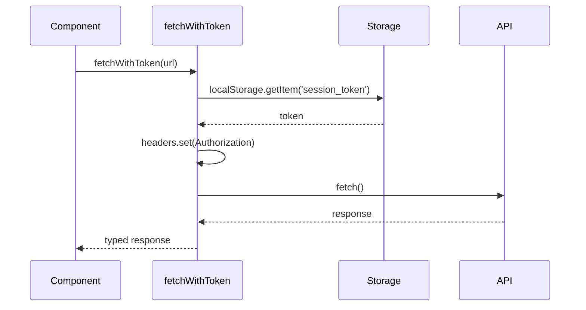

# Слой Shared

**Версия:** 1.2\
**Дата создания:** 2026-02-08\
**Дата обновления:** 2026-02-09

---

## Краткое содержание

Этот документ описывает слой `shared` в архитектуре Feature-Sliced Design (FSD) проекта Python-TypeScript Wiki Frontend. Рассматриваются назначение слоя, его структура, обзор UI компонентов (Button, Dialog, Input, Select, Alert, Card, DropdownMenu, MorphingButton), утилит (auth-utils, constants, environment, fetch-mutator, query-client, routes, utils), mock данные и Orval API клиент.

---

## Оглавление

1. [Назначение и обязанности](#назначение-и-обязанности)
2. [Структура слоя](#структура-слоя)
3. [UI компоненты](#ui-компоненты)
4. [Утилиты](#утилиты)
5. [Mock данные](#mock-данные)
6. [Orval API клиент](#orval-api-клиент)
7. [Best practices](#best-practices)
8. [Добавление новых компонентов](#добавление-новых-компонентов)

---

## Назначение и обязанности

Слой `shared` — это уровень приложения, который содержит переиспользуемые компоненты, утилиты и общие ресурсы для всех слоёв (app, pages, widgets, features, entities).

**Обязанности:**
- Переиспользуемые UI компоненты (Button, Dialog, Input и т.д.)
- Утилиты общего назначения (helpers, utils)
- Константы и конфигурации
- Mock данные для локальной разработки
- API клиент (Orval)

**Правила:**
- ✅ Переиспользование во всех слоях
- ✅ Максимальная универсальность компонентов
- ✅ Минимальные зависимости
- ❌ Не содержать бизнес-логику (вынести в features)
- ❌ Не содержать типы сущностей (вынести в entities)

Примечание по текущему коду: в `shared/mock/` есть типизация через импорты из `entities` (например `shared/mock/users.ts`), это фактическая особенность текущей реализации.

**Отличия от layers:**
- **Shared** — универсальные компоненты и утилиты
- **Widgets** — составные UI блоки уровня страницы
- **Features** — бизнес-логика и интерактивность
- **Entities** — бизнес-сущности

---

## Структура слоя

```
shared/
├── index.ts                       # Публичный API shared-слоя
├── ui/                           # Переиспользуемые UI компоненты
│   ├── button.tsx
│   ├── dialog.tsx
│   ├── input.tsx
│   ├── select.tsx
│   ├── alert.tsx
│   ├── card.tsx
│   ├── dropdown-menu.tsx
│   ├── morphing-button.tsx
│   └── index.ts
├── lib/                           # Утилиты
│   ├── auth-utils.ts
│   ├── constants.ts
│   ├── environment.ts
│   ├── fetch-mutator.ts
│   ├── query-client.ts
│   ├── routes.ts
│   ├── utils.ts
│   └── index.ts
├── mock/                          # Mock данные
│   ├── activityMocks.ts
│   ├── spaceMocks.ts
│   ├── users.ts                   # Используется напрямую из feature edit-space
│   └── index.ts                   # Экспортирует activity + space
└── orval-api/                     # API клиент (сгенерированный Orval)
    └── withToken/
```

### Назначение папок

| Папка | Назначение |
|-------|-----------|
| `shared/index.ts` | Корневой public API shared-слоя |
| `shared/ui/` | Переиспользуемые UI компоненты |
| `shared/lib/` | Утилиты общего назначения |
| `shared/mock/` | Mock данные для локальной разработки |
| `shared/orval-api/` | API клиент (сгенерированный Orval) |

---

## UI компоненты

### Button

**Файл:** `shared/ui/button.tsx`

**Назначение:** Переиспользуемый компонент кнопки с разными вариантами стилей.

**Реализация (ключевые части):**

```typescript
import * as React from 'react';
import { Slot } from '@radix-ui/react-slot';
import { cva, type VariantProps } from 'class-variance-authority';
import { cn } from '@/shared/lib/utils';

const buttonVariants = cva(
  "inline-flex items-center justify-center gap-2 whitespace-nowrap rounded-md text-sm font-medium transition-all cursor-pointer disabled:pointer-events-none disabled:opacity-50",
  {
    variants: {
      variant: {
        default: 'bg-primary text-primary-foreground hover:bg-primary/90',
        auth: 'bg-secondary-800 text-primary-foreground hover:bg-secondary-700',
        destructive: 'bg-destructive text-white hover:bg-destructive/80',
        outline: 'border bg-background hover:bg-accent',
        secondary: 'bg-secondary text-primary-foreground hover:bg-secondary/80',
        ghost: 'hover:bg-accent',
        link: 'text-primary underline',
      },
      size: {
        default: 'h-9 px-4 py-2',
        sm: 'h-8 px-3',
        lg: 'h-10 px-6',
        form: 'h-10 px-4',
        icon: 'size-9',
        'icon-sm': 'size-8',
        'icon-lg': 'size-10',
      },
    },
    defaultVariants: {
      variant: 'default',
      size: 'default',
    },
  }
);

function Button({
  className,
  variant = 'default',
  size = 'default',
  asChild = false,
  ...props
}: React.ComponentProps<'button'> &
  VariantProps<typeof buttonVariants> & {
    asChild?: boolean;
  }) {
  const Comp = asChild ? Slot : 'button';

  return (
    <Comp
      data-slot="button"
      className={cn(buttonVariants({ variant, size, className }))}
      {...props}
    />
  );
}
```

**Варианты кнопки:**

| Вариант | Стиль | Использование |
|---------|-------|--------------|
| `default` | Основная кнопка | Основные действия |
| `auth` | Кнопка авторизации | На странице авторизации |
| `destructive` | Кнопка удаления | Опасные действия (удаление) |
| `outline` | Контурная кнопка | Вторичные действия |
| `secondary` | Вторичная кнопка | Вторичные действия |
| `ghost` | Фон кнопка | Вторичные действия |
| `link` | Ссылка | Навигация |

**Размеры кнопки:**

| Размер | Высота | Использование |
|--------|--------|--------------|
| `default` | `h-9` | По умолчанию |
| `sm` | `h-8` | Компактные кнопки |
| `lg` | `h-10` | Крупные кнопки |
| `form` | `h-10` | Формы |
| `icon` | `size-9` | Кнопки с иконкой |
| `icon-sm` | `size-8` | Маленькие иконки |
| `icon-lg` | `size-10` | Крупные иконки |

**Примеры использования:**

```typescript
<Button>Нажми меня</Button>
<Button variant="destructive">Удалить</Button>
<Button size="lg">Крупная кнопка</Button>
<Button variant="outline" size="sm">Маленькая</Button>
```

**CVA (Class Variance Authority):**

Использует CVA для типобезопасного управления вариантами и размерами кнопки.

```typescript
const buttonVariants = cva(
  "base-classes",
  {
    variants: {
      variant: {
        default: 'bg-primary',
        secondary: 'bg-secondary',
      },
      size: {
        default: 'h-9',
        sm: 'h-8',
      },
    },
  }
);
```

---

### Dialog

**Файл:** `shared/ui/dialog.tsx`

**Назначение:** Переиспользуемый компонент модального окна из shadcn/ui (использует Radix UI под капотом).

**Реализация (ключевые части):**

```typescript
import * as React from 'react';
import * as DialogPrimitive from '@radix-ui/react-dialog';
import { cn } from '@/shared/lib/utils';

const Dialog = DialogPrimitive.Root;
const DialogTrigger = DialogPrimitive.Trigger;
const DialogPortal = DialogPrimitive.Portal;
const DialogClose = DialogPrimitive.Close;

const DialogOverlay = React.forwardRef<
  React.ElementRef<typeof DialogPrimitive.Overlay>,
  React.ComponentPropsWithoutRef<typeof DialogPrimitive.Overlay>
>(({ className, ...props }, ref) => (
  <DialogPrimitive.Overlay
    ref={ref}
    className={cn(
      'fixed inset-0 z-50 bg-white/50 data-[state=open]:animate-in data-[state=closed]:animate-out',
      className
    )}
    {...props}
  />
));

const DialogContent = React.forwardRef<
  React.ElementRef<typeof DialogPrimitive.Content>,
  React.ComponentPropsWithoutRef<typeof DialogPrimitive.Content>
>(({ className, children, onEscapeKeyDown, ...props }, ref) => (
  <DialogPortal>
    <DialogOverlay />
    <DialogPrimitive.Content
      ref={ref}
      onEscapeKeyDown={(event) => {
        event.preventDefault();
        onEscapeKeyDown?.(event);
      }}
      className={cn(
        'fixed left-[50%] top-[50%] z-50 grid w-full max-w-lg translate-x-[-50%] translate-y-[-50%]',
        className
      )}
      {...props}
    >
      {children}
    </DialogPrimitive.Content>
  </DialogPortal>
));
```

**Компоненты:**

| Компонент | Назначение |
|-----------|-----------|
| `Dialog` | Корневой компонент |
| `DialogTrigger` | Триггер открытия |
| `DialogPortal` | Портал для рендеринга |
| `DialogClose` | Программное/встроенное закрытие |
| `DialogOverlay` | Задний фон |
| `DialogContent` | Содержимое окна |
| `DialogHeader` | Заголовок |
| `DialogFooter` | Нижняя часть |
| `DialogTitle` | Название |
| `DialogDescription` | Описание |

**Пример использования (иллюстративный):**

```typescript
import {
  Dialog,
  DialogContent,
  DialogHeader,
  DialogTitle,
} from '@/shared/ui';

export function MyModal({ isOpen, onClose }) {
  return (
    <Dialog open={isOpen} onOpenChange={onClose}>
      <DialogContent>
        <DialogHeader>
          <DialogTitle>Модальное окно</DialogTitle>
        </DialogHeader>
        <p>Содержимое модального окна</p>
      </DialogContent>
    </Dialog>
  );
}
```

---

### Input

**Файл:** `shared/ui/input.tsx`

**Назначение:** Переиспользуемый компонент поля ввода.

**Реализация:**

```typescript
import * as React from 'react';
import { cn } from '@/shared/lib/utils';

function Input({ className, type, ...props }: React.ComponentProps<'input'>) {
  return (
    <input
      type={type}
      data-slot="input"
      className={cn(
        'h-10 w-full min-w-0 rounded-md border px-3 py-2 text-base',
        'focus-visible:border-primary focus-visible:ring-ring/50 focus-visible:ring-0',
        className
      )}
      {...props}
    />
  );
}

export { Input };
```

**Пример использования:**

```typescript
import { Input } from '@/shared/ui';

export function MyForm() {
  return (
    <div className="space-y-4">
      <Input placeholder="Имя пользователя" />
      <Input type="password" placeholder="Пароль" />
    </div>
  );
}
```

---

### Select

**Файл:** `shared/ui/select.tsx`

**Назначение:** Переиспользуемый компонент выпадающего списка из shadcn/ui (использует Radix UI под капотом).

**Реализация (ключевые части):**

```typescript
import * as React from 'react';
import * as SelectPrimitive from '@radix-ui/react-select';
import { Check, ChevronDown, ChevronUp } from 'lucide-react';
import { cn } from '@/shared/lib/utils';

const Select = SelectPrimitive.Root;
const SelectTrigger = React.forwardRef<
  React.ElementRef<typeof SelectPrimitive.Trigger>,
  React.ComponentPropsWithoutRef<typeof SelectPrimitive.Trigger>
>(({ className, children, ...props }, ref) => (
  <SelectPrimitive.Trigger
    ref={ref}
    className={cn('flex h-10 w-full items-center justify-between', className)}
  >
    {children}
    <SelectPrimitive.Icon asChild>
      <ChevronDown className="h-4 w-4 opacity-50" />
    </SelectPrimitive.Icon>
  </SelectPrimitive.Trigger>
));

const SelectContent = React.forwardRef<
  React.ElementRef<typeof SelectPrimitive.Content>,
  React.ComponentPropsWithoutRef<typeof SelectPrimitive.Content>
>(({ className, children, position = 'popper', ...props }, ref) => (
  <SelectPrimitive.Portal>
    <SelectPrimitive.Content
      ref={ref}
      className={cn('relative z-50 max-h-96 overflow-hidden rounded-md border', className)}
      position={position}
      {...props}
    >
      <SelectScrollUpButton />
      <SelectPrimitive.Viewport>
        {children}
      </SelectPrimitive.Viewport>
      <SelectScrollDownButton />
    </SelectPrimitive.Content>
  </SelectPrimitive.Portal>
));

const SelectItem = React.forwardRef<
  React.ElementRef<typeof SelectPrimitive.Item>,
  React.ComponentPropsWithoutRef<typeof SelectPrimitive.Item>
>(({ className, children, ...props }, ref) => (
  <SelectPrimitive.Item
    ref={ref}
    className={cn('relative flex w-full cursor-default select-none items-center', className)}
    {...props}
  >
    <span className="absolute left-2 flex h-3.5 w-3.5 items-center justify-center">
      <SelectPrimitive.ItemIndicator>
        <Check className="h-4 w-4" />
      </SelectPrimitive.ItemIndicator>
    </span>
    <SelectPrimitive.ItemText>{children}</SelectPrimitive.ItemText>
  </SelectPrimitive.Item>
));
```

**Пример использования:**

```typescript
import {
  Select,
  SelectContent,
  SelectItem,
  SelectTrigger,
  SelectValue,
} from '@/shared/ui';

export function MySelect() {
  return (
    <Select>
      <SelectTrigger>
        <SelectValue placeholder="Выберите опцию" />
      </SelectTrigger>
      <SelectContent>
        <SelectItem value="option1">Опция 1</SelectItem>
        <SelectItem value="option2">Опция 2</SelectItem>
        <SelectItem value="option3">Опция 3</SelectItem>
      </SelectContent>
    </Select>
  );
}
```

---

### Alert

**Файл:** `shared/ui/alert.tsx`

**Назначение:** Переиспользуемый компонент уведомления с разными вариантами (default, destructive).

**Реализация (ключевые части):**

```typescript
import * as React from 'react';
import { cva, type VariantProps } from 'class-variance-authority';
import { cn } from '@/shared/lib/utils';

const alertVariants = cva(
  'relative w-full rounded-lg border px-4 py-3 text-sm',
  {
    variants: {
      variant: {
        default: 'bg-card text-card-foreground',
        destructive: 'text-destructive bg-card',
      },
    },
    defaultVariants: {
      variant: 'default',
    },
  }
);

function Alert({
  className,
  variant,
  ...props
}: React.ComponentProps<'div'> & VariantProps<typeof alertVariants>) {
  return (
    <div role="alert" className={cn(alertVariants({ variant }), className)} {...props} />
  );
}
```

**Пример использования:**

```typescript
import { Alert, AlertTitle, AlertDescription } from '@/shared/ui';

export function MyAlert() {
  return (
    <Alert variant="destructive">
      <AlertTitle>Ошибка!</AlertTitle>
      <AlertDescription>Что-то пошло не так.</AlertDescription>
    </Alert>
  );
}
```

---

### Card

**Файл:** `shared/ui/card.tsx`

**Назначение:** Переиспользуемый компонент карточки для отображения контента.

**Реализация (ключевые части):**

```typescript
import * as React from 'react';
import { cn } from '@/shared/lib/utils';

function Card({ className, ...props }: React.ComponentProps<'div'>) {
  return (
    <div
      data-slot="card"
      className={cn(
        'bg-card text-card-foreground flex flex-col gap-6 rounded-xl border py-6 shadow-sm',
        className
      )}
      {...props}
    />
  );
}

function CardHeader({ className, ...props }: React.ComponentProps<'div'>) {
  return (
    <div
      data-slot="card-header"
      className={cn(
        '@container/card-header grid auto-rows-min grid-rows-[auto_auto] items-start gap-2 px-6',
        className
      )}
      {...props}
    />
  );
}

function CardTitle({ className, ...props }: React.ComponentProps<'div'>) {
  return (
    <div data-slot="card-title" className={cn('leading-none font-semibold', className)} {...props} />
  );
}

function CardDescription({ className, ...props }: React.ComponentProps<'div'>) {
  return (
    <div data-slot="card-description" className={cn('text-sm text-muted-foreground', className)} {...props} />
  );
}
```

**Пример использования:**

```typescript
import { Card, CardHeader, CardTitle, CardDescription } from '@/shared/ui';

export function MyCard() {
  return (
    <Card className="w-full">
      <CardHeader>
        <CardTitle>Заголовок карточки</CardTitle>
        <CardDescription>Описание карточки</CardDescription>
      </CardHeader>
    </Card>
  );
}
```

---

### DropdownMenu

**Файл:** `shared/ui/dropdown-menu.tsx`

**Назначение:** Переиспользуемый компонент выпадающего меню.

**Пример использования:**

```typescript
import {
  DropdownMenu,
  DropdownMenuContent,
  DropdownMenuItem,
  DropdownMenuTrigger,
} from '@/shared/ui';

export function MyMenu() {
  return (
    <DropdownMenu>
      <DropdownMenuTrigger>Меню</DropdownMenuTrigger>
      <DropdownMenuContent>
        <DropdownMenuItem>Профиль</DropdownMenuItem>
        <DropdownMenuItem>Настройки</DropdownMenuItem>
        <DropdownMenuItem>Выход</DropdownMenuItem>
      </DropdownMenuContent>
    </DropdownMenu>
  );
}
```

---

### MorphingButton

**Файл:** `shared/ui/morphing-button.tsx`

**Назначение:** Анимированная кнопка, которая морфится в список действий.

**Реализация (ключевые части):**

```typescript
interface MorphingButtonAction {
  label: string;
  icon?: React.ReactNode;
  onClick: () => void;
  className?: string;
  variant?: React.ComponentProps<typeof Button>['variant'];
  size?: React.ComponentProps<typeof Button>['size'];
}

interface MorphingButtonProps {
  triggerLabel: string;
  triggerIcon?: React.ReactNode;
  triggerClassName?: string;
  triggerVariant?: React.ComponentProps<typeof Button>['variant'];
  triggerSize?: React.ComponentProps<typeof Button>['size'];
  actions: MorphingButtonAction[];
  containerClassName?: string;
}

export function MorphingButton({
  triggerLabel,
  triggerIcon,
  triggerClassName,
  triggerVariant = 'default',
  triggerSize = 'default',
  actions,
  containerClassName,
}: MorphingButtonProps) {
  const [isExpanded, setIsExpanded] = React.useState(false);
  const [isCollapsing, setIsCollapsing] = React.useState(false);
  const [showActions, setShowActions] = React.useState(false);
  const containerRef = React.useRef<HTMLDivElement>(null);

  const handleTriggerClick = () => {
    setIsExpanded(true);
    setIsCollapsing(false);
    setTimeout(() => {
      setShowActions(true);
    }, 500);
  };

  const handleActionClick = (action: MorphingButtonAction) => {
    action.onClick();
    setIsCollapsing(true);
    setTimeout(() => {
      setShowActions(false);
      setTimeout(() => {
        setIsExpanded(false);
        setIsCollapsing(false);
      }, 50);
    }, 200);
  };

  return (
    <div ref={containerRef} className={cn('relative', containerClassName)}>
      {/* Trigger Button */}
      <div style={{ opacity: isExpanded ? 0 : 1 }}>
        <Button onClick={handleTriggerClick} variant={triggerVariant} size={triggerSize} className={cn(triggerClassName)}>
          {triggerIcon}
          {triggerLabel}
        </Button>
      </div>

      {/* Action Buttons */}
      {showActions && (
        <div className="absolute top-0 right-0 flex flex-row gap-2">
          {actions.map((action, index) => (
            <Button
              key={index}
              onClick={() => handleActionClick(action)}
              variant={action.variant ?? triggerVariant}
              size={action.size ?? triggerSize}
              className={cn(action.className || triggerClassName)}
            >
              {action.icon}
              {action.label}
            </Button>
          ))}
        </div>
      )}
    </div>
  );
}
```

**Пример использования:**

```typescript
import { MorphingButton } from '@/shared/ui';

export function MyHeader() {
  const [isCreateSpaceOpen, setIsCreateSpaceOpen] = React.useState(false);

  return (
    <MorphingButton
      triggerLabel="+ Создать"
      actions={[
        {
          label: 'Пространство',
          icon: <FolderOpen className="size-4" />,
          onClick: () => setIsCreateSpaceOpen(true),
        },
        {
          label: 'Страницу',
          icon: <FileText className="size-4" />,
          onClick: () => console.log('Create page'),
        },
      ]}
    />
  );
}
```

---

## Утилиты

### auth-utils.ts

**Файл:** `shared/lib/auth-utils.ts`

**Назначение:** Управление сессией авторизации.

**Основные функции:**

| Функция | Назначение |
|----------|-----------|
| `setSessionToken(token, expiresAt)` | Сохранение токена и срока действия в localStorage |
| `getSessionToken()` | Получение токена (null, если истёк или отсутствует) |
| `clearSessionToken()` | Удаление токена (logout или истечение) |
| `isAuthenticated()` | Проверка авторизации |
| `saveRedirectUrl(url)` | Сохранение URL для редиректа после логина |
| `getRedirectUrl()` | Получение URL для редиректа (по умолчанию /home) |
| `clearRedirectUrl()` | Удаление URL редиректа |
| `requireAuth(currentPath)` | Route guard — редирект на /auth, если не авторизован |

`requireAuth(currentPath)` в текущей реализации сначала проверяет `FEATURE_AUTH_BYPASS`; если флаг включен, редирект не выполняется.

**Пример использования:**

```typescript
import { setSessionToken, getSessionToken, isAuthenticated } from '@/shared/lib/auth-utils';

// Сохранение токена после успешной авторизации
setSessionToken('session_token_123', '2026-02-08T14:00:00Z');

// Проверка авторизации
if (isAuthenticated()) {
  const token = getSessionToken(); // Получение токена
}
```

---

### constants.ts

**Файл:** `shared/lib/constants.ts`

**Назначение:** Константы для ключей localStorage/sessionStorage.

**Константы:**

```typescript
export const SESSION_TOKEN_KEY = 'session_token';
export const SESSION_EXPIRES_KEY = 'session_expires_at';
export const REDIRECT_URL_KEY = 'auth_redirect_url';
```

---

### environment.ts

**Файл:** `shared/lib/environment.ts`

**Назначение:** Переменные окружения и функция `isLocalRun()`.

**Константы:**

```typescript
export const FEATURE_AUTH_BYPASS = import.meta.env.VITE_BYPASS_AUTH === 'true';
export const APP_ID = import.meta.env.VITE_SSO_APP_ID;
export const BASE_URL = import.meta.env.VITE_API_BASE_URL;
const APP_ENV = import.meta.env.VITE_APP_ENV || 'local';

export const isLocalRun = () => APP_ENV === 'local';
```

**Функция `isLocalRun()`:**

Возвращает `true`, если приложение запущено в локальном окружении. Используется для переключения между mock и real API.

**Пример использования:**

```typescript
import { isLocalRun } from '@/shared/lib/environment';

if (isLocalRun()) {
  // Используем mock данные
} else {
  // Используем real API
}
```

---

### fetch-mutator.ts

**Файл:** `shared/lib/fetch-mutator.ts`

**Назначение:** Функция для выполнения fetch запросов с автоматическим добавлением Bearer токена.

**Реализация:**

```typescript
import { BASE_URL } from '@/shared/lib';

export const fetchWithToken = async <
  T extends { data: unknown; status: number; headers: Headers },
>(
  url: string,
  options?: RequestInit
): Promise<T> => {
  const token =
    typeof window !== 'undefined'
      ? localStorage.getItem('session_token')
      : null;

  const headers = new Headers(options?.headers);

  if (token) {
    headers.set('Authorization', `Bearer ${token}`);
  }

  const newOptions: RequestInit = {
    ...options,
    headers,
  };

  const urlObj = new URL(url, BASE_URL);
  const res = await fetch(urlObj.toString(), newOptions);

  // Handle empty responses (204, 205, 304)
  const body = [204, 205, 304].includes(res.status) ? null : await res.text();
  const data = body ? JSON.parse(body) : {};

  if (!res.ok) {
    throw data;
  }

  return {
    data,
    status: res.status,
    headers: res.headers,
  } as T;
};
```

**Поток данных:**



---

### query-client.ts

**Файл:** `shared/lib/query-client.ts`

**Назначение:** Конфигурация TanStack Query Client.

**Реализация:**

```typescript
import { QueryClient } from '@tanstack/react-query';

export const queryClient = new QueryClient({
  defaultOptions: {
    queries: {
      refetchOnWindowFocus: false,
      retry: 3,
      staleTime: 60 * 1000, // 1 минута
    },
  },
});
```

**Конфигурация:**

| Настройка | Значение | Описание |
|-----------|---------|----------|
| `refetchOnWindowFocus` | `false` | Отключено для оптимизации |
| `retry` | `3` | 3 попытки при ошибке |
| `staleTime` | `60000` | Время до устаревания данных (1 минута) |

---

### routes.ts

**Файл:** `shared/lib/routes.ts`

**Назначение:** Константы маршрутов.

**Константы:**

```typescript
export const ROUTES = {
  HOME: '/',
  AUTH: '/auth',
  TOKEN_PAGE: '/token',
  HOME_PAGE: '/home',
  HOME_EMPTY: '/home-empty',
  SPACE: '/space/$spaceId',
} as const;
```

**Пример использования:**

```typescript
import { ROUTES } from '@/shared/lib';

<Link to={ROUTES.HOME}>Главная</Link>
<Link to={ROUTES.SPACE} params={{ spaceId: '123' }}>Пространство</Link>
```

---

### utils.ts

**Файл:** `shared/lib/utils.ts`

**Назначение:** Утилиты общего назначения (например, `cn` для слияния Tailwind классов).

**Реализация:**

```typescript
import { type ClassValue, clsx } from 'clsx';
import { twMerge } from 'tailwind-merge';

export function cn(...inputs: ClassValue[]) {
  return twMerge(clsx(inputs));
}
```

**Пример использования:**

```typescript
import { cn } from '@/shared/lib/utils';

<div className={cn('base-class', isActive && 'active-class')}>...</div>
```

---

## Mock данные

### activityMocks.ts

**Файл:** `shared/mock/activityMocks.ts`

**Назначение:** Mock данные для активности пользователя.

**Реализация:**

```typescript
import type { Activity } from '@/entities/activity';

export const mockActivities: Activity[] = [
  {
    id: '1',
    pageTitle: 'Страница с крутой информацией',
    visitedAt: 'Посещено 2 часа назад',
  },
  {
    id: '2',
    pageTitle: 'Страница с крутой информацией',
    visitedAt: 'Посещено 2 часа назад',
  },
];
```

### spaceMocks.ts

**Файл:** `shared/mock/spaceMocks.ts`

**Назначение:** Mock данные для пространств и статей.

**Реализация:**

```typescript
import type { Space } from '@/entities/space/model/types';
import type { Article } from '@/entities/space/model/types';

export const mockSpaces: Space[] = [
  {
    id: '1',
    name: 'Local Space 1',
    role: 'owner',
    is_deleted: false,
    deleted_at: null,
  },
  {
    id: '2',
    name: 'Local Space 2',
    role: 'member',
    is_deleted: false,
    deleted_at: null,
  },
  {
    id: '3',
    name: 'Local Space 3',
    role: 'viewer',
    is_deleted: false,
    deleted_at: null,
  },
];

export const mockArticles: Article[] = [
  {
    id: 'art-1',
    name: 'Introduction to Wiki',
    created_at: '2024-01-20T12:00:00Z',
  },
  {
    id: 'art-2',
    name: 'Getting Started Guide',
    created_at: '2024-01-21T15:30:00Z',
  },
  {
    id: 'art-3',
    name: 'Advanced Tips & Tricks',
    created_at: '2024-01-22T09:15:00Z',
  },
];

export const getMockSpaces = (): Space[] => mockSpaces;

export const getMockSpace = (spaceId: string) => {
  const mocks = mockSpaces.map((space) => ({
    id: space.id,
    name: space.name,
    articles: mockArticles,
  }));
  
  const mockValue = mocks.find((space) => space.id === spaceId);
  if (!mockValue) {
    throw new Error('Space not found');
  }
  return mockValue;
};
```

### users.ts

**Файл:** `shared/mock/users.ts`

**Назначение:** Mock данные для пользователей.

**Реализация:**

```typescript
import {
  type SpaceUser,
  type User,
  userRoles,
} from '@/entities/user/model/types.ts';

export const MOCK_ALL_USERS: User[] = [
  { id: '1', username: 'john_doe' },
  { id: '2', username: 'jane_smith' },
  { id: '3', username: 'bob_wilson' },
  // ... остальные пользователи
];

export const MOCK_SPACE_USERS: Record<string, SpaceUser[]> = {
  default: [
    { id: '1', username: 'john_doe', role: userRoles.admin },
    { id: '2', username: 'jane_smith', role: userRoles.writer },
    { id: '8', username: 'frank_ocean', role: userRoles.reader },
    { id: '9', username: 'grace_hopper', role: userRoles.reader },
    // ... остальные пользователи
  ],
};
```

---

## Orval API клиент

**Папка:** `shared/orval-api/withToken/`

**Назначение:** Сгенерированный API клиент из OpenAPI спецификации с помощью Orval.

Файлы внутри `shared/orval-api/withToken/` автогенерируемые, их не редактируют вручную.

**Структура:**

```
shared/orval-api/withToken/
├── api/
│   ├── auth/
│   │   ├── auth.ts (API вызовы авторизации)
│   │   └── auth.zod.ts (Zod схемы для авторизации)
│   └── default/
│       ├── default.ts (API вызовы по умолчанию)
│       └── default.zod.ts (Zod схемы)
├── types/
│   ├── errorResponseType.ts
│   ├── errorCodeType.ts
│   └── ... (другие типы)
└── index.ts
```

**Ключевые особенности:**

1. **Type-safe API клиент** — все вызовы типобезопасны
2. **Zod схемы** — схемы генерируются рядом с API-кодом и доступны для runtime-проверок при необходимости
3. **TanStack Query интеграция** — хуки для запросов и мутаций
4. **Единый mutator для запросов** — Orval использует `fetchWithToken` (Bearer-токен + `BASE_URL`)

**Пример использования:**

```typescript
import { useVerifyTokenTokenPost } from '@/shared/orval-api/withToken';

export function TokenPage() {
  const verifyMutation = useVerifyTokenTokenPost({
    mutation: {
      onSuccess: (data) => {
        // Обработка успешной верификации
        console.log('Token verified', data);
      },
      onError: (error) => {
        // Обработка ошибки
        console.error('Verification failed', error);
      },
    },
  });

  const handleVerify = () => {
    verifyMutation.mutate({ data: { token: 'some_token' } });
  };

  return <button onClick={handleVerify}>Верифицировать</button>;
}
```

---

## Best practices

### Разделение ответственности

| Компонент | Слой | Ответственность |
|-----------|------|-------------------|
| **Button** | shared | Переиспользуемый UI компонент |
| **Dialog** | shared | Переиспользуемый модальный компонент |
| **SpaceCard** | entities | UI для пространства |
| **EditSpaceModal** | features | Логика редактирования |

### Создание UI компонентов

**Правило:** UI компоненты должны быть максимально универсальными и переиспользуемыми.

```typescript
// ✅ Правильно (универсальный компонент)
export function Button({ variant, size, children, ...props }) {
  return (
    <button className={cn(buttonVariants({ variant, size }))} {...props}>
      {children}
    </button>
  );
}

// ❌ Неправильно (зависит от бизнес-логики)
export function SpaceButton({ spaceId }) {
  return (
    <button onClick={() => navigateToSpace(spaceId)}>
      {spaceId}
    </button>
  );
}
```

### Работа с утилитами

**Правило:** Утилиты должны быть максимально универсальными и переиспользуемыми.

```typescript
// ✅ Правильно (универсальная утилита)
export function cn(...inputs) {
  return twMerge(clsx(inputs));
}

// ❌ Неправильно (зависит от бизнес-логики)
export function getSpaceUrl(spaceId: string) {
  return `/api/spaces/${spaceId}`;
}
```

---

## Добавление новых компонентов

### Шаг 1: Создайте компонент

```bash
# Пример: создание компонента "Badge"
src/shared/ui/
├── badge.tsx
└── index.ts
```

### Шаг 2: Реализуйте компонент

```typescript
// shared/ui/badge.tsx
import * as React from 'react';
import { cva } from 'class-variance-authority';
import { cn } from '@/shared/lib/utils';

const badgeVariants = cva(
  'inline-flex items-center rounded-full px-2.5 py-0.5 text-xs font-medium',
  {
    variants: {
      variant: {
        default: 'bg-primary text-primary-foreground',
        secondary: 'bg-secondary text-secondary-foreground',
        destructive: 'bg-destructive text-destructive-foreground',
      },
    },
    defaultVariants: {
      variant: 'default',
    },
  }
);

interface BadgeProps extends React.HTMLAttributes<HTMLDivElement> {
  variant?: 'default' | 'secondary' | 'destructive';
}

export function Badge({ variant = 'default', className, ...props }: BadgeProps) {
  return (
    <div className={cn(badgeVariants({ variant }), className)} {...props} />
  );
}
```

### Шаг 3: Экспортируйте компонент

```typescript
// shared/ui/index.ts
// Добавьте экспорт нового компонента в существующий файл
export { Badge } from './badge';
```

### Шаг 4: Используйте компонент

```typescript
import { Badge } from '@/shared/ui';

export function MyComponent() {
  return (
    <>
      <Badge variant="default">Default Badge</Badge>
      <Badge variant="secondary">Secondary Badge</Badge>
      <Badge variant="destructive">Destructive Badge</Badge>
    </>
  );
}
```

---

## Полезные ссылки

- [Feature-Sliced Design - Shared Layer](https://feature-sliced.design/docs/reference/layers#shared)
- [Radix UI Documentation](https://www.radix-ui.com/)
- [Tailwind CSS Documentation](https://tailwindcss.com/docs)
- [Class Variance Authority (CVA)](https://cva.style/docs)
- [Orval Documentation](https://orval.dev/)
