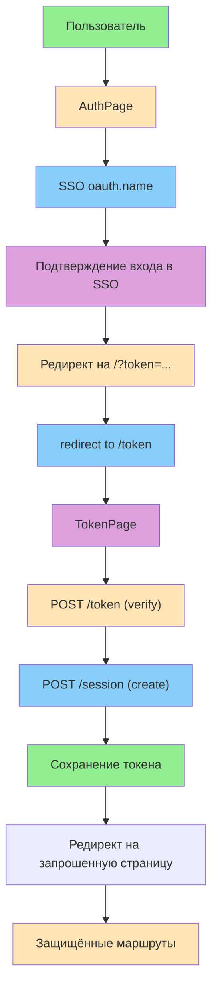
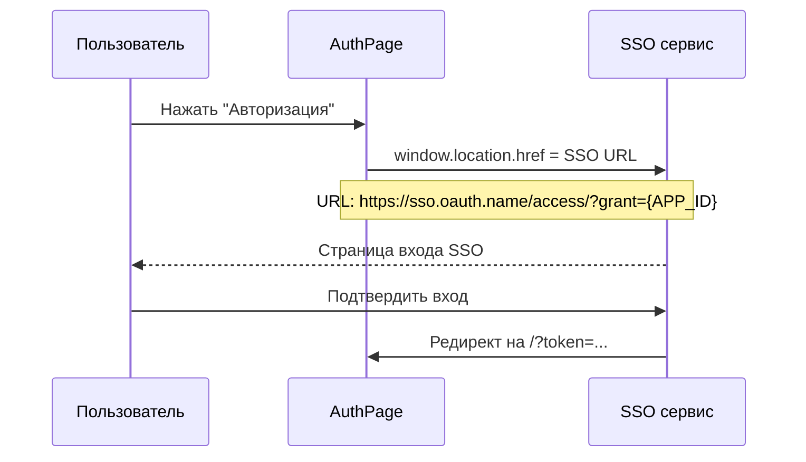
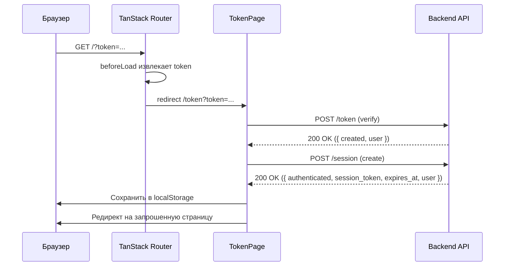
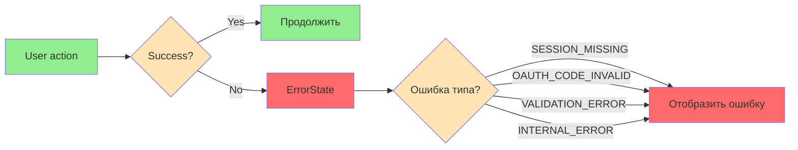

# Поток авторизации

**Версия:** 2.1\
**Дата создания:** 2026-02-08\
**Дата обновления:** 2026-02-09

---

## Краткое содержание

Этот документ описывает полный поток авторизации в проекте Python-TypeScript Wiki Frontend. Рассматриваются интеграция с SSO `oauth.name`, верификация токена, создание сессии, управление токеном, защита маршрутов и обработка ошибок.

---

## Оглавление

1. [Обзор потока авторизации](#обзор-потока-авторизации)
2. [SSO OAuth (oauth.name)](#sso-oauth-oauthname)
3. [Верификация токена](#верификация-токена)
4. [Создание сессии](#создание-сессии)
5. [Управление токеном](#управление-токеном)
6. [Защита маршрутов](#защита-маршрутов)
7. [Обработка ошибок](#обработка-ошибок)

---

## Обзор потока авторизации

### Полный цикл авторизации



### Ключевые этапы

1. **SSO OAuth** — Пользователь нажимает "Авторизация" и перенаправляется на SSO сервис
2. **Верификация** — SSO возвращает токен, который верифицируется на бэкенде
3. **Создание сессии** — После успешной верификации создаётся сессия
4. **Хранение** — Токен и срок действия сохраняются в `localStorage`
5. **Защита маршрутов** — Защищённые маршруты требуют наличия валидного токена (если `FEATURE_AUTH_BYPASS` не включен)

---

## SSO OAuth (oauth.name)

### 1. AuthPage — страница авторизации

**Файл:** `src/pages/auth/ui/AuthPage.tsx`

**Назначение:** Страница авторизации с кнопкой входа через SSO `oauth.name`.

**Реализация:**

```typescript
import { Button } from '@/shared/ui';
import { APP_ID } from '@/shared/lib';

/**
 * Build SSO login URL
 * In DEV: use local proxy that adds Referer header
 * In PROD: direct to oauth.name (browser sends correct Referer)
 */
function getSsoLoginUrl(): string {
  // Production: direct request (Referer matches registered domain)
  return `https://sso.oauth.name/access/?grant=${APP_ID}`;
}

export function AuthPage() {
  const handleLogin = () => {
    window.location.href = getSsoLoginUrl();
  };

  return (
    <div className="min-h-screen flex items-center justify-center bg-white px-4">
      <div className="flex flex-col items-center gap-8">
        {/* Logo and Title */}
        <div className="flex items-center gap-3 sm:gap-4">
          <span className="text-5xl sm:text-6xl md:text-7xl leading-none">
            🧠
          </span>
          <h1 className="text-3xl sm:text-5xl md:text-6xl font-normal text-black whitespace-nowrap">
            База Знаний
          </h1>
        </div>

        {/* Auth Button */}
        <Button variant="auth" size="form" onClick={handleLogin}>
          🔓 Авторизация
        </Button>
      </div>
    </div>
  );
}
```

**Поток работы:**



**Ключевые элементы:**
- **SSO URL:** `https://sso.oauth.name/access/?grant={APP_ID}`
- **Перенаправление:** Через `window.location.href`
- **APP_ID:** Переменная окружения `VITE_SSO_APP_ID`

---

## Верификация токена

### 2. TokenPage — обработка токена от SSO

**Файл:** `src/pages/token/ui/TokenPage.tsx`

**Назначение:** Обработка токена от SSO сервиса, верификация и создание сессии.

**Реализация:**

```typescript
import { useEffect, useRef } from 'react';
import { useNavigate } from '@tanstack/react-router';
import { Loader2, AlertCircle, ArrowLeft } from 'lucide-react';
import { Button } from '@/shared/ui';
import {
  useVerifyTokenTokenPost,
  useCreateSessionSessionPost,
  ErrorCodeType,
  type ErrorResponseType,
} from '@/shared/orval-api/withToken';
import {
  setSessionToken,
  getRedirectUrl,
  clearRedirectUrl,
} from '@/shared/lib';
import { ROUTES } from '@/shared/lib/routes';

function LoadingState() {
  return (
    <div className="min-h-screen flex flex-col items-center justify-center bg-background">
      <div className="flex flex-col items-center gap-6">
        <Loader2 className="size-12 animate-spin text-primary" />
        <div className="text-center">
          <h1 className="text-2xl font-semibold text-foreground">
            Авторизация...
          </h1>
          <p className="text-muted-foreground mt-2">Пожалуйста, подождите</p>
        </div>
      </div>
    </div>
  );
}

function ErrorState({ error }: { error: unknown }) {
  const errorCode = isErrorResponse(error)
    ? error.message
    : ErrorCodeType.INTERNAL_ERROR;

  return (
    <div className="min-h-screen flex flex-col items-center justify-center bg-background">
      <div className="flex flex-col items-center gap-6 max-w-md text-center px-4">
        <div className="rounded-full bg-destructive/10 p-4">
          <AlertCircle className="size-12 text-destructive" />
        </div>
        <div>
          <h1 className="text-2xl font-semibold text-foreground">
            Ошибка авторизации
          </h1>
          <p className="text-muted-foreground mt-2">{errorCode}</p>
        </div>
        <Button
          variant="default"
          size="lg"
          onClick={() => (window.location.href = ROUTES.AUTH)}
        >
          <ArrowLeft className="size-4 mr-2" />
          Попробовать снова
        </Button>
      </div>
    </div>
  );
}

function isErrorResponse(error: unknown): error is ErrorResponseType {
  return (
    typeof error === 'object' &&
    error !== null &&
    'message' in error &&
    typeof (error as ErrorResponseType).message === 'string'
  );
}

function TokenHandler({ token }: { token: string }) {
  const navigate = useNavigate();
  const hasStarted = useRef(false);

  const verifyMutation = useVerifyTokenTokenPost({
    mutation: {
      onSuccess: () => {
        createSessionMutation.mutate({ data: { token } });
      },
      onError: (error) => {
        // eslint-disable-next-line no-console
        console.error('Token verification failed:', error);
      },
    },
  });

  const createSessionMutation = useCreateSessionSessionPost({
    mutation: {
      onSuccess: (response) => {
        setSessionToken(response.data.session_token, response.data.expires_at);
        const redirectUrl = getRedirectUrl();
        clearRedirectUrl();
        void navigate({ to: redirectUrl, replace: true });
      },
      onError: (error) => {
        // eslint-disable-next-line no-console
        console.error('Session creation failed:', error);
      },
    },
  });

  useEffect(() => {
    if (!hasStarted.current) {
      hasStarted.current = true;
      verifyMutation.mutate({ data: { token } });
    }
  }, [token, verifyMutation]);

  if (verifyMutation.isPending || createSessionMutation.isPending) {
    return <LoadingState />;
  }

  if (verifyMutation.isError) {
    return <ErrorState error={verifyMutation.error} />;
  }

  if (createSessionMutation.isError) {
    return <ErrorState error={createSessionMutation.error} />;
  }

  return <LoadingState />;
}

export function TokenPage() {
  // URLSearchParams.get() automatically decodes token
  const rawToken = new URLSearchParams(window.location.search).get('token');

  if (!rawToken) {
    const missingTokenError: ErrorResponseType = {
      status: 'error',
      message: ErrorCodeType.SESSION_MISSING,
      timestamp: new Date().toISOString(),
    };
    return <ErrorState error={missingTokenError} />;
  }

  // We need only the base64 part after the colon for backend verification
  const token = rawToken.includes(':')
    ? rawToken.split(':').slice(1).join(':') // Handle edge case of multiple colons
    : rawToken;

  return <TokenHandler token={token} />;
}
```

**Ключевые элементы:**

**Состояния:**
- **LoadingState** — Спиннер и текст "Авторизация..."
- **ErrorState** — Ошибка с кнопкой "Попробовать снова"

**Мутации:**
1. `useVerifyTokenTokenPost` — Верификация токена (POST /token)
2. `useCreateSessionSessionPost` — Создание сессии (POST /session)

**Поток работы:**



**Ошибки:**
| Код | Описание | Обработка |
|------|----------|----------|
| `SESSION_MISSING` | Токен отсутствует | Отображение ErrorState |
| `OAUTH_CODE_INVALID` | OAuth токен невалиден | Отображение ErrorState |
| `VALIDATION_ERROR` | Невалидный payload запроса | Отображение ErrorState |
| `INTERNAL_ERROR` | Внутренняя ошибка | Отображение ErrorState |

---

## Создание сессии

### API вызовы

`TokenPage` использует сгенерированные Orval hooks (`useVerifyTokenTokenPost`, `useCreateSessionSessionPost`). Формат успешных ответов:

```typescript
import type {
  TokenVerifyResponseType,
  SessionCreateResponseType,
} from '@/shared/orval-api/withToken';

type VerifyTokenSuccess = {
  data: TokenVerifyResponseType;
  status: 200;
  headers: Headers;
};

type CreateSessionSuccess = {
  data: SessionCreateResponseType;
  status: 200;
  headers: Headers;
};
```

**API 1: Верификация токена (`POST /token`)**

```typescript
{
  data: {
    created: true,
    user: {
      telegram_id: 123456,
      username: 'user',
      created_at: '2026-02-08T14:00:00Z',
      last_login_at: '2026-02-08T14:00:00Z',
    },
  },
  status: 200,
  headers: Headers,
}
```

**API 2: Создание сессии (`POST /session`)**

```typescript
{
  data: {
    authenticated: true,
    session_token: 'opaque_session_token_from_backend',
    expires_at: '2026-02-08T14:00:00Z',
    user: {
      telegram_id: 123456,
      username: 'user',
      created_at: '2026-02-08T14:00:00Z',
      last_login_at: '2026-02-08T14:00:00Z',
    },
  },
  status: 200,
  headers: Headers,
}
```

---

## Управление токеном

### auth-utils.ts — управление сессией

**Файл:** `src/shared/lib/auth-utils.ts`

**Назначение:** Функции для управления токеном и сессией.

**Основные функции:**

#### 1. setSessionToken

```typescript
export function setSessionToken(token: string, expiresAt: string): void {
  try {
    localStorage.setItem(SESSION_TOKEN_KEY, token);
    localStorage.setItem(SESSION_EXPIRES_KEY, expiresAt);
  } catch {
    console.warn('Failed to save session token');
  }
}
```

**Назначение:** Сохраняет opaque токен и срок действия в `localStorage`.

**Параметры:**
- `token` — Opaque session token от бэкенда
- `expiresAt` — ISO 8601 datetime строка срока действия

---

#### 2. getSessionToken

```typescript
export function getSessionToken(): string | null {
  try {
    const token = localStorage.getItem(SESSION_TOKEN_KEY);
    const expiresAt = localStorage.getItem(SESSION_EXPIRES_KEY);

    if (!token || !expiresAt) {
      return null;
    }

    // Check expiration using ISO datetime
    if (new Date(expiresAt) <= new Date()) {
      clearSessionToken();
      return null;
    }

    return token;
  } catch {
    return null;
  }
}
```

**Назначение:** Получает токен из `localStorage`. Возвращает `null`, если токен истёк или отсутствует.

**Логика проверки срока действия:**
```typescript
if (new Date(expiresAt) <= new Date()) {
  clearSessionToken();
  return null;
}
```

---

#### 3. clearSessionToken

```typescript
export function clearSessionToken(): void {
  try {
    localStorage.removeItem(SESSION_TOKEN_KEY);
    localStorage.removeItem(SESSION_EXPIRES_KEY);
  } catch {
    // Ignore errors
  }
}
```

**Назначение:** Удаляет токен и срок действия из `localStorage` (logout или истечение).

---

#### 4. isAuthenticated

```typescript
export function isAuthenticated(): boolean {
  return getSessionToken() !== null;
}
```

**Назначение:** Проверяет, авторизован ли пользователь.

**Использование:**
```typescript
import { isAuthenticated } from '@/shared/lib/auth-utils';

if (isAuthenticated()) {
  // Пользователь авторизован
} else {
  // Пользователь не авторизован
}
```

---

#### 5. saveRedirectUrl

```typescript
export function saveRedirectUrl(url: string): void {
  try {
    sessionStorage.setItem(REDIRECT_URL_KEY, url);
  } catch {
    // Ignore errors
  }
}
```

**Назначение:** Сохраняет URL для редиректа после логина в `sessionStorage`.

**Использование:**
```typescript
import { saveRedirectUrl } from '@/shared/lib';
import { requireAuth } from '@/shared/lib';

// В beforeLoad защищённого маршрута
beforeLoad: ({ location }) => {
  requireAuth(location.pathname + location.searchStr);
}

// В функции requireAuth
export function requireAuth(currentPath: string): void {
  if (FEATURE_AUTH_BYPASS) {
    return;
  }
  if (!isAuthenticated()) {
    saveRedirectUrl(currentPath); // Сохранить текущий URL
    throw redirect({ to: ROUTES.AUTH });
  }
}
```

---

#### 6. getRedirectUrl

```typescript
export function getRedirectUrl(): string {
  try {
    return sessionStorage.getItem(REDIRECT_URL_KEY) ?? ROUTES.HOME_PAGE;
  } catch {
    return ROUTES.HOME_PAGE;
  }
}
```

**Назначение:** Получает сохранённый URL для редиректа (по умолчанию `/home`).

**Использование:**
```typescript
import { getRedirectUrl } from '@/shared/lib';
import { ROUTES } from '@/shared/lib';

// В TokenPage после успешной авторизации
const redirectUrl = getRedirectUrl();
void navigate({ to: redirectUrl, replace: true });
```

---

#### 7. clearRedirectUrl

```typescript
export function clearRedirectUrl(): void {
  try {
    sessionStorage.removeItem(REDIRECT_URL_KEY);
  } catch {
    // Ignore errors
  }
}
```

**Назначение:** Удаляет сохранённый URL после редиректа.

---

### constants.ts — ключи хранилища

**Файл:** `src/shared/lib/constants.ts`

**Реализация:**

```typescript
/**
 * Storage keys for authentication
 */
export const SESSION_TOKEN_KEY = 'session_token';
export const SESSION_EXPIRES_KEY = 'session_expires_at';
export const REDIRECT_URL_KEY = 'auth_redirect_url';
```

**Хранение:**
- `session_token` — opaque токен от бэкенда
- `session_expires_at` — ISO 8601 datetime срока действия
- `auth_redirect_url` — URL для редиректа после логина (sessionStorage)

---

## Защита маршрутов

### environment.ts — переменные окружения

**Файл:** `src/shared/lib/environment.ts`

**Реализация:**

```typescript
export const FEATURE_AUTH_BYPASS = import.meta.env.VITE_BYPASS_AUTH === 'true';
export const APP_ID = import.meta.env.VITE_SSO_APP_ID;
export const BASE_URL = import.meta.env.VITE_API_BASE_URL;
const APP_ENV = import.meta.env.VITE_APP_ENV || 'local';

export const isLocalRun = () => APP_ENV === 'local';
```

**Переменные:**

| Переменная | Окружение | Значение | Описание |
|-----------|-----------|---------|----------|
| `VITE_SSO_APP_ID` | env | ID приложения в SSO сервисе |
| `VITE_BYPASS_AUTH` | env | `true` для обхода авторизации в dev |
| `VITE_APP_ENV` | env | `local`/`development`/`production` |
| `VITE_API_BASE_URL` | env | Базовый URL API |

---

### requireAuth — guard для защищённых маршрутов

**Реализация:**

```typescript
import { redirect } from '@tanstack/react-router';
import { ROUTES } from './routes';
import { FEATURE_AUTH_BYPASS } from '@/shared/lib';
// isAuthenticated и saveRedirectUrl объявлены в этом же модуле выше

/**
 * Route guard - called in beforeLoad for protected routes
 * Saves current path and redirects to auth page if not authenticated
 */
export function requireAuth(currentPath: string): void {
  // Обход авторизации для разработки
  if (FEATURE_AUTH_BYPASS) {
    return;
  }

  // Проверка авторизации
  if (!isAuthenticated()) {
    // Сохранение текущего URL для редиректа после логина
    saveRedirectUrl(currentPath);

    // Редирект на страницу авторизации
    throw redirect({ to: ROUTES.AUTH });
  }
}
```

**Использование в router.tsx:**

```typescript
import {
  createRootRoute,
  createRoute,
  createRouter,
  redirect,
} from '@tanstack/react-router';
import App from './App';
import { AuthPage } from '@/pages/auth';
import { HomePage } from '@/pages/home';
import { SpacePage } from '@/pages/space';
import { TokenPage } from '@/pages/token';
import { isAuthenticated, requireAuth } from '@/shared/lib';
import { ROUTES } from '@/shared/lib/routes';

const rootRoute = createRootRoute({ component: App });

const indexRoute = createRoute({
  getParentRoute: () => rootRoute,
  path: ROUTES.HOME,
  beforeLoad: ({ location }) => {
    const params = new URLSearchParams(location.searchStr);
    const token = params.get('token');

    if (token) {
      throw redirect({ to: ROUTES.TOKEN_PAGE, search: { token } });
    }

    throw redirect({ to: isAuthenticated() ? ROUTES.HOME_PAGE : ROUTES.AUTH });
  },
});

const authRoute = createRoute({
  getParentRoute: () => rootRoute,
  path: ROUTES.AUTH,
  component: AuthPage,
});

const tokenRoute = createRoute({
  getParentRoute: () => rootRoute,
  path: ROUTES.TOKEN_PAGE,
  component: TokenPage,
});

const homeRoute = createRoute({
  getParentRoute: () => rootRoute,
  path: ROUTES.HOME_PAGE,
  component: HomePage,
  beforeLoad: ({ location }) => {
    requireAuth(location.pathname + location.searchStr);
  },
});

const homeEmptyRoute = createRoute({
  getParentRoute: () => rootRoute,
  path: ROUTES.HOME_EMPTY,
  component: () => <HomePage isEmpty />,
  beforeLoad: ({ location }) => {
    requireAuth(location.pathname + location.searchStr);
  },
});

const spaceRoute = createRoute({
  getParentRoute: () => rootRoute,
  path: ROUTES.SPACE,
  component: SpacePage,
  beforeLoad: ({ location }) => {
    requireAuth(location.pathname + location.searchStr);
  },
});

const routeTree = rootRoute.addChildren([
  indexRoute,
  authRoute,
  tokenRoute,
  homeRoute,
  homeEmptyRoute,
  spaceRoute,
]);

export const router = createRouter({ routeTree });
```

---

## Обработка ошибок

### Типы ошибок

**Файл:** `src/shared/orval-api/withToken/types/errorCodeType.ts`

**Реализация:**

```typescript
export type ErrorCodeType = (typeof ErrorCodeType)[keyof typeof ErrorCodeType];

export const ErrorCodeType = {
  VALIDATION_ERROR: 'VALIDATION_ERROR',
  OAUTH_CODE_INVALID: 'OAUTH_CODE_INVALID',
  OAUTH_STATE_INVALID: 'OAUTH_STATE_INVALID',
  SESSION_MISSING: 'SESSION_MISSING',
  SESSION_EXPIRED: 'SESSION_EXPIRED',
  RATE_LIMIT_EXCEEDED: 'RATE_LIMIT_EXCEEDED',
  INTERNAL_ERROR: 'INTERNAL_ERROR',
} as const;
```

### Поток обработки ошибок



**Обработка в TokenPage:**

| Ошибка | Код | Обработка |
|--------|-----|----------|
| **Токен отсутствует** | `SESSION_MISSING` | Отображение ErrorState с кнопкой "Попробовать снова" |
| **OAuth токен невалиден** | `OAUTH_CODE_INVALID` | Отображение ErrorState с кодом ошибки |
| **Невалидный payload** | `VALIDATION_ERROR` | Отображение ErrorState с кодом ошибки |
| **Внутренняя ошибка** | `INTERNAL_ERROR` | Отображение ErrorState с кодом ошибки |

---

## Переменные окружения

### Конфигурация

```bash
# .env
VITE_SSO_APP_ID=your_app_id
VITE_BYPASS_AUTH=false
VITE_APP_ENV=local
VITE_API_BASE_URL=https://api.example.com
```

### Переменные

| Переменная | Тип | Fallback в коде | Описание |
|-----------|-----|-----------------|----------|
| `VITE_SSO_APP_ID` | string | отсутствует | ID приложения в SSO сервисе (`APP_ID`) |
| `VITE_BYPASS_AUTH` | string (`'true'`/другое значение) | `false`, если не равно `'true'` | Обход авторизации в `requireAuth` |
| `VITE_APP_ENV` | string | `local` | Окружение для `isLocalRun()` |
| `VITE_API_BASE_URL` | string | отсутствует | Базовый URL API (`BASE_URL`) |

---

## Полезные ссылки

- [Feature-Sliced Design - Layers Overview](https://feature-sliced.design/docs/get-started/overview)
- [TanStack Router Documentation](https://tanstack.com/router/latest)
- [TanStack Query Documentation](https://tanstack.com/query/latest)
