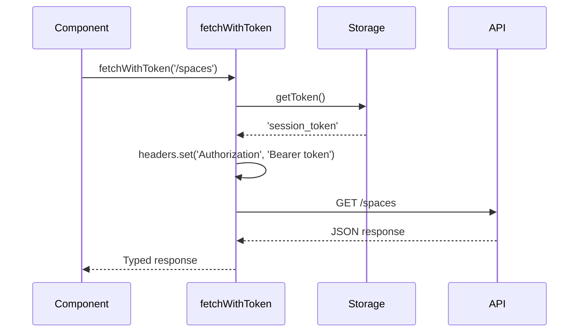
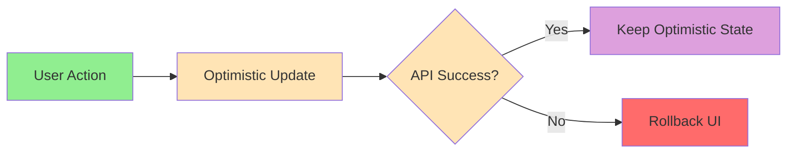

# Интеграция с API

**Версия:** 1.1\
**Дата создания:** 2026-02-08\
**Дата обновления:** 2026-02-09

---

## Краткое содержание

Этот документ описывает паттерны интеграции с API в проекте Python-TypeScript Wiki Frontend. Рассматриваются fetch mutator, TanStack Query конфигурация, паттерны использования хуков, оптимистичные обновления, инвалидация кэша, обработка ошибок и состояния загрузки.

Также зафиксировано текущее состояние кодовой базы: для части фич используются ручные API-хуки, а Orval-клиент применяется в auth-потоке.

---

## Оглавление

1. [Текущее состояние интеграции](#текущее-состояние-интеграции)
2. [Fetch Mutator](#fetch-mutator)
3. [TanStack Query конфигурация](#tanstack-query-конфигурация)
4. [Паттерны использования хуков](#паттерны-использования-хуков)
5. [Оптимистичные обновления](#оптимистичные-обновления)
6. [Инвалидация кэша](#инвалидация-кэша)
7. [Стратегии обработки ошибок](#стратегии-обработки-ошибок)
8. [Состояния загрузки](#состояния-загрузки)

---

## Текущее состояние интеграции

- Ручные хуки для пространств: `src/entities/space/api/useSpaces.ts`, `src/entities/space/api/useSpace.ts`, `src/entities/space/api/create-space.ts`
- Orval-клиент и generated hooks: `src/shared/orval-api/withToken/*` (конфигурация: `orval.config.ts`, спецификация: `mock/mock.api.json`)
- В UI Orval-хуки сейчас используются в `src/pages/token/ui/TokenPage.tsx` (`useVerifyTokenTokenPost`, `useCreateSessionSessionPost`)
- Для фичи редактирования пространства используется mock-адаптер: `src/features/edit-space/api/edit-space.ts`

---

## Fetch Mutator

### fetchWithToken — функция для fetch с автоматическим добавлением Authorization header

**Файл:** `src/shared/lib/fetch-mutator.ts`

**Назначение:** Выполняет fetch запросы с автоматическим добавлением Bearer токена из `localStorage`.

**Реализация:**

```typescript
import { BASE_URL } from '@/shared/lib';

/**
 * Mutator for orval fetch client that automatically adds Authorization header with token
 * @template T - Response type that includes data, status, and headers
 */
export const fetchWithToken = async <
  T extends { data: unknown; status: number; headers: Headers },
>(
  url: string,
  options?: RequestInit
): Promise<T> => {
  // Get token from localStorage (you can change this to get from context/store if needed)
  const token =
    typeof window !== 'undefined'
      ? localStorage.getItem('session_token')
      : null;

  // Merge headers, adding Authorization if token exists
  const headers = new Headers(options?.headers);

  if (token) {
    headers.set('Authorization', `Bearer ${token}`);
  }

  // Create new options with merged headers
  const newOptions: RequestInit = {
    ...options,
    headers,
  };

  const urlObj = new URL(url, BASE_URL);
  const res = await fetch(urlObj.toString(), newOptions);

  // Handle empty responses (204, 205, 304)
  const body = [204, 205, 304].includes(res.status) ? null : await res.text();

  // Parse response body
  const data = body ? JSON.parse(body) : {};

  // Throw error for non-2xx responses so React Query handles them as errors
  if (!res.ok) {
    throw data;
  }

  // Return typed response with data, status, and headers
  return {
    data,
    status: res.status,
    headers: res.headers,
  } as T;
};
```

**Ключевые особенности:**

1. **Автоматическое добавление Bearer токена** — Получает токен из `localStorage` и добавляет в заголовок `Authorization: Bearer {token}`
2. **Обработка пустых ответов** — Коды 204, 205, 304 читаются как пустое тело и приводятся к пустому объекту `{}`
3. **Парсинг JSON** — Автоматически парсит тело ответа
4. **Проброс ошибок** — Выбрасывает данные ответа для non-2xx кодов (для обработки в TanStack Query)
5. **Типизация ответа** — Возвращает типизированный ответ с `data`, `status`, `headers`

**Использование:**

```typescript
import { fetchWithToken } from '@/shared/lib/fetch-mutator';

interface SpacesResponse {
  items: Space[];
}

interface SpacesResponseSuccess {
  data: SpacesResponse;
  status: number;
  headers: Headers;
}

const { data } = await fetchWithToken<SpacesResponseSuccess>('/spaces');
```

**Поток данных:**



---

## TanStack Query конфигурация

### Query Client — глобальная конфигурация TanStack Query

**Файл:** `src/shared/lib/query-client.ts`

**Реализация:**

```typescript
import { QueryClient } from '@tanstack/react-query';

export const queryClient = new QueryClient({
  defaultOptions: {
    queries: {
      refetchOnWindowFocus: false,
      retry: 3,
      staleTime: 60 * 1000, // 1 минута
    },
  },
});
```

**Конфигурация:**

| Настройка | Значение | Описание |
|-----------|---------|----------|
| `refetchOnWindowFocus` | `false` | Отключено для оптимизации |
| `retry` | `3` | 3 попытки при ошибке |
| `staleTime` | `60000` | Время до устаревания данных (1 минута) |

---

## Паттерны использования хуков

### 1. useQuery для получения данных

**Файл:** `src/entities/space/api/useSpaces.ts`

**Назначение:** Хук для получения списка пространств с переключением между mock и real API.

**Реализация:**

```typescript
import { useQuery } from '@tanstack/react-query';
import { fetchWithToken } from '@/shared/lib/fetch-mutator';
import type { Space } from '../model/types';
import { isLocalRun } from '@/shared/lib/environment';
import { getMockSpaces } from '@/shared/mock/spaceMocks';

interface SpacesResponse {
  items: Space[];
}

interface SpacesResponseSuccess {
  data: SpacesResponse;
  status: number;
  headers: Headers;
}

export function useSpaces() {
  return useQuery<Space[]>({
    queryKey: ['spaces'],
    queryFn: async () => {
      // Переключение между mock и real API
      if (isLocalRun()) {
        return getMockSpaces();
      }

      // Real API вызов
      const { data } = await fetchWithToken<SpacesResponseSuccess>('/spaces');
      return data.items;
    },
  });
}
```

**Ключевые элементы:**

- **Query Key:** `['spaces']` — уникальный идентификатор запроса
- **Переключение mock/real:** Через `isLocalRun()`
- **Mock данные:** `getMockSpaces()` из `src/shared/mock/spaceMocks.ts`
- **API запрос:** `fetchWithToken()` с типизированным ответом

---

### 2. useMutation для изменений

**Файл:** `src/entities/space/ui/create-space-modal.tsx`

**Назначение:** Хук для создания пространства.

**Реализация (ключевые части):**

```typescript
import { useMutation, useQueryClient } from '@tanstack/react-query';
import { createSpace } from '../api/create-space';

export function CreateSpaceModal({ isOpen, onOpenChange }: CreateSpaceModalProps) {
  const [name, setName] = useState('');
  const isNameValid = name.trim().length >= 3;
  const queryClient = useQueryClient();

  const createSpaceMutation = useMutation({
    mutationFn: (spaceName: string) => createSpace(spaceName),
    onSuccess: () => {
      // Инвалидация кэша после успешной мутации
      queryClient.invalidateQueries({ queryKey: ['spaces'] });

      // Закрытие модального окна и сброс формы
      onOpenChange(false);
      setName('');
    },
    onError: (error) => {
      console.error('Failed to create space', error); // eslint-disable-line no-console
    },
  });

  const handleSave = () => {
    if (!isNameValid) return;
    createSpaceMutation.mutate(name);
  };

  return (
    <Dialog open={isOpen} onOpenChange={onOpenChange}>
      {/* ... */}
    </Dialog>
  );
}
```

**Ключевые элементы:**

- **Mutation Function:** `createSpace(spaceName)`
- **Endpoint создания пространства:** `createSpace()` отправляет `POST /api/v1/spaces` (см. `src/entities/space/api/create-space.ts`)
- **onSuccess Callback:** Инвалидация кэша и закрытие модального окна
- **onError Callback:** Логирование ошибки
- **mutate() method:** Вызов мутации

---

## Оптимистичные обновления

### Паттерн оптимистичных обновлений UI

**Назначение:** Мгновенное обновление UI до завершения мутации для быстродействия.

В текущей реализации мутации `updateUserRole` и `removeUserFromSpace` вызывают mock-функции из `src/features/edit-space/api/edit-space.ts` (они возвращают `{ success: true }`), а оптимистичное обновление выполняется на уровне query cache.

**Реализация (пример из `src/features/edit-space/ui/edit-space-modal.tsx`):**

```typescript
const updateRoleMutation = useMutation({
  mutationFn: ({ userId, role }: { userId: string; role: UserRole }) =>
    updateUserRole(space.id, userId, role),
  onMutate: async ({ userId, role }) => {
    // 1. Отмена текущего запроса
    await queryClient.cancelQueries({ queryKey: ['spaceUsers', space.id] });

    // 2. Сохранение предыдущего состояния (для отката при ошибке)
    const previous = queryClient.getQueryData(['spaceUsers', space.id]);

    // 3. Оптимистичное обновление UI
    queryClient.setQueryData<SpaceUser[]>(['spaceUsers', space.id], (old) =>
      old?.map((u) => (u.id === userId ? { ...u, role } : u))
    );

    // 4. Возврат предыдущего состояния для отката
    return { previous };
  },
  onError: (_, __, context) => {
    // 5. Откат оптимистичного обновления при ошибке
    if (context?.previous) {
      queryClient.setQueryData(['spaceUsers', space.id], context.previous);
    }
  },
});
```

**Поток данных:**



**Ключевые шаги:**

1. **Отмена запроса** — `queryClient.cancelQueries()`
2. **Сохранение предыдущего состояния** — `queryClient.getQueryData()`
3. **Оптимистичное обновление** — `queryClient.setQueryData()`
4. **Откат при ошибке** — `queryClient.setQueryData(previous)`
5. **Синхронизация** — в текущем примере выполняется через оптимистичный cache patch и rollback (без `invalidateQueries` в этом mutation)

---

## Инвалидация кэша

### Паттерн инвалидации кэша после мутации

**Назначение:** Обновление данных в кэше после успешной мутации.

**Реализация:**

```typescript
const createSpaceMutation = useMutation({
  mutationFn: (spaceName: string) => createSpace(spaceName),
  onSuccess: () => {
    // Инвалидация кэша для списка пространств
    queryClient.invalidateQueries({ queryKey: ['spaces'] });
  },
});
```

**Ключевые элементы:**

- **Query Key:** `['spaces']` — идентификатор запроса для инвалидации
- **invalidateQueries()** — метод TanStack Query для инвалидации

**Другие способы инвалидации:**

```typescript
// Инвалидация всех запросов с заданным префиксом
queryClient.invalidateQueries({ queryKey: ['spaces'] });

// Инвалидация конкретного запроса
queryClient.invalidateQueries({ queryKey: ['space', spaceId] });

// Сброс кэша
queryClient.resetQueries({ queryKey: ['spaces'] });
```

---

## Стратегии обработки ошибок

### 1. API ошибки (non-2xx ответы)

**Назначение:** Обработка ошибок API (400, 401, 500 и т.д.).

**Реализация:**

В `fetch-mutator.ts` данные ответа выбрасываются для non-2xx кодов:

```typescript
// Throw error for non-2xx responses so React Query handles them as errors
if (!res.ok) {
  throw data;
}
```

**Обработка в компонентах:**

```typescript
const createSpaceMutation = useMutation({
  mutationFn: (spaceName: string) => createSpace(spaceName),
  onError: (error) => {
    console.error('Failed to create space', error);
  },
});

if (verifyMutation.isError) {
  return <ErrorState error={verifyMutation.error} />;
}

if (createSessionMutation.isError) {
  return <ErrorState error={createSessionMutation.error} />;
}
```

---

### 2. Zod схемы и типы

**Назначение:** Типизация и возможность runtime-валидации данных.

**Реализация:**

Zod схемы генерируются Orval в `src/shared/orval-api/withToken/api/**/*.zod.ts`. Схемы из `src/entities/*/model/schema.ts` используются отдельно (например, `userDataSchema`).

**Пример:**

```typescript
// src/entities/user/model/schema.ts
import { z } from 'zod';

export const userDataSchema = z.object({
  username: z.string(),
  telegram_id: z.number(),
  first_name: z.string().optional(),
  last_name: z.string().optional(),
  photo_url: z.url().optional(),
  created_at: z.number(),
  permission: z.string().optional(),
});
```

**Обработка ошибок валидации:**

Orval генерирует схемы и типы (`ValidationErrorType`, `ErrorResponseType`), но в текущем runtime-коде приложения generated zod-схемы напрямую не вызываются. Ошибки API обрабатываются через `throw data` в `fetchWithToken`, `onError` в мутациях и проверки `isError` в компонентах.

---

### 3. Network errors

**Назначение:** Обработка сетевых ошибок (отсутствие интернета, таймауты).

**Реализация:**

TanStack Query автоматически выполняет retry логику (настраивается в `QueryClient`):

```typescript
export const queryClient = new QueryClient({
  defaultOptions: {
    queries: {
      refetchOnWindowFocus: false,
      retry: 3,
      staleTime: 60 * 1000,
    },
  },
});
```

Эта настройка применяется к запросам (`defaultOptions.queries`).

**Retry задержка:**
- Явно в `query-client.ts` не настроена (`retryDelay` не задан)
- Используется дефолтная стратегия TanStack Query

---

### 4. Auth errors (401)

**Назначение:** Обработка ошибок авторизации (недействительный или истёкший токен).

**Реализация:**

В текущей кодовой базе нет единого глобального обработчика 401. Ошибки обрабатываются на уровне конкретных мутаций/страниц (например, `TokenPage`):

```typescript
if (verifyMutation.isError) {
  return <ErrorState error={verifyMutation.error} />;
}

if (createSessionMutation.isError) {
  return <ErrorState error={createSessionMutation.error} />;
}
```

---

### 5. Error boundaries

**Назначение:** Обработка ошибок на уровне компонентов для предотвращения краша приложения.

**Реализация (планируется):**

```typescript
import { ErrorBoundary } from 'react-error-boundary';

function ErrorFallback({ error, resetErrorBoundary }: { error: Error; resetErrorBoundary: () => void }) {
  return (
    <div role="alert">
      <p>Что-то пошло не так:</p>
      <pre>{error.message}</pre>
      <button onClick={resetErrorBoundary}>Попробовать снова</button>
    </div>
  );
}

export function ApiProvider({ children }: { children: ReactNode }) {
  return (
    <ErrorBoundary FallbackComponent={ErrorFallback}>
      <QueryClientProvider client={queryClient}>
        {children}
      </QueryClientProvider>
    </ErrorBoundary>
  );
}
```

---

## Состояния загрузки

### 1. isLoading vs isFetching

**Назначение:** Различие между начальной загрузкой и обновлением данных.

В текущем коде используются `isLoading` (например, `src/features/edit-space/ui/edit-space-modal.tsx`) и `isPending` для мутаций. `isFetching` здесь приведен как полезный паттерн, который можно применять при рефетче.

| Состояние | Описание | Использование |
|-----------|----------|--------------|
| `isLoading` | Начальная загрузка данных (ещё нет кэша) | Отображение спиннера при первом запросе |
| `isFetching` | Обновление данных (уже есть кэш) | Может использоваться для индикатора рефетча |

**Пример:**

```typescript
const { data, isLoading, isFetching } = useSpaces();

return (
  <div>
    {isLoading && <p>Загрузка...</p>}
    {isFetching && <p>Обновление...</p>}
    {data && <p>Данные загружены</p>}
  </div>
);
```

---

### 2. Skeleton loaders

**Назначение:** Визуальные индикаторы загрузки в виде скелетов UI.

**Пример (планируется):**

```typescript
function SpaceSkeleton() {
  return (
    <div className="space-y-3 animate-pulse">
      <div className="h-24 bg-gray-200 rounded-md" />
      <div className="h-24 bg-gray-200 rounded-md" />
      <div className="h-24 bg-gray-200 rounded-md" />
    </div>
  );
}

// В компоненте
const { isLoading } = useSpaces();

if (isLoading) {
  return <SpaceSkeleton />;
}

return <SpaceList />;
```

---

### 3. Disabled состояние при mutation

**Назначение:** Отключение элементов UI во время выполнения мутации.

**Пример:**

```typescript
const createSpaceMutation = useMutation({
  mutationFn: (spaceName: string) => createSpace(spaceName),
});

return (
  <Button
    onClick={() => createSpaceMutation.mutate(name)}
    disabled={createSpaceMutation.isPending || !isNameValid}
  >
    Создать
  </Button>
);
```

**Состояния мутации:**

| Состояние | Описание | Использование |
|-----------|----------|--------------|
| `isPending` | Мутация выполняется | Отключение кнопки |
| `isSuccess` | Мутация успешно завершена | Отображение success уведомления |
| `isError` | Произошла ошибка | Отображение error уведомления |

---

## Примеры интеграции

### Пример 1: Получение списка пространств

**Файл:** `src/entities/space/api/useSpaces.ts`

```typescript
import { useQuery } from '@tanstack/react-query';
import { fetchWithToken } from '@/shared/lib/fetch-mutator';
import type { Space } from '../model/types';
import { isLocalRun } from '@/shared/lib/environment';
import { getMockSpaces } from '@/shared/mock/spaceMocks';

interface SpacesResponse {
  items: Space[];
}

interface SpacesResponseSuccess {
  data: SpacesResponse;
  status: number;
  headers: Headers;
}

export function useSpaces() {
  return useQuery<Space[]>({
    queryKey: ['spaces'],
    queryFn: async () => {
      if (isLocalRun()) {
        return getMockSpaces();
      }

      const { data } = await fetchWithToken<SpacesResponseSuccess>('/spaces');
      return data.items;
    },
  });
}
```

---

### Пример 2: Получение одного пространства

**Файл:** `src/entities/space/api/useSpace.ts`

```typescript
import { useQuery } from '@tanstack/react-query';
import { fetchWithToken } from '@/shared/lib/fetch-mutator';
import type { Article } from '../model/types';
import { isLocalRun } from '@/shared/lib/environment';
import { getMockSpace } from '@/shared/mock/spaceMocks';

interface SpaceResponse {
  id: string;
  name: string;
  articles: Article[];
}

interface SpaceResponseSuccess {
  data: SpaceResponse;
  status: number;
  headers: Headers;
}

export function useSpace(spaceId: string) {
  return useQuery<SpaceResponse>({
    queryKey: ['space', spaceId],
    queryFn: async () => {
      if (isLocalRun()) {
        return getMockSpace(spaceId);
      }

      const { data } = await fetchWithToken<SpaceResponseSuccess>(
        `/spaces/${spaceId}`
      );
      return data;
    },
    enabled: !!spaceId,
  });
}
```

---

### Пример 3: Создание пространства

**Файл:** `src/entities/space/ui/create-space-modal.tsx`

```typescript
import { useState } from 'react';
import { useMutation, useQueryClient } from '@tanstack/react-query';
import {
  Dialog,
  DialogContent,
  DialogHeader,
  DialogTitle,
  Input,
  Button,
} from '@/shared/ui';
import { createSpace } from '../api/create-space';

interface CreateSpaceModalProps {
  isOpen: boolean;
  onOpenChange: (open: boolean) => void;
}

export function CreateSpaceModal({
  isOpen,
  onOpenChange,
}: CreateSpaceModalProps) {
  const [name, setName] = useState('');
  const isNameValid = name.trim().length >= 3;
  const queryClient = useQueryClient();

  const createSpaceMutation = useMutation({
    mutationFn: (spaceName: string) => createSpace(spaceName),
    onSuccess: () => {
      // Инвалидация кэша
      queryClient.invalidateQueries({ queryKey: ['spaces'] });

      // Закрытие модального окна и сброс формы
      onOpenChange(false);
      setName('');
    },
    onError: (error) => {
      console.error('Failed to create space', error); // eslint-disable-line no-console
    },
  });

  const handleSave = () => {
    if (!isNameValid) return;
    createSpaceMutation.mutate(name);
  };

  return (
    <Dialog open={isOpen} onOpenChange={onOpenChange}>
      <DialogContent className="max-w-xl p-6">
        <DialogHeader className="mb-4">
          <DialogTitle className="text-xl font-semibold">
            Создать новое пространство
          </DialogTitle>
        </DialogHeader>
        <div className="flex items-center gap-4 w-full">
          <Input
            value={name}
            onChange={(e) => setName(e.target.value)}
            placeholder="Название пространства"
            className={`flex-1`}
          />
          <Button
            onClick={handleSave}
            disabled={createSpaceMutation.isPending || !isNameValid}
            size="form"
          >
            Сохранить
          </Button>
        </div>
      </DialogContent>
    </Dialog>
  );
}
```

---

## Полезные ссылки

- [TanStack Query Documentation](https://tanstack.com/query/latest)
- [Orval Documentation](https://orval.dev/)
- [Feature-Sliced Design - Shared Layer](https://feature-sliced.design/docs/reference/layers#shared)
- [React Hooks Documentation](https://react.dev/learn)
