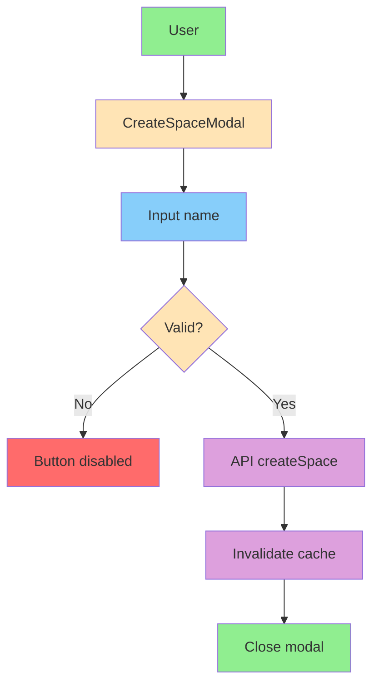

# Функционал пространств

**Версия:** 1.1\
**Дата создания:** 2026-02-08\
**Дата обновления:** 2026-02-09

---

## Краткое содержание

Этот документ описывает функционал пространств в проекте Python-TypeScript Wiki Frontend. Рассматриваются создание пространств, редактирование, управление пользователями и mock данные для локальной разработки.

---

## Оглавление

1. [Обзор пространств](#обзор-пространств)
2. [Создание пространства](#создание-пространства)
3. [Редактирование пространства](#редактирование-пространства)
4. [Права доступа](#права-доступа)
5. [Mock данные](#mock-данные)

---

## Обзор пространств

### Назначение

Пространства — это основной способ организации контента в Базе Знаний. Каждое пространство имеет:

- **Название** — имя пространства
- **ID** — идентификатор пространства
- **Роль в объекте пространства (`Space.role`)** — строка от API/mock (в текущих mock данных: `owner`, `member`, `viewer`)
- **Статьи** — загружаются отдельно в `useSpace(spaceId)` для страницы пространства

### Типы данных

```typescript
// src/entities/space/model/types.ts
export interface Space {
  id: string;
  name: string;
  role: string;
  is_deleted: boolean;
  deleted_at: string | null;
}

export interface Article {
  id: string;
  name: string;
  created_at: string;
}
```

### Роли и доступ

В проекте используются две связанные, но разные модели ролей:

1. `Space.role` — строковое поле в сущности пространства (`owner/member/viewer` в текущих mock данных).
2. `UserRole` (`admin/writer/reader`) — роли участников пространства в потоке `src/features/edit-space`.

### Роли участников пространства (`UserRole`)

| Роль | Код | Описание |
|------|-----|----------|
| **Владелец** | `userRoles.admin` | Значение роли `admin` |
| **Запись** | `userRoles.writer` | Значение роли `writer` |
| **Чтение** | `userRoles.reader` | Значение роли `reader` |

---

## Создание пространства

### CreateSpaceModal — модальное окно создания

**Файл:** `src/entities/space/ui/create-space-modal.tsx`

**Назначение:** Модальное окно для создания нового пространства.

**Реализация:**

```typescript
import { useState } from 'react';
import { useMutation, useQueryClient } from '@tanstack/react-query';
import {
  Dialog,
  DialogContent,
  DialogHeader,
  DialogTitle,
  Input,
  Button,
} from '@/shared/ui';
import { createSpace } from '../api/create-space';

interface CreateSpaceModalProps {
  isOpen: boolean;
  onOpenChange: (open: boolean) => void;
}

export function CreateSpaceModal({
  isOpen,
  onOpenChange,
}: CreateSpaceModalProps) {
  const [name, setName] = useState('');
  const isNameValid = name.trim().length >= 3;
  const queryClient = useQueryClient();

  const createSpaceMutation = useMutation({
    mutationFn: (spaceName: string) => createSpace(spaceName),
    onSuccess: () => {
      queryClient.invalidateQueries({ queryKey: ['spaces'] });
      onOpenChange(false);
      setName('');
    },
    onError: (error) => {
      // eslint-disable-next-line no-console
      console.error('Failed to create space', error);
    },
  });

  const handleSave = () => {
    if (!isNameValid) return;
    createSpaceMutation.mutate(name);
  };

  return (
    <Dialog open={isOpen} onOpenChange={onOpenChange}>
      <DialogContent className="max-w-xl p-6">
        <DialogHeader className="mb-4">
          <DialogTitle className="text-xl font-semibold">
            Создать новое пространство
          </DialogTitle>
        </DialogHeader>
        <div className="flex items-center gap-4 w-full">
          <Input
            value={name}
            onChange={(e) => setName(e.target.value)}
            placeholder="Название пространства"
            className={`flex-1`}
          />
          <Button
            onClick={handleSave}
            disabled={createSpaceMutation.isPending || !isNameValid}
            size="form"
          >
            Сохранить
          </Button>
        </div>
      </DialogContent>
    </Dialog>
  );
}
```

**Ключевые элементы:**
- **Валидация:** Минимум 3 символа в названии
- **Кнопка "Сохранить":** Отключена при создании или невалидном названии
- **Инвалидация кэша:** После успешного создания обновляется список пространств
- **Закрытие:** После успешного создания модальное окно закрывается

**Поток работы:**



---

### createSpace — API вызов

**Файл:** `src/entities/space/api/create-space.ts`

**Реализация:**

```typescript
import { fetchWithToken } from '@/shared/lib/fetch-mutator';

type CreateSpaceResponseSuccess = {
  data: unknown;
  status: number;
  headers: Headers;
};

export const createSpace = async (name: string) => {
  const { data } = await fetchWithToken<CreateSpaceResponseSuccess>(
    `/api/v1/spaces`,
    {
      method: 'POST',
      headers: {
        'Content-Type': 'application/json',
      },
      body: JSON.stringify({ name }),
    }
  );

  return data;
};
```

**API запрос:**

```http
POST /api/v1/spaces
Content-Type: application/json
Authorization: Bearer {token} (если токен доступен)

{
  "name": "Название пространства"
}
```

**Примечание по эндпойнтам:** в текущем коде создание пространства идет через `/api/v1/spaces`, а получение списка/деталей — через `/spaces` и `/spaces/{spaceId}`.

**Важно о результате функции `createSpace`:**
- `fetchWithToken` возвращает объект вида `{ data, status, headers }`
- `createSpace` возвращает только `data` (то есть payload ответа API без обёртки)

---

## Редактирование пространства

### EditSpaceModal — модальное окно редактирования

**Файл:** `src/features/edit-space/ui/edit-space-modal.tsx`

**Назначение:** Модальное окно для редактирования пространства, управления пользователями и удаления.

**Реализация (ключевые части):**

```typescript
import { useReducer, useEffect, useCallback } from 'react';
import { useQuery, useMutation, useQueryClient } from '@tanstack/react-query';
import {
  Dialog,
  DialogContent,
  DialogHeader,
  DialogTitle,
  Input,
  Button,
} from '@/shared/ui';
import {
  searchUsers,
  getSpaceUsers,
  addUserToSpace,
  updateUserRole,
  removeUserFromSpace,
  updateSpace,
  deleteSpace,
} from '../api/edit-space';
import { type UserRole } from '@/entities/user';
import { EditSpaceUserSearch } from './edit-space-user-search';
import { EditSpaceUsersList } from './edit-space-users-list';
import type { Space } from '@/entities/space/model/types';
import type { SpaceUser, User } from '@/entities/user/model/types.ts';

interface EditSpaceModalProps {
  space: Space;
  isOpen: boolean;
  onOpenChange: (open: boolean) => void;
}

type State = {
  spaceName: string;
  searchQuery: string;
  foundUsers: User[];
  pendingUsers: User[];
};

type Action =
  | { type: 'SET_SPACE_NAME'; payload: string }
  | { type: 'SET_SEARCH_QUERY'; payload: string }
  | { type: 'SET_FOUND_USERS'; payload: User[] }
  | { type: 'ADD_PENDING_USER'; payload: User }
  | { type: 'REMOVE_PENDING_USER'; payload: string }
  | { type: 'CLEAR_SEARCH' }
  | { type: 'RESET'; payload: string };

function reducer(state: State, action: Action): State {
  switch (action.type) {
    case 'SET_SPACE_NAME':
      return { ...state, spaceName: action.payload };
    case 'SET_SEARCH_QUERY':
      return { ...state, searchQuery: action.payload };
    case 'SET_FOUND_USERS':
      return { ...state, foundUsers: action.payload };
    case 'ADD_PENDING_USER':
      return {
        ...state,
        pendingUsers: [...state.pendingUsers, action.payload],
      };
    case 'REMOVE_PENDING_USER':
      return {
        ...state,
        pendingUsers: state.pendingUsers.filter((u) => u.id !== action.payload),
      };
    case 'CLEAR_SEARCH':
      return { ...state, searchQuery: '', foundUsers: [] };
    case 'RESET':
      return {
        spaceName: action.payload,
        searchQuery: '',
        foundUsers: [],
        pendingUsers: [],
      };
    default:
      return state;
  }
}

export function EditSpaceModal({
  space,
  isOpen,
  onOpenChange,
}: EditSpaceModalProps) {
  const queryClient = useQueryClient();

  const [state, dispatch] = useReducer(reducer, {
    spaceName: space.name,
    searchQuery: '',
    foundUsers: [],
    pendingUsers: [],
  });

  // Reset state when modal opens/closes or space changes
  useEffect(() => {
    if (isOpen) {
      dispatch({ type: 'RESET', payload: space.name });
    }
  }, [isOpen, space.name]);

  // Query for existing users
  const { data: existingUsers = [], isLoading: loadingUsers } = useQuery({
    queryKey: ['spaceUsers', space.id],
    queryFn: () => getSpaceUsers(space.id),
    enabled: isOpen,
  });

  // Query for user search with debouncing
  useEffect(() => {
    const timer = setTimeout(() => {
      if (state.searchQuery.trim()) {
        searchUsers(state.searchQuery).then((users) => {
          dispatch({ type: 'SET_FOUND_USERS', payload: users });
        });
      } else {
        dispatch({ type: 'SET_FOUND_USERS', payload: [] });
      }
    }, 300);
    return () => clearTimeout(timer);
  }, [state.searchQuery]);

  // Mutations
  const updateSpaceMutation = useMutation({
    mutationFn: (name: string) => updateSpace(space.id, name),
  });

  const addUserMutation = useMutation({
    mutationFn: (userId: string) => addUserToSpace(space.id, userId),
    onSuccess: (_, userId) => {
      queryClient.invalidateQueries({ queryKey: ['spaceUsers', space.id] });
      dispatch({ type: 'REMOVE_PENDING_USER', payload: userId });
    },
  });

  const updateRoleMutation = useMutation({
    mutationFn: ({ userId, role }: { userId: string; role: UserRole }) =>
      updateUserRole(space.id, userId, role),
    onMutate: async ({ userId, role }) => {
      await queryClient.cancelQueries({ queryKey: ['spaceUsers', space.id] });
      const previous = queryClient.getQueryData(['spaceUsers', space.id]);

      queryClient.setQueryData<SpaceUser[]>(['spaceUsers', space.id], (old) =>
        old?.map((u) => (u.id === userId ? { ...u, role } : u))
      );

      return { previous };
    },
    onError: (_, __, context) => {
      if (context?.previous) {
        queryClient.setQueryData(['spaceUsers', space.id], context.previous);
      }
    },
  });

  const removeUserMutation = useMutation({
    mutationFn: (userId: string) => removeUserFromSpace(space.id, userId),
    onMutate: async (userId) => {
      await queryClient.cancelQueries({ queryKey: ['spaceUsers', space.id] });
      const previous = queryClient.getQueryData(['spaceUsers', space.id]);

      queryClient.setQueryData<SpaceUser[]>(['spaceUsers', space.id], (old) =>
        old?.filter((u) => u.id !== userId)
      );

      return { previous };
    },
    onError: (_, __, context) => {
      if (context?.previous) {
        queryClient.setQueryData(['spaceUsers', space.id], context.previous);
      }
    },
  });

  const deleteSpaceMutation = useMutation({
    mutationFn: () => deleteSpace(space.id),
    onSuccess: () => onOpenChange(false),
  });

  // Handlers
  const handleSelectUser = useCallback(
    (user: User) => {
      if (
        !state.pendingUsers.find((u) => u.id === user.id) &&
        !existingUsers.find((u) => u.id === user.id)
      ) {
        dispatch({ type: 'ADD_PENDING_USER', payload: user });
      }
      dispatch({ type: 'CLEAR_SEARCH' });
    },
    [state.pendingUsers, existingUsers]
  );

  const handleAddPendingUser = useCallback(
    (user: User) => {
      addUserMutation.mutate(user.id);
    },
    [addUserMutation]
  );

  const handleRoleChange = useCallback(
    (userId: string, newRole: UserRole) => {
      updateRoleMutation.mutate({ userId, role: newRole });
    },
    [updateRoleMutation]
  );

  const handleRemoveUser = useCallback(
    (userId: string) => {
      removeUserMutation.mutate(userId);
    },
    [removeUserMutation]
  );

  const handleSaveSpaceName = useCallback(() => {
    if (!state.spaceName || state.spaceName === space.name) return;
    updateSpaceMutation.mutate(state.spaceName);
  }, [state.spaceName, space.name, updateSpaceMutation]);

  const handleDeleteSpace = useCallback(() => {
    if (confirm('Вы уверены, что хотите удалить это пространство?')) {
      deleteSpaceMutation.mutate();
    }
  }, [deleteSpaceMutation]);

  return (
    <Dialog open={isOpen} onOpenChange={onOpenChange}>
      <DialogContent className="max-w-2xl bg-white dark:bg-white p-6 gap-6">
        <DialogHeader>
          <DialogTitle className="text-xl font-semibold">
            Настройки пространства
          </DialogTitle>
        </DialogHeader>

        {/* Row 1: Name and Save Button */}
        <div className="flex items-center gap-4 w-full">
          <Input
            value={state.spaceName}
            onChange={(e) =>
              dispatch({ type: 'SET_SPACE_NAME', payload: e.target.value })
            }
            placeholder="Название пространства"
            className="flex-1"
          />
          <Button
            variant="default"
            size="form"
            onClick={handleSaveSpaceName}
            disabled={
              updateSpaceMutation.isPending || state.spaceName === space.name
            }
          >
            Сохранить
          </Button>
        </div>

        {/* Row 2: Header */}
        <div>
          <h3 className="text-lg font-medium">Доступ</h3>
        </div>

        {/* Row 3: Users Management */}
        <div className="grid grid-cols-1 sm:grid-cols-2 gap-8 h-72">
          {/* Left Column: Add Users */}
          <EditSpaceUserSearch
            searchQuery={state.searchQuery}
            foundUsers={state.foundUsers}
            pendingUsers={state.pendingUsers}
            existingUsers={existingUsers}
            onSearchQueryChange={(query) =>
              dispatch({ type: 'SET_SEARCH_QUERY', payload: query })
            }
            onSelectUser={handleSelectUser}
            onAddPendingUser={handleAddPendingUser}
          />

          {/* Right Column: Existing Users */}
          <EditSpaceUsersList
            existingUsers={existingUsers}
            loadingUsers={loadingUsers}
            onRoleChange={handleRoleChange}
            onRemoveUser={handleRemoveUser}
          />
        </div>

        {/* Row 4: Action Buttons */}
        <div className="flex flex-row gap-2 items-center mt-4 pt-4 border-t">
          <Button
            onClick={() => onOpenChange(false)}
            variant="secondary"
            size="sm"
          >
            Закрыть
          </Button>
          <Button onClick={handleDeleteSpace} variant="destructive" size="sm">
            Удалить
          </Button>
        </div>
      </DialogContent>
    </Dialog>
  );
}
```

**Ключевые элементы:**

**State management (useReducer):**

```typescript
type State = {
  spaceName: string;
  searchQuery: string;
  foundUsers: User[];
  pendingUsers: User[];
};
```

**Actions:**
- `SET_SPACE_NAME` — обновление названия
- `SET_SEARCH_QUERY` — обновление поискового запроса
- `SET_FOUND_USERS` — сохранение найденных пользователей
- `ADD_PENDING_USER` — добавление пользователя в "Ожидающие"
- `REMOVE_PENDING_USER` — удаление из "Ожидающих"
- `CLEAR_SEARCH` — очистка поиска
- `RESET` — сброс состояния

---

### searchUsers — поиск пользователей

**Файл:** `src/features/edit-space/api/edit-space.ts`

**Реализация:**

```typescript
import { MOCK_ALL_USERS, MOCK_SPACE_USERS } from '@/shared/mock/users.ts';
import type { SpaceUser, User } from '@/entities/user/model/types.ts';

export const searchUsers = async (query: string): Promise<User[]> => {
  if (!query) return [];

  const lowerQuery = query.toLowerCase();
  const existingUserIds = new Set(MOCK_SPACE_USERS['default'].map((u) => u.id));

  return MOCK_ALL_USERS.filter((user) => !existingUserIds.has(user.id)) // Exclude existing users
    .filter((user) => user.username.toLowerCase().includes(lowerQuery));
};
```

**Назначение:** Поиск пользователей по username (для локальной разработки).

**Поток работы:**
1. Получение всех пользователей из `MOCK_ALL_USERS`
2. Исключение пользователей из `MOCK_SPACE_USERS['default']` (в текущей mock-реализации без учета `spaceId`)
3. Фильтрация по username (case-insensitive)

---

### getSpaceUsers — получение пользователей пространства

**Файл:** `src/features/edit-space/api/edit-space.ts`

**Реализация:**

```typescript
export const getSpaceUsers = async (spaceId: string): Promise<SpaceUser[]> => {
  return MOCK_SPACE_USERS[spaceId] || MOCK_SPACE_USERS['default'];
};
```

**Назначение:** Получение списка пользователей пространства (для локальной разработки).

---

### addUserToSpace — добавление пользователя

**Файл:** `src/features/edit-space/api/edit-space.ts`

**Реализация:**

```typescript
export const addUserToSpace = async (
  _spaceId: string,
  _userId: string,
  _role: UserRole = userRoles.reader
) => {
  return { success: true };
};
```

**Назначение:** Добавление пользователя в пространство (для локальной разработки).

---

### updateUserRole — изменение роли пользователя

**Файл:** `src/features/edit-space/api/edit-space.ts`

**Реализация:**

```typescript
export const updateUserRole = async (
  _spaceId: string,
  _userId: string,
  _role: UserRole
) => {
  return { success: true };
};
```

**Назначение:** Изменение роли пользователя в пространстве (для локальной разработки).

---

### removeUserFromSpace — удаление пользователя

**Файл:** `src/features/edit-space/api/edit-space.ts`

**Реализация:**

```typescript
export const removeUserFromSpace = async (
  _spaceId: string,
  _userId: string
) => {
  return { success: true };
};
```

**Назначение:** Удаление пользователя из пространства (для локальной разработки).

---

### updateSpace — обновление названия

**Файл:** `src/features/edit-space/api/edit-space.ts`

**Реализация:**

```typescript
export const updateSpace = async (_spaceId: string, _name: string) => {
  return { success: true };
};
```

**Назначение:** Обновление названия пространства (для локальной разработки).

---

### deleteSpace — удаление пространства

**Файл:** `src/features/edit-space/api/edit-space.ts`

**Реализация:**

```typescript
export const deleteSpace = async (_spaceId: string) => {
  return { success: true };
};
```

**Назначение:** Удаление пространства (для локальной разработки).

---

### EditSpaceUsersList — список пользователей

**Файл:** `src/features/edit-space/ui/edit-space-users-list.tsx`

**Реализация:**

```typescript
import { Minus } from 'lucide-react';
import {
  Select,
  SelectContent,
  SelectItem,
  SelectTrigger,
  SelectValue,
  Button,
} from '@/shared/ui';
import { isUserRole, userRoles, type UserRole } from '@/entities/user';
import type { SpaceUser } from '@/entities/user/model/types.ts';

interface EditSpaceUsersListProps {
  existingUsers: SpaceUser[];
  loadingUsers: boolean;
  onRoleChange: (userId: string, role: UserRole) => void;
  onRemoveUser: (userId: string) => void;
}

export function EditSpaceUsersList({
  existingUsers,
  loadingUsers,
  onRoleChange,
  onRemoveUser,
}: EditSpaceUsersListProps) {
  return (
    <div className="flex flex-col gap-2 overflow-y-auto pr-2">
      <span className="text-sm text-gray-500 font-medium">Участники:</span>
      {loadingUsers ? (
        <div className="text-sm text-gray-400">Загрузка...</div>
      ) : (
        existingUsers.map((user) => (
          <div
            key={user.id}
            className="flex items-center justify-between rounded-sm"
          >
            <span className="text-sm pl-2">@{user.username}</span>
            <div className="flex items-center gap-1">
              <Select
                value={user.role}
                onValueChange={(val) => {
                  if (isUserRole(val)) {
                    onRoleChange(user.id, val);
                  }
                }}
              >
                <SelectTrigger className="w-28 h-8 text-xs bg-white">
                  <SelectValue />
                </SelectTrigger>
                <SelectContent>
                  <SelectItem value={userRoles.admin}>Владелец</SelectItem>
                  <SelectItem value={userRoles.writer}>Запись</SelectItem>
                  <SelectItem value={userRoles.reader}>Чтение</SelectItem>
                </SelectContent>
              </Select>
              <Button
                size="icon"
                variant="ghost"
                className="h-4 w-4 text-white hover:text-red-500"
                onClick={() => onRemoveUser(user.id)}
              >
                <Minus className="h-2 w-2" />
              </Button>
            </div>
          </div>
        ))
      )}
    </div>
  );
}
```

**Назначение:** Отображение списка существующих пользователей с возможностью изменения ролей и удаления.

**Ключевые элементы:**
- **Dropdown с ролями:** Владелец, Запись, Чтение
- **Кнопка удаления:** Иконка минус с hover-состоянием

---

### EditSpaceUserSearch — поиск и добавление пользователей

**Файл:** `src/features/edit-space/ui/edit-space-user-search.tsx`

**Реализация:**

```typescript
import { Plus } from 'lucide-react';
import { Input, Button } from '@/shared/ui';
import type { SpaceUser, User } from '@/entities/user/model/types.ts';

interface EditSpaceUserSearchProps {
  searchQuery: string;
  foundUsers: User[];
  pendingUsers: User[];
  existingUsers: SpaceUser[];
  onSearchQueryChange: (value: string) => void;
  onSelectUser: (user: User) => void;
  onAddPendingUser: (user: User) => void;
}

export function EditSpaceUserSearch({
  searchQuery,
  foundUsers,
  pendingUsers,
  existingUsers,
  onSearchQueryChange,
  onSelectUser,
  onAddPendingUser,
}: EditSpaceUserSearchProps) {
  return (
    <div className="flex flex-col gap-4">
      <div className="relative">
        <Input
          value={searchQuery}
          onChange={(e) => onSearchQueryChange(e.target.value)}
          placeholder="Найти пользователя..."
        />
        {foundUsers.length > 0 && searchQuery && (
          <div className="absolute top-full left-0 right-0 mt-1 bg-white border rounded-md shadow-lg z-10 max-h-48 overflow-auto">
            {foundUsers.map((user) => (
              <div
                key={user.id}
                className="px-3 py-2 hover:bg-gray-100 cursor-pointer"
                onClick={() => onSelectUser(user)}
              >
                @{user.username}
              </div>
            ))}
          </div>
        )}
      </div>

      <div className="flex flex-col gap-2 overflow-auto">
        <span className="text-sm text-gray-500 font-medium">
          Выбранные пользователи:
        </span>
        {pendingUsers.map((user) => (
          <div
            key={user.id}
            className="flex items-center justify-between p-2 rounded-sm hover:bg-secondary-50"
          >
            <span className="text-sm">@{user.username}</span>
            {!existingUsers.some(
              (existingUser) => existingUser.id === user.id
            ) && (
              <Button
                size="icon"
                variant="ghost"
                className="h-4 w-4 text-white hover:text-red-500"
                onClick={() => onAddPendingUser(user)}
              >
                <Plus className="h-2 w-2" />
              </Button>
            )}
          </div>
        ))
        {pendingUsers.length === 0 && (
          <span className="text-sm text-gray-400">Нет выбранных</span>
        )}
      </div>
    </div>
  );
}
```

**Назначение:** Поиск пользователей и добавление их в пространство.

**Ключевые элементы:**
- **Поиск:** Поле ввода и dropdown с результатами; debounce 300ms выполняется в `EditSpaceModal`
- **Dropdown с результатами:** Отображается при наличии результатов
- **Список "Ожидающие":** Пользователи, выбранные для добавления
- **Кнопка добавления:** Появляется, если пользователь ещё не добавлен

---

### SpacePage — страница пространств

**Файл:** `src/pages/space/ui/SpacePage.tsx`

**Реализация:**

```typescript
import { DashboardLayout } from '@/widgets/layout';
import { useParams } from '@tanstack/react-router';
import { useSpace } from '@/entities/space';

export function SpacePage() {
  const { spaceId } = useParams({ from: '/space/$spaceId' });
  const { data: space } = useSpace(spaceId);
  const articles = space?.articles || [];

  return (
    <DashboardLayout>
      <div className="flex flex-col gap-6">
        <div>
          <h1 className="text-2xl font-bold">
            Страница пространства {space?.name}
          </h1>
          <p className="text-muted-foreground text-sm">ID: {spaceId}</p>
        </div>

        <section>
          <h2 className="text-xl font-semibold mb-4">Статьи</h2>
          {articles && articles.length > 0 ? (
            <div className="grid gap-3">
              {articles.map((article) => (
                <div
                  key={article.id}
                  className="p-4 border rounded-lg bg-card hover:bg-muted/50 transition-colors cursor-pointer"
                >
                  <h3 className="font-medium">{article.name}</h3>
                  <p className="text-xs text-muted-foreground mt-1">
                    Создано: {new Date(article.created_at).toLocaleDateString()}
                  </p>
                </div>
              ))}
            </div>
          ) : (
            <p className="text-muted-foreground">
              В этом пространстве пока нет статей.
            </p>
          )}
        </section>
      </div>
    </DashboardLayout>
  );
}
```

**Назначение:** Страница отдельного пространства со списком статей.

**Ключевые элементы:**
- **Заголовок:** Название пространства и ID
- **Список статей:** Отображает статьи пространства
- **Интерактивность:** Hover эффекты карточек статей

---

## Права доступа

В текущем коде frontend нет общей матрицы проверок прав на действия с пространством.

Фактическое поведение:
- `Space.role` хранится как `string` в `Space` и приходит из API/mock.
- В `src/features/edit-space/ui/edit-space-users-list.tsx` для участников используются `UserRole` (`admin/writer/reader`) и выполняется только валидация значения через `isUserRole`.
- Управление участниками (`searchUsers`, `getSpaceUsers`, `addUserToSpace`, `updateUserRole`, `removeUserFromSpace`, `updateSpace`, `deleteSpace`) реализовано как mock API в `src/features/edit-space/api/edit-space.ts`.

---

## Mock данные

### Mock данные для пространств

**Файл:** `src/shared/mock/spaceMocks.ts`

**Реализация:**

```typescript
import type { Space } from '@/entities/space/model/types';
import type { Article } from '@/entities/space/model/types';

export const mockSpaces: Space[] = [
  {
    id: '1',
    name: 'Local Space 1',
    role: 'owner',
    is_deleted: false,
    deleted_at: null,
  },
  {
    id: '2',
    name: 'Local Space 2',
    role: 'member',
    is_deleted: false,
    deleted_at: null,
  },
  {
    id: '3',
    name: 'Local Space 3',
    role: 'viewer',
    is_deleted: false,
    deleted_at: null,
  },
];

export const mockArticles: Article[] = [
  {
    id: 'art-1',
    name: 'Introduction to Wiki',
    created_at: '2024-01-20T12:00:00Z',
  },
  {
    id: 'art-2',
    name: 'Getting Started Guide',
    created_at: '2024-01-21T15:30:00Z',
  },
  {
    id: 'art-3',
    name: 'Advanced Tips & Tricks',
    created_at: '2024-01-22T09:15:00Z',
  },
];

export const getMockSpaces = (): Space[] => mockSpaces;

export const getMockSpace = (spaceId: string) => {
  const mocks = mockSpaces.map((space) => ({
    id: space.id,
    name: space.name,
    articles: mockArticles,
  }));

  const mockValue = mocks.find((space) => space.id === spaceId);
  if (!mockValue) {
    throw new Error('Space not found');
  }
  return mockValue;
};
```

**Назначение:** Mock данные для пространств и статей (для локальной разработки).

**Функции:**
- `getMockSpaces()` — получение списка пространств
- `getMockSpace(spaceId)` — получение одного пространства со статьями

---

### Mock данные для пользователей

**Файл:** `src/shared/mock/users.ts`

**Реализация:**

```typescript
import {
  type SpaceUser,
  type User,
  userRoles,
} from '@/entities/user/model/types.ts';

export const MOCK_ALL_USERS: User[] = [
  { id: '1', username: 'john_doe' },
  { id: '2', username: 'jane_smith' },
  { id: '3', username: 'bob_wilson' },
  // ... остальные пользователи
];

export const MOCK_SPACE_USERS: Record<string, SpaceUser[]> = {
  default: [
    { id: '1', username: 'john_doe', role: userRoles.admin },
    { id: '2', username: 'jane_smith', role: userRoles.writer },
    { id: '8', username: 'frank_ocean', role: userRoles.reader },
    { id: '9', username: 'grace_hopper', role: userRoles.reader },
    // ... остальные пользователи
  ],
};
```

**Назначение:** Mock данные для пользователей (для локальной разработки).

---

## Полезные ссылки

- [Feature-Sliced Design - Entities Layer](https://feature-sliced.design/docs/reference/layers#entities)
- [TanStack Query Documentation](https://tanstack.com/query/latest)
- [React Hooks Documentation](https://react.dev/learn)
