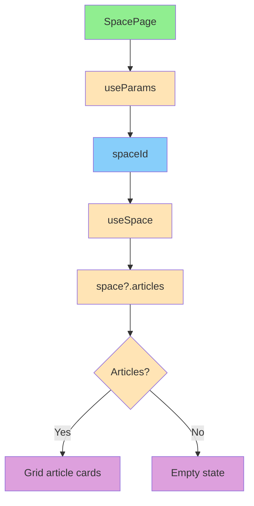

# Функционал статей

**Версия:** 1.1\
**Дата создания:** 2026-02-08\
**Дата обновления:** 2026-02-09

---

## Краткое содержание

Этот документ описывает функционал статей в проекте Python-TypeScript Wiki Frontend. Рассматриваются типы данных, UI отображение, mock данные и текущее состояние навигации.

---

## Оглавление

1. [Обзор статей](#обзор-статей)
2. [Типы статей](#типы-статей)
3. [UI статей](#ui-статей)
4. [Mock данные](#mock-данные)
5. [Навигация к статье](#навигация-к-статье)

---

## Обзор статей

### Назначение

Статьи — это основной контент в пространствах Базы Знаний. Каждая статья имеет:

- **Название** — имя статьи
- **ID** — идентификатор статьи
- **Дата создания** — Дата и время создания статьи

### Паттерны использования

Статьи отображаются на странице пространства и группируются по пространствам.

---

## Типы статей

### Article type

**Файл:** `src/entities/space/model/types.ts`

**Реализация:**

```typescript
export interface Article {
  id: string;
  name: string;
  created_at: string;
}
```

**Поля типа:**

| Поле | Тип | Описание |
|------|-----|----------|
| `Article.id` | `string` | ID статьи |
| `Article.name` | `string` | Название статьи |
| `Article.created_at` | `string` | Дата создания (ISO string) |

---

## UI статей

### SpacePage — отображение списка статей

**Файл:** `src/pages/space/ui/SpacePage.tsx`

**Реализация:**

```typescript
import { DashboardLayout } from '@/widgets/layout';
import { useParams } from '@tanstack/react-router';
import { useSpace } from '@/entities/space';

export function SpacePage() {
  const { spaceId } = useParams({ from: '/space/$spaceId' });
  const { data: space } = useSpace(spaceId);
  const articles = space?.articles || [];

  return (
    <DashboardLayout>
      <div className="flex flex-col gap-6">
        <div>
          <h1 className="text-2xl font-bold">
            Страница пространства {space?.name}
          </h1>
          <p className="text-muted-foreground text-sm">ID: {spaceId}</p>
        </div>

        <section>
          <h2 className="text-xl font-semibold mb-4">Статьи</h2>
          {articles && articles.length > 0 ? (
            <div className="grid gap-3">
              {articles.map((article) => (
                <div
                  key={article.id}
                  className="p-4 border rounded-lg bg-card hover:bg-muted/50 transition-colors cursor-pointer"
                >
                  <h3 className="font-medium">{article.name}</h3>
                  <p className="text-xs text-muted-foreground mt-1">
                    Создано: {new Date(article.created_at).toLocaleDateString()}
                  </p>
                </div>
              ))}
            </div>
          ) : (
            <p className="text-muted-foreground">
              В этом пространстве пока нет статей.
            </p>
          )}
        </section>
      </div>
    </DashboardLayout>
  );
}
```

**Ключевые элементы:**
- **Заголовок:** Название пространства и ID
- **Список статей:** Grid с карточками статей
- **Пустое состояние:** "В этом пространстве пока нет статей."
- **Интерактивность:** Hover эффекты карточек

**Поток работы:**



---

## Mock данные

### Mock статьи

**Файл:** `src/shared/mock/spaceMocks.ts`

**Реализация:**

```typescript
import type { Article } from '@/entities/space/model/types';

export const mockArticles: Article[] = [
  {
    id: 'art-1',
    name: 'Introduction to Wiki',
    created_at: '2024-01-20T12:00:00Z',
  },
  {
    id: 'art-2',
    name: 'Getting Started Guide',
    created_at: '2024-01-21T15:30:00Z',
  },
  {
    id: 'art-3',
    name: 'Advanced Tips & Tricks',
    created_at: '2024-01-22T09:15:00Z',
  },
];
```

**Назначение:** Mock данные для статей (для локальной разработки).

**Использование:**
```typescript
// src/entities/space/api/useSpace.ts
import { getMockSpace } from '@/shared/mock/spaceMocks';

export function useSpace(spaceId: string) {
  return useQuery<SpaceResponse>({
    queryKey: ['space', spaceId],
    queryFn: async () => {
      if (isLocalRun()) {
        return getMockSpace(spaceId);
      }

      const { data } = await fetchWithToken<SpaceResponseSuccess>(
        `/spaces/${spaceId}`
      );
      return data;
    },
    enabled: !!spaceId,
  });
}
```

---

## Навигация к статье

В текущем коде нет отдельного роута страницы статьи и нет перехода по клику на карточку статьи:
- В `src/pages/space/ui/SpacePage.tsx` карточка статьи рендерится как `div` с `cursor-pointer`.
- В `src/app/router.tsx` маршрут вида `/article/$articleId` отсутствует.

---

## Полезные ссылки

- [Feature-Sliced Design - Entities Layer](https://feature-sliced.design/docs/reference/layers#entities)
- [TanStack Query Documentation](https://tanstack.com/query/latest)
- [TanStack Router Documentation](https://tanstack.com/router/latest)
